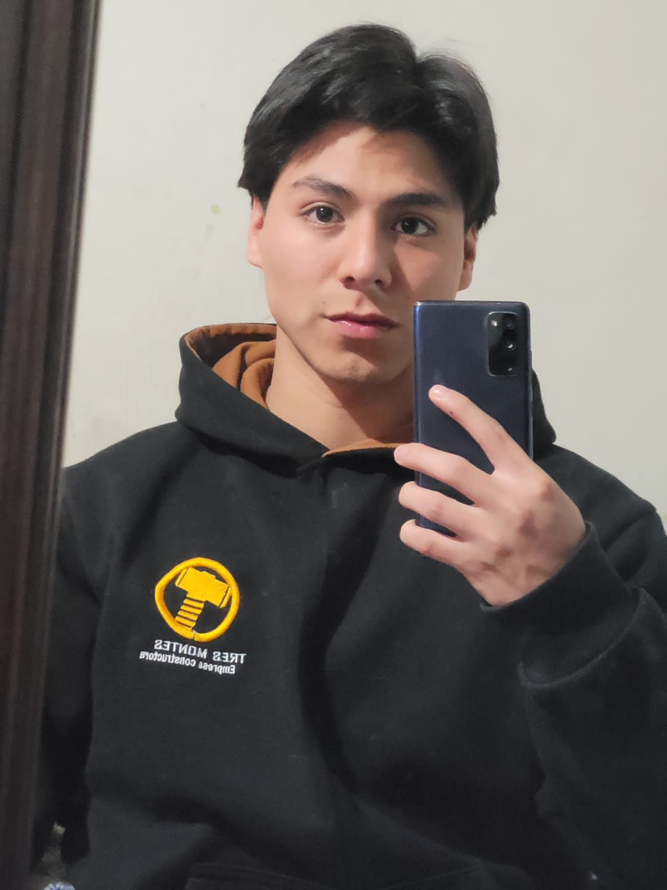
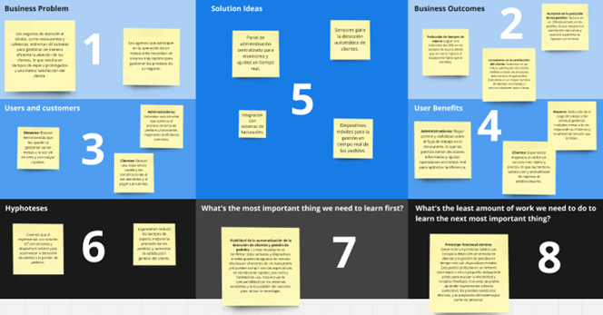

# Capítulo I: Introducción

## 1.1. Startup Profile
### 1.1.1. Descripción de la Startup
Somos Tecnogurus, un startup conformado por estudiantes de la Universidad Peruana de Ciencias Aplicadas. Solucionamos problemáticas con herramientas tecnológicas para automatizar y acelerar procesos.
En esta oportunidad presentamos Tecgnurus una solución IoT que buscará acortar los tiempos de atención de restaurantes por medio de dispositivos tecnológicos que nos ayudaran a facilitar esto. Para ello contaremos con sensores los cuales detectaran si un cliente ha ingresado al local y donde se ha sentado. De la misma forma estos sensores ayudaran a detectar cuando un cliente se para de su mesa o hay platos por recoger. Así mismo ofrecemos una solución tecnológica al tomar los pedidos con dispositivos móviles y caja para llevar un correcto control de las cuentas por clientes o mesas.

Misión: Mejorar los tiempos de producción y atención de un negocio centrado en la atención de comensales. Ya sean restaurantes, cafeterías u hoteles.

Visión: Ser la empresa que proporcione la solución más completa y satisfactoria a esta problemática que afecta este sector.
### 1.1.2. Perfiles de integrantes del equipo
#### AAAA

#### Gabriel Anthony Braithuaite Toledo

+ Mi nombre es Gabriel Braithuaite, considero que podré aportar al equipo con mi creatividad, disposición para trabajar y con mis conocimientos. Tengo la voluntad de aprender cosas nuevas y crecer junto a mi equipo a lo largo del tiempo que trabajemos juntos.
#### Johan Príncipe Godoy

+ Mi nombre es Johan Príncipe, considero que seré un aporte importante al equipo debido a mis conocimientos en programación y mi capacidad para resolver problemas. Me apasiona el desarrollo de software y la creación de soluciones innovadoras. Estoy comprometido a contribuir al éxito del proyecto y a aprender de mis compañeros.
#### Nicolas Zagal Vallejo

+  Mi nombre es Nicolas Zagal, me considero un miemrbo clave para el equipo debido a mis conocimientos y compromiso. Poseo capacidad para enfrentar desafíos y su disposición para colaborar en el backend y frontend

## 1.2. Solution Profile
Para comprender la solución debemos detallar aspectos que se abordaran a lo largo del proyecto y que metas tendremos
### 1.2.1 Antecedentes y problemática

*What?* 
Los negocios tipo restaurante, suelen tener problemas al momento de atender a sus clientes. El proceso sigue el siguiente flujo: Observar el ingreso del nuevo cliente, atenderlo y tomar su pedido, enviar el detalle del pedido a caja y cocina, recibir los platos de cocina y despacharlos, retirar platos y cobrarlo.

*When?*
Esta problematica se da en 3 ocaciones: 
Observar el ingreso del nuevo cliente: En ocasiones el negocio no cuenta con gran cantidad de personal por lo que algunos clientes pueden pasar desapercibidos. 
Enviar el detalle de la orden a mesa y cocina: Cuando hay mesas con gran cantidad de clientes a veces es difícil acordarse todos los platos o se pierde mucho tiempo al pasar las comandas a cocina o caja.
Retiro de utencilios: En ocasiones platos se quedan en las mesas vacías dando un aspecto descuidado al negocio

*Where?*
Esta problemática se da en los negocios de atención al cliente con despacho de alimentos como: Restaurantes, cafeterías, bares, hoteles, etc.

*Who?* 
Los principales afectados por esta problemática son los meseros de estos negocios y los administradores puesto que son ellos los encargados de brindar el servicio lo más rápido posible a los clientes.

*Why?* 
Esto se da principalmente por la falta de personal o la falta de herramientas que ayuden a gestionar los pedidos, alargando así los procesos.

*How?* 
El proyecto deberá llevarse a cabo utilizando sensores y dispositivos móviles de modo que se pueda detectar cuando un cliente nuevo ingresa, donde se sienta y si hay platos en la mesa. También se agilizará el proceso de gestionar el despacho del pedido mediante la expedición de comandas detalladas eficazmente.

*How much?* 
La cantidad de sensores o dispositivos se deberán calcular en base a las necesidades del cliente. Se estima el uso de un dispositivo para la entrada del local, así como un dispositivo por cada mesa y silla. Por otro lado, para la recepción de comandas se necesitará un dispositivo móvil por mesero que se encargará de enviar información y uno por cada caja y centro de despacho de alimentos ya sea cocina, barra u otro. Este último se centrará en recibir la información. 

### 1.2.2 Lean UX Process.
#### 1.2.2.1. Lean UX Problem Statements.

El estado actual de la industria de la restauración se ha enfocado principalmente en los meseros, quienes a menudo tienen dificultades para atender varias mesas al mismo tiempo, lo que resulta en demoras en el servicio y descontento de los clientes. Asimismo, los administradores enfrentan problemas al ingresar los pedidos en el sistema, lo que puede ocasionar retrasos en el despacho de nuevas órdenes y complicar el proceso de facturación. 

La falta de un sistema de gestión de pedidos eficiente es una brecha que los productos y servicios actuales no abordan. Nuestra solución abordará esta necesidad mediante la implementación de un sistema basado en IoT que optimice el manejo de pedidos y facilite el trabajo tanto de meseros como de administradores. 

Nuestro enfoque inicial se dirigirá a estos dos segmentos de clientes. Sabremos que hemos tenido éxito cuando veamos una reducción en los tiempos de servicio y un aumento en la satisfacción del cliente en nuestro público objetivo.

#### 1.2.2.2. Lean UX Assumptions.

**Business Assumptions**
- **La solución IoT reducirá los tiempos de atención**: Se asume que al automatizar la detección de clientes y la gestión de pedidos, los tiempos de atención disminuirán considerablemente, mejorando la eficiencia del servicio.
- **El mercado está dispuesto a adoptar nuevas tecnologías**: Se asume que los restaurantes, cafeterías y otros negocios de atención al cliente están dispuestos a invertir en tecnología IoT para mejorar sus procesos operativos.
- **El costo de implementación será recuperable**: Se asume que el costo de implementar dispositivos IoT y móviles será recuperado rápidamente debido a la mejora en la eficiencia operativa y la satisfacción del cliente.
- **La solución aumentará la satisfacción del cliente**: Se asume que una atención más rápida y eficiente resultará en una mayor satisfacción del cliente, lo que se traducirá en mayor lealtad y repetición de visitas.
- **El proyecto es escalable**: Se asume que la solución puede adaptarse a diferentes tamaños de negocio, desde pequeños cafés hasta grandes cadenas de restaurantes.

**Business Outcome Assumptions**
- **Incremento en las ventas**: Se asume que al mejorar la eficiencia y satisfacción del cliente, las ventas de los establecimientos aumentarán.
- **Reducción de costos operativos**: Se asume que la automatización de procesos reducirá la necesidad de personal adicional y los costos asociados.
- **Mejora en la retención de clientes**: Se asume que un servicio más eficiente resultará en una mayor retención de clientes y en recomendaciones boca a boca.

**User Assumptions**
- **Los meseros preferirán un sistema automatizado**: Se asume que los meseros estarán dispuestos a utilizar dispositivos móviles para gestionar pedidos, reconociendo los beneficios en términos de ahorro de tiempo y reducción de errores.
- **Los clientes valoran la rapidez y eficiencia**: Se asume que los clientes notarán y apreciarán la rapidez en la atención, lo que mejorará su experiencia general en el establecimiento.
- **El personal administrativo se adaptará fácilmente a la nueva tecnología**: Se asume que los administradores y el personal encargado de la caja y la cocina se adaptarán rápidamente al uso de los nuevos dispositivos, facilitando la integración con el sistema existente.
- **Los usuarios no tendrán problemas con la interfaz**: Se asume que la interfaz de usuario de los dispositivos móviles será intuitiva y fácil de usar, reduciendo la necesidad de capacitación extensa.

**User Outcome Assumptions**
- **Aumento en la satisfacción del mesero**: Se asume que los meseros se sentirán más satisfechos y eficientes en su trabajo gracias a la reducción de tiempos de espera y errores en la gestión de pedidos a través de tecnología IoT.
- **Mejora en la experiencia del cliente**: Se asume que los clientes disfrutarán de una experiencia más fluida y rápida, facilitada por el sistema IoT, lo que se traducirá en comentarios positivos y retorno al establecimiento.
- **Facilidad en la adopción del sistema**: Se asume que la capacitación para el uso del nuevo sistema IoT será breve, resultando en una rápida adopción por parte del personal.

**Feature Assumptions**
- **Detección de entrada de clientes mediante IoT**: Sensores IoT que detectan automáticamente cuando un cliente entra al local, enviando una notificación al sistema para asignar una mesa.
- **Asignación automática de mesas**: Sistema IoT que sugiere o asigna automáticamente mesas disponibles basándose en la información proporcionada por los sensores.
- **Gestión de pedidos en tiempo real**: Dispositivos móviles conectados a un sistema IoT para meseros que permiten tomar pedidos y enviarlos instantáneamente a la cocina y caja, reduciendo tiempos de espera y errores.
- **Monitoreo automatizado del estado de mesas**: Sensores que detectan si hay platos por recoger o si una mesa está desocupada, notificando al personal para que mantengan el área limpia y ordenada.
- **Interfaz de administración centralizada**: Un panel IoT para administradores que permite monitorear en tiempo real el estado de las mesas, pedidos en curso y realizar ajustes rápidos en el flujo de trabajo.
- **Integración con sistemas de facturación**: El sistema IoT se conecta con el software de facturación del negocio para automatizar el cobro, reduciendo el tiempo de espera para los clientes al pagar.

#### 1.2.2.3.	Lean UX Hypothesis Statements.

- **Creemos que lograremos** una reducción significativa en los tiempos de espera y un aumento en la satisfacción del cliente.  
   **Si** los meseros.
   **Alcanzan** un servicio más rápido y eficiente.  
   **Con** la automatización de la detección de clientes mediante sensores IoT.

- **Creemos que lograremos** una mayor precisión en los pedidos y una mejora en la eficiencia del servicio.  
   **Si** los meseros.
   **Alcanzan** una disminución de errores en las órdenes y un proceso de toma de pedidos más ágil.  
   **Con** un sistema de gestión de pedidos en tiempo real.

- **Creemos que lograremos** una rápida adaptación del personal al nuevo sistema.  
  **Si** los usuarios.
  **Alcanzan** un menor tiempo de capacitación y mejor aceptación de la tecnología por parte de los empleados,  
  **Con** esta interfaz amigable.

- **Creemos que lograremos** un proceso de cobro más rápido y preciso, mejorando la percepción del servicio.  
   **Si** los meseros.  
   **Alcanzan** una disminución en los tiempos de espera al final de la experiencia del cliente.  
   **Con** la integración con el software de facturación.

- **Creemos que lograremos** un aumento en la cuota de mercado y mayores ingresos para nuestro startup.  
   **Si** los usuarios.  
   **Alcanzan** una mayor adopción de la tecnología por parte de restaurantes y cafeterías.  
   **Con** una solución IoT escalable.

#### 1.2.2.4. Lean UX Canvas.
El Lean UX Canvas es una herramienta que nos permite alinear nuestras suposiciones de negocio, usuarios y resultados en un formato claro y colaborativo. A través de este canvas, identificamos hipótesis clave que guían nuestro desarrollo, enfocándonos en resolver problemas reales del usuario mientras cumplimos con los objetivos del negocio. Es una forma ágil de validar nuestras ideas rápidamente y hacer ajustes necesarios antes de avanzar en el proceso.

Lean UX Canvas Completo: https://miro.com/app/board/uXjVKkI6spU=/?share_link_id=282794708200

## 1.3. Segmentos objetivos.
Apuntamos a un segmento objetivo que requiera una aplicación integral que les ayude a gestionar eficazmente. 
Entre ellos están:

-  **Mesero**
Es el encargado de gestionar y atender los pedidos de los comensales. Ellos son los principales afectados puesto que deben dar el mejor servicio y de la manera más eficaz.
-  **Administrador**
Este segmento buscara obtener el detalle de las cuentas de comensales creadas, así como conocer el flujo de la gestión de las mesas con los dispositivos IOT, y vista de los productos e insumos.
