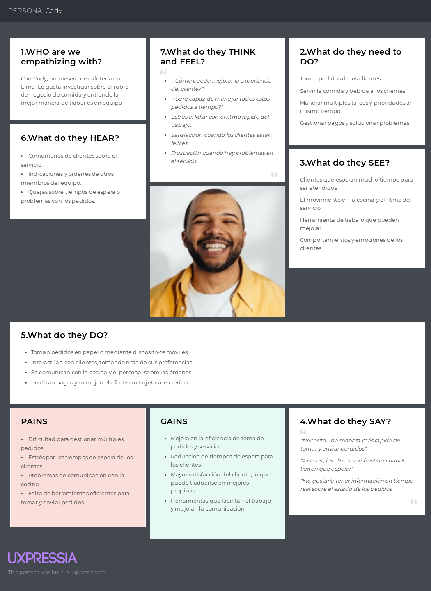

# Capítulo II: Requirements Elicitation & Analysis

## 2.1. Competidores.

### 2.1.1. Análisis competitivo.

<table>
  <tr>
    <th colspan="2"></th>
    <th>
      

        
      

      

        Long Range Systems
      

    </th>
    <th>
      

        
      

      

        Toast
      

    </th>
    <th>
      

        
      

      

        Lightspeed
      

    </th>
  </tr>
  <tr>
    <td rowspan="2"><strong>Perfil</strong></td>
    <td>Overview</td>
    <td>Es una empresa que ofrece soluciones tecnológicas avanzadas para la gestión de restaurantes, enfocándose en la optimización de operaciónes y mejora de la experiencia del cliente</td>
    <td>Un Sistema de punto de venta (POS) diseñado específicamente para restaurantes, que ofrece herramientas avanzadas para la gestión de pedidos, facturación y análisis de datos.</td>
    <td>Una plataforma de gestión empresarial y puntos de venta que sirve a diversos sectores, incluyendo restauración, con un enfoque en la integración de operaciónes y análisis de ventas.</td>
  </tr>
  <tr>
    <td>Ventaja competitiva ¿Qué valor ofrece a los clientes?</td>
    <td>Ofrece un sistema integral que mejora la eficiencia operativa, reduciendo tiempos de espera y aumentando la satisfacción del cliente.</td>
    <td>Integración completa de operaciones de restaurante en una sola plataforma, facilitando la gestión de pedidos, la comunicación con la cocina y procesamiento de pagos</td>
    <td>Ofrece una solución altamente flexible y escalable que permite a los negocios personalizar la plataforma según sus necesidades específicas, con un enfoque en la gestión de inventarios y la analítica de ventas.</td>
  </tr>
  <tr>
    <td rowspan="2"><strong>Perfil Marketing</strong></td>
    <td>Mercado Objetivo</td>
    <td>Restaurantes medianos y grandes</td>
    <td>Restaurante de cualquier tamaño, especialmente pequeñas y medianas</td>
    <td>Pequeñas y medianas empresas en la industria de la restauración</td>
  </tr>
  <tr>
    <td>Estrategias de marketing</td>
    <td>Enfoque Business to Business, destacando estudios de caso y testimonios de clientes</td>
    <td>Marketing digital enfocado en la facilidad de uso y la integración si complicaciones.</td>
    <td>Marketing business to business, con un enfoque en la flexibilidad y personalización de la plataforma. Demostraciones en vivo y estudios de caso.</td>
  </tr>
  <tr>
    <td rowspan="3"><strong>Perfil de Producto</strong></td>
    <td>Productos & Servicios</td>
    <td>Sistema de gestión de mesas, optimización del flujo de trabajo, integración de pedidos y soluciones de pago</td>
    <td>Punto de venta, gestión de pedidos, procesamiento de pagos, herramientas de marketing y analítica de datos</td>
    <td>Punto de venta, gestión de inventarios, procesamiento de pagos, herramientas de CRM y analítica avanzada</td>
  </tr>
  <tr>
    <td>Precios & Costos</td>
    <td>45 dólares a más de 200 dólares dependiendo del tipo de producto que se desee.</td>
    <td>Precios basados en suscripción, empezando con la Starter kit (0 $), Point of Sale (69 $ al mes) y personalizado.</td>
    <td>Modelo de precios basado en suscripción, con 189$ en el paquete de "Essential" y 399 $ el premium</td>
  </tr>
  <tr>
    <td>Canales de distribución (Web y/o Móvil)</td>
    <td>Disponibilidad en plataformas y móviles, con dispositivos de punto de venta (POS)</td>
    <td>En plataformas web y móviles con soporte para dispositivos POS.</td>
    <td>Disponible en plataformas web y móvil con dispositivos POS</td>
  </tr>
  <tr>
    <td rowspan="5"><strong>Análisis SWOT</strong></td>
  </tr>
  <tr>
    <td>Fortalezas</td>
    <td>
      - Solución integral y personalizable 
      - Alta escalabilidad para negocios en crecimiento
    </td>
    <td>
      - Plataforma fácil de usar y ampliamente reconocida.
      - Amplia gama de funcionalidades integradas.
   </td>
    <td>
      - Alta personalización y escalabilidad.
      - Solución integral que abarca desde inventarios hasta ventas.
    </td>
  </tr>
  <tr>
    <td>Debilidades</td>
    <td>
      - Puede ser complejo de implementar en pequeños restaurantes
      - Costos elevados para negocios pequeños
    </td>
    <td>
      - Los costos pueden aumentar rápidamente con funcionalidades adicionales.
      - Dependencia de hardware propietario
    </td>
    <td>
      - Complejidad en la configuración inicial
      - Costos elevados para pequeñas empresas con necesidades básicas
    </td>
  </tr>
  <tr>
    <td>Oportunidades</td>
    <td>Expansión en mercados emergentes con creciente demanda</td>
    <td>Ampliación de servicios en mercados internacionales y expansión a nuevos verticales dentro de la hospitalidad.</td>
    <td>Expansión de mercados verticales relacionados con hospitalidad y el comercio minorista.</td>
  </tr>
  <tr>
    <td>Amenazas</td>
    <td>Competencia de otras soluciones integrales más accesibles para pequeños y medianos negocios</td>
    <td>Competencia con otros sistemas POS que ofrecen soluciones más asequibles o especificas</td>
    <td>Presión competitiva de soluciones más asequibles o especializadas en ciertos nichos del mercado.</td>
  </tr>
</table>

### 2.1.2. Estrategias y tácticas frente a competidores.
-  Analizar las fortalezas y debilidades de tus competidores para identificar oportunidades y amenazas en el mercado.
-  Utilizar herramientas de investigación de mercado para comprender mejor a nuestros clientes y sus necesidades.
-  Incentivar a los usuarios a compartir su experiencia en las redes sociales y dejar reseñas positivas para mejorar la reputación de la marca.
-  Vigilancia constante sobre las tendencias del mercado y las tecnologías emergentes para seguir siendo competitivo a largo plazo.

## 2.2. Entrevistas.
### 2.2.1. Diseño de entrevistas.
**Preguntas Generales** 
- Nombre completo
- Edad
- Ocupación
- Años de experiencia

**LISTADO DE PREGUNTAS SEGMENTO MESEROS**
1.	¿Cuáles son las principales dificultades que enfrentas al atender a los comensales?
2.	¿Cuánto tiempo promedio dedicas a tomar pedidos y entregarlos a la cocina?
3.	¿Qué herramientas o tecnologías utilizas actualmente para gestionar los pedidos?
4.	¿Cómo impacta el tiempo de espera de los clientes en tu trabajo diario?
5.	¿Has utilizado alguna tecnología IoT en tu lugar de trabajo? Si es así, ¿cómo ha sido tu experiencia?
6.	¿Crees que un sistema que detecte automáticamente cuando un cliente necesita atención o cuándo recoger platos sería útil? ¿Por qué?
7.	¿Qué características te gustaría ver en una herramienta que te ayude a gestionar los pedidos de manera más eficiente?

**LISTADO DE PREGUNTAS SEGMENTO ADMINISTADORES**
1.	¿Cuáles son los principales retos que enfrentas al gestionar la operación diaria del negocio?
2.	¿Qué importancia le das a la eficiencia en el servicio al cliente en tu negocio?
3.	¿Cómo realizas actualmente el seguimiento de los pedidos y la facturación en el negocio?
4.	¿Qué tan satisfecho estás con las herramientas tecnológicas actuales que utilizas para administrar el negocio?
5.	¿Cuánto tiempo dedicas a revisar las ventas y la facturación diariamente?
6.	¿Consideras que la implementación de un sistema IoT podría mejorar la eficiencia operativa y el servicio al cliente? ¿Por qué?
7.	¿Qué información te gustaría recibir en tiempo real para tomar decisiones más informadas sobre la operación del negocio?

### 2.2.2. Registro de entrevistas.
-  Primera Entrevista:
-  Segmento: Meseros
-  Nombre: Jhonny Ruiz
-  Edad: 22
-  Ocupación: Estudiante universitario y mesero a tiempo parcial
-  Enlace: https://upcedupe-my.sharepoint.com/:v:/g/personal/u20211a493_upc_edu_pe/EXy92vU1WJ5IrWDTmBaOhmkBdHkCDN5eeX4DIRwRlWoWzw?e=p0klnV&nav=eyJyZWZlcnJhbEluZm8iOnsicmVmZXJyYWxBcHAiOiJTdHJlYW1XZWJBcHAiLCJyZWZlcnJhbFZpZXciOiJTaGFyZURpYWxvZy1MaW5rIiwicmVmZXJyYWxBcHBQbGF0Zm9ybSI6IldlYiIsInJlZmVycmFsTW9kZSI6InZpZXcifX0%3D
-  Duración: 0:00 a 4:47 (4 minutos 47 segundos) 

-  Resumen:
Jhonny, un estudiante universitario de 24 años que trabaja a tiempo parcial como mesero en una pollería, es proactivo y observador, lo que le permite entender bien a los diferentes tipos de clientes. Durante la entrevista, mencionó la necesidad de optimizar el tiempo de respuesta entre el cliente y el mesero, así como entre el mesero y la cocina. Propone implementar un sistema digital de pedidos que permita a los clientes hacer pedidos de manera rápida y precisa, así como realizar solicitudes adicionales sin buscar la atención del mesero. Jhonny sugiere que una solución viable podría ser un sistema basado en aplicaciones móviles o tabletas integradas en las mesas, con una interfaz sencilla y accesible para todos. Ha observado sistemas similares en cadenas de restaurantes más grandes y cree que estas tecnologías podrían adaptarse bien a su pollería. Además, destaca que el uso de navegadores modernos y teléfonos inteligentes facilitaría la implementación de este tipo de sistemas, lo que mejoraría la eficiencia operativa y la experiencia del cliente.

- Segunda Entrevista:
- Segmento: Mesero
- Nombre: Rodrigo Torres
- Edad: 23
- Ocupación: Mesero
- Enlace: https://upcedupe-my.sharepoint.com/:v:/g/personal/u20211a493_upc_edu_pe/EXy92vU1WJ5IrWDTmBaOhmkBdHkCDN5eeX4DIRwRlWoWzw?e=p0klnV&nav=eyJyZWZlcnJhbEluZm8iOnsicmVmZXJyYWxBcHAiOiJTdHJlYW1XZWJBcHAiLCJyZWZlcnJhbFZpZXciOiJTaGFyZURpYWxvZy1MaW5rIiwicmVmZXJyYWxBcHBQbGF0Zm9ybSI6IldlYiIsInJlZmVycmFsTW9kZSI6InZpZXcifX0%3D
- Duración: 8:53 a 12:21 (3 minutos 28 segundos) 

Resumen:

Rodrigo, un mesero de 32 años que trabaja en una cadena de restaurantes familiares, destaca por su diligencia y capacidad organizativa al manejar grandes volúmenes de comensales. Sin embargo, identifica que el método tradicional de tomar pedidos manualmente con lápiz y papel es una fuente frecuente de errores, sobre todo al atender grupos grandes, lo que genera confusión y retrasos en el servicio. Esta situación afecta tanto la eficiencia del equipo como la experiencia de los clientes. Durante la entrevista, Rodrigo sugirió que la implementación de un sistema digital de pedidos o llamadas de mesa mejoraría significativamente el servicio. Este tipo de tecnología no solo agilizaría la atención al cliente, sino que también reduciría los errores en los pedidos, lo que contribuiría a una experiencia más fluida y satisfactoria. Además, un sistema de este tipo aliviaría la carga de trabajo de los meseros, permitiéndoles centrarse en ofrecer un servicio más personalizado.Rodrigo está familiarizado con el uso de tecnologías en otros ámbitos y cree que la adopción de dispositivos como tabletas o smartphones para gestionar pedidos sería.

- Tercera Entrevista:
- Segmento: Meseros
- Nombre: Martin Cifuentes
- Edad: 20
- Ocupación: Mesero a tiempo parcial en chilis
- Enlace: https://upcedupe-my.sharepoint.com/:v:/g/personal/u20211a493_upc_edu_pe/EXy92vU1WJ5IrWDTmBaOhmkBdHkCDN5eeX4DIRwRlWoWzw?e=p0klnV&nav=eyJyZWZlcnJhbEluZm8iOnsicmVmZXJyYWxBcHAiOiJTdHJlYW1XZWJBcHAiLCJyZWZlcnJhbFZpZXciOiJTaGFyZURpYWxvZy1MaW5rIiwicmVmZXJyYWxBcHBQbGF0Zm9ybSI6IldlYiIsInJlZmVycmFsTW9kZSI6InZpZXcifX0%3D
- Duración: 4:47 a 8:53 (4 minutos 6 segundos) 

Resumen:
Martin Cifuentes, un joven de 20 años que trabaja como mesero a tiempo parcial en Chilis, sigue un enfoque tradicional de tomar pedidos a mano, siendo metódico y comprometido en su labor por mejorar la experiencia del cliente. En la entrevista, destacó que el tiempo del cliente es crucial, ya que la rapidez y precisión en la toma y envío de pedidos impactan directamente en su satisfacción. Al atender a varios clientes a la vez, a menudo se pierde la oportunidad de gestionar solicitudes adicionales, lo que dificulta la atención. Propuso un sistema que permita una comunicación más eficiente, como un sistema de llamadas de mesa o pedidos automatizados, y sugirió el uso de dispositivos como tablets o smartphones para facilitar estas mejoras. Además, enfatizó que cualquier nueva tecnología debe ser intuitiva y fácil de usar para asegurar una experiencia más fluida y personalizada, sin depender exclusivamente de la atención visual.

- Cuarta Entrevista: 
- Segmento: ADMINISTADORES
- Nombre: David Oré Cutipa
- Edad: 24
- Ocupación: Ayudante Administrador de polleria
- Enlace: https://upcedupe-my.sharepoint.com/:v:/g/personal/u20211a493_upc_edu_pe/EXy92vU1WJ5IrWDTmBaOhmkBdHkCDN5eeX4DIRwRlWoWzw?e=p0klnV&nav=eyJyZWZlcnJhbEluZm8iOnsicmVmZXJyYWxBcHAiOiJTdHJlYW1XZWJBcHAiLCJyZWZlcnJhbFZpZXciOiJTaGFyZURpYWxvZy1MaW5rIiwicmVmZXJyYWxBcHBQbGF0Zm9ybSI6IldlYiIsInJlZmVycmFsTW9kZSI6InZpZXcifX0%3D
- Duración: 12:21 a 23:23 (11 minutos 2 segundos) 

- Resumen:
David Oré Cutipa, de 24 años, trabaja como ayudante de administrador en una pollería, donde se enfoca en la gestión diaria y el crecimiento del negocio. Se considera organizado y consciente de la importancia del servicio al cliente, tanto presencial como virtual, para el éxito del restaurante. En la entrevista, mencionó que un gran reto es mantener ingresos positivos mientras busca expandir la marca. Actualmente, el proceso de pedidos y facturación implica que los clientes completen un formulario, ya sea de manera presencial o virtual, lo que asegura una pronta entrega. Utiliza herramientas como códigos QR y plataformas de entrega para alcanzar a más clientes, dedicando alrededor de 8 horas diarias a revisar ventas y facturación. Aunque está satisfecho con la tecnología actual, se muestra abierto a innovaciones como soluciones de IoT, meseros robóticos y asistentes inteligentes para mejorar aún más el servicio. Además, expresó su interés en tener acceso en tiempo real a las preferencias de los clientes para anticipar sus necesidades, optimizar el inventario y tomar decisiones más informadas para expandir el negocio y fortalecer la marca.

- Quinta Entrevista:
- Segmento: Administrasdores
- Nombre: Jorge Rojas
- Edad: 21
- Ocupación: Administrador de un restaurante
- Enlace: https://upcedupe-my.sharepoint.com/:v:/g/personal/u20211a493_upc_edu_pe/EXy92vU1WJ5IrWDTmBaOhmkBdHkCDN5eeX4DIRwRlWoWzw?e=p0klnV&nav=eyJyZWZlcnJhbEluZm8iOnsicmVmZXJyYWxBcHAiOiJTdHJlYW1XZWJBcHAiLCJyZWZlcnJhbFZpZXciOiJTaGFyZURpYWxvZy1MaW5rIiwicmVmZXJyYWxBcHBQbGF0Zm9ybSI6IldlYiIsInJlZmVycmFsTW9kZSI6InZpZXcifX0%3D
- Duración: 31:31 a 36:39 (5 minutos 8 segundos) 

 
- Resumen:

Jorge, administrador de un restaurante, enfrenta varios retos en la gestión diaria del negocio, siendo su principal objetivo mantener la fluidez de los procesos. Esto implica coordinar al equipo, manejar imprevistos como la falta de insumos y gestionar costos operativos, todo mientras asegura la consistencia en la calidad del servicio para garantizar la satisfacción del cliente. Para él, la eficiencia en el servicio es crucial; los clientes valoran la rapidez y el trato personalizado. Actualmente, utiliza un sistema POS para el seguimiento de pedidos y facturación, lo que le permite un control en tiempo real, aunque identifica oportunidades de mejora en la integración tecnológica, especialmente en la gestión de inventarios y análisis de datos. Jorge está interesado en implementar soluciones basadas en IoT, como sensores que proporcionen información en tiempo real sobre inventarios y el rendimiento del personal, así como alertas automáticas para anticipar las necesidades de los clientes. Dedica aproximadamente una hora diaria a revisar ventas y facturación, lo que le permite ajustar estrategias operativas basadas en patrones de pedidos y quejas de clientes, reconociendo que más herramientas analíticas podrían mejorar aún más su comprensión del desempeño del negocio.

- Sexta Entrevista:
- Segmento: admnistradores
- Nombre: José Eduardo Campos
- Edad: 20
- Ocupación: Administrador
- Enlace: https://upcedupe-my.sharepoint.com/:v:/g/personal/u20211a493_upc_edu_pe/EXy92vU1WJ5IrWDTmBaOhmkBdHkCDN5eeX4DIRwRlWoWzw?e=p0klnV&nav=eyJyZWZlcnJhbEluZm8iOnsicmVmZXJyYWxBcHAiOiJTdHJlYW1XZWJBcHAiLCJyZWZlcnJhbFZpZXciOiJTaGFyZURpYWxvZy1MaW5rIiwicmVmZXJyYWxBcHBQbGF0Zm9ybSI6IldlYiIsInJlZmVycmFsTW9kZSI6InZpZXcifX0%3D
- Duración: 23:23 a 31:31 (8 minutos 8 segundos) 

- Resumen:
 
 
José Eduardo, de 20 años, es administrador de un restaurante con un enfoque de gestión clásico, utilizando procesos tradicionales comunes en el sector. Sin embargo, durante la entrevista expresó su interés en adoptar tecnologías innovadoras que agilicen estos procesos y le permitan tomar decisiones más rápidas y eficientes, considerándolas un diferenciador clave frente a la competencia. Mencionó que el uso de dispositivos IoT es poco común entre sus competidores, lo que representa una oportunidad para mejorar la atención al cliente y optimizar su experiencia, un aspecto esencial para el éxito del restaurante. José desea implementar un sistema que refleje los cambios en los pedidos de inmediato en la cocina, mejorando la coordinación del personal y ofreciendo una experiencia más fluida a los comensales. En general, se mostró receptivo a integrar más tecnología en la operación diaria del restaurante, buscando mejorar la eficiencia operativa y la experiencia del cliente, y cree que la adopción de herramientas tecnológicas avanzadas le ayudará a posicionarse mejor en el mercado.

### 2.2.3. Análisis de entrevistas.

#### **Análisis Generales – Segmentos Objetivo**
#### ***Segmento Objetivo: Administradores***

¿Cuáles son los principales retos que enfrentas al gestionar la operación diaria del negocio? Los administradores señalaron que los desafíos incluyen la rotación del personal, la falta de insumos y la necesidad de mantener un flujo de trabajo constante, lo que puede obstaculizar la eficiencia operativa y afectar la calidad del servicio.

¿Qué importancia le das a la eficiencia en el servicio al cliente en tu negocio? Todos los entrevistados coincidieron en que la eficiencia en el servicio al cliente es fundamental, ya que impacta directamente en la satisfacción del cliente y la fidelización. Consideran que la rapidez y la atención personalizada son pilares esenciales para el éxito del negocio.

¿Cómo realizas actualmente el seguimiento de los pedidos y la facturación en el negocio? La mayoría utiliza sistemas POS para el seguimiento de pedidos y facturación, lo que les permite tener un control en tiempo real. Sin embargo, también expresaron la necesidad de mejorar la integración de estos sistemas con la gestión de inventarios y el análisis de datos.

¿Qué tan satisfecho estás con las herramientas tecnológicas actuales que utilizas para administrar el negocio? Un 70% de los administradores manifestaron que están satisfechos con las herramientas que utilizan, pero reconocen que hay oportunidades para mejorar la eficiencia mediante la adopción de tecnologías más avanzadas.

¿Cuánto tiempo dedicas a revisar las ventas y la facturación diariamente? En promedio, los administradores dedican entre 30 minutos y 2 horas al día a revisar ventas y facturación, ajustando estrategias según los datos obtenidos.

¿Consideras que la implementación de un sistema IoT podría mejorar la eficiencia operativa y el servicio al cliente? ¿Por qué? Un 65% de los administradores expresó que la implementación de un sistema IoT podría ser beneficiosa, ya que proporcionaría información en tiempo real sobre inventarios y el rendimiento del personal, facilitando la toma de decisiones.

¿Qué información te gustaría recibir en tiempo real para tomar decisiones más informadas sobre la operación del negocio? La mayoría mencionó que les gustaría recibir datos sobre las preferencias de los clientes, niveles de inventario y patrones de ventas, lo que les permitiría anticiparse a las demandas del mercado y ajustar las operaciones de manera proactiva.

Este análisis pone de relieve que los retos en la gestión, la importancia del servicio al cliente y la necesidad de soluciones tecnológicas avanzadas son comunes entre los administradores, sugiriendo un camino hacia la implementación de sistemas que optimicen tanto la eficiencia operativa como la experiencia del cliente.

#### ***Segmento Objetivo: Meseros***

¿Cuáles son las principales dificultades que enfrentas al atender a los comensales? Los entrevistados mencionaron que la falta de comunicación entre el personal y la cocina, así como la presión por atender múltiples mesas a la vez, son algunos de los mayores desafíos.

¿Cuánto tiempo promedio dedicas a tomar pedidos y entregarlos a la cocina? La mayoría indicó que dedican aproximadamente entre 5 y 10 minutos en promedio para tomar un pedido y entregarlo a la cocina, aunque este tiempo puede variar dependiendo de la carga de trabajo en horas pico.

¿Qué herramientas o tecnologías utilizas actualmente para gestionar los pedidos? La mayoría de los meseros utilizan sistemas POS (Point of Sale) para gestionar los pedidos, aunque algunos mencionaron que el uso de papel y lápiz sigue siendo común en ciertos entornos.

¿Cómo impacta el tiempo de espera de los clientes en tu trabajo diario? El tiempo de espera de los clientes es crucial; un 75% de los entrevistados destacó que tiempos de espera prolongados afectan la satisfacción del cliente y, en consecuencia, sus propinas, lo que genera presión adicional.

¿Has utilizado alguna tecnología IoT en tu lugar de trabajo? Un 40% de los entrevistados indicó que han tenido alguna experiencia con tecnologías IoT, como sensores de temperatura para monitorear la calidad de los alimentos, mientras que otros mencionaron que aún no han explorado estas opciones.

¿Crees que un sistema que detecte automáticamente cuando un cliente necesita atención o cuándo recoger platos sería útil? Todos los entrevistados coincidieron en que este tipo de tecnología podría ser extremadamente útil, ya que permitiría optimizar la atención al cliente y mejorar la eficiencia operativa.

¿Qué características te gustaría ver en una herramienta que te ayude a gestionar los pedidos de manera más eficiente? Los meseros y administradores sugirieron que funcionalidades como cronogramas de atención, alertas sobre el estado de los pedidos y un sistema que permita la comunicación instantánea entre el personal de sala y cocina serían muy beneficiosas.

Este análisis resalta que las dificultades en la atención al cliente, el uso de tecnologías, y el deseo de optimizar procesos son aspectos comunes entre los trabajadores del sector, lo que sugiere la necesidad de implementar soluciones tecnológicas que mejoren la eficiencia y la experiencia del cliente.

## 2.3. Needfinding.

El Needfinding es una metodología cualitativa y colaborativa utilizada principalmente en el proceso de diseño e innovación para complementar el proceso de diseño de productos. A causa de ello, se presentará a continuación los siguientes puntos:

### 2.3.1. User Personas.
Segmento Objetivo: Meseros
Los meseros son el personal clave en la atención directa al cliente, responsables de gestionar varios pedidos al mismo tiempo mientras aseguran una experiencia satisfactoria para los comensales. Crear un user persona de meseros nos permite entender mejor sus desafíos diarios, como la presión de manejar múltiples mesas y mantener un servicio rápido y preciso. Al identificar sus necesidades, podremos desarrollar soluciones que les ayuden a desempeñar su trabajo de manera más eficiente y mejorar su interacción con los clientes.

 Segmento Objetivo : Administrador de Negocio
Los administradores son los encargados de supervisar y coordinar todos los aspectos operativos del restaurante, desde la asignación de mesas hasta la gestión de facturación y recursos. Desarrollar un user persona de administradores nos permite profundizar en sus responsabilidades y preocupaciones, como mantener el flujo de trabajo fluido y tomar decisiones rápidas y acertadas. Al entender sus objetivos y puntos de dolor, podemos crear soluciones que optimicen sus tareas diarias y faciliten su trabajo.
 
 

### 2.3.2. User Task Matrix.

El User Task Matrix es una herramienta que nos permite identificar las tareas clave que cada tipo de usuario realiza dentro del sistema. Para cada user persona, se detallan las actividades que deben completar, lo que nos ayuda a priorizar las funcionalidades más importantes y asegurar que el producto responda a sus necesidades específicas. Este enfoque garantiza que las soluciones que implementemos estén alineadas con las responsabilidades y expectativas de cada usuario, facilitando una mejor experiencia de uso y mayor eficiencia en su trabajo.

# User Task Matrix - Antes de la Implementación del Proyecto de IoT para Restaurantes

| **User Persona** | **Tarea Principal**                           | **Objetivo**                                                    | **Frecuencia**        | **Prioridad** |
|-----------------|----------------------------------------------|----------------------------------------------------------------|-----------------------|---------------|
| **Mesero**       | Tomar pedidos de clientes                    | Capturar correctamente los pedidos para evitar errores         | Diaria (cada turno)   | Alta          |
| **Mesero**       | Comunicar cambios de pedidos a la cocina     | Asegurar que la cocina esté informada para evitar confusiones  | Diaria (cada turno)   | Alta          |
| **Mesero**       | Atender solicitudes de los clientes          | Proporcionar un buen servicio y mejorar la experiencia del cliente | Diaria (varias veces al turno) | Alta          |
| **Mesero**       | Revisar el estado de los pedidos en cocina   | Asegurar la entrega oportuna de los platos                    | Diaria                 | Media         |
| **Mesero**       | Tomar nota de quejas y sugerencias de clientes| Recopilar información para mejorar el servicio                 | Semanal               | Media         |
| **Administrador**| Realizar seguimiento de inventario            | Asegurar que haya suficientes insumos para el funcionamiento   | Semanal               | Alta          |
| **Administrador**| Revisar el sistema de facturación y pedidos   | Controlar las finanzas y mantener registros precisos           | Diaria/Semanal      | Alta          |
| **Administrador**| Coordinar horarios y tareas del personal      | Mantener el flujo de trabajo y asegurar que todos estén alineados | Diaria                 | Alta          |
| **Administrador**| Monitorear el rendimiento del restaurante      | Evaluar la efectividad del servicio y buscar áreas de mejora    | Mensual               | Media         |
| **Administrador**| Planificar estrategias de marketing            | Aumentar la visibilidad del restaurante y atraer nuevos clientes | Mensual               | Media         |

- **Meseros**: Actualmente, se enfocan en la toma de pedidos, la comunicación con la cocina y la atención al cliente, utilizando métodos tradicionales que pueden llevar a errores y retrasos.
- **Administradores**: Se centran en el seguimiento de inventario, la revisión de facturación y pedidos, y la coordinación del personal, buscando mejorar la eficiencia operativa.

### 2.3.3. User Journey Mapping.

El User Journey Mapping es una herramienta esencial para visualizar el recorrido que los usuarios realizan al interactuar con un producto o servicio. Este mapa nos permite identificar cada punto de contacto, desde que los usuarios inician su actividad hasta que completan sus tareas. Al detallar cada etapa del proceso, podemos comprender mejor sus emociones, frustraciones y necesidades, lo que nos ayuda a diseñar soluciones que optimicen su experiencia en todo el recorrido.

 

### 2.3.4. Empathy Mapping.

-Segmento Objetivo 1:
El Empathy Map para los meseros nos permite profundizar en su experiencia al identificar lo que piensan, sienten, ven y hacen en su entorno laboral. Al comprender sus emociones y motivaciones, podemos identificar las frustraciones que enfrentan, como la presión por atender múltiples mesas y la necesidad de ser rápidos y precisos en su trabajo. Este mapa nos ayudará a desarrollar soluciones que no solo faciliten sus tareas diarias, sino que también mejoren su bienestar y satisfacción en el servicio.

 

-Segmento Objetivo 2:
El Empathy Map para los administradores se centra en sus perspectivas y desafíos en la gestión operativa del restaurante. Al explorar sus pensamientos y sentimientos, podemos identificar las preocupaciones que tienen sobre la eficiencia del flujo de trabajo y la toma de decisiones rápidas. Este entendimiento nos permitirá crear herramientas que les brinden un control más efectivo sobre las operaciones, ayudándoles a cumplir sus objetivos y a mejorar la experiencia tanto para el personal como para los clientes.

 

### 2.3.5. As-is Scenario Mapping.
En el siguiente seccion, presentaremos el Mapeo de Escenarios Actuales específicamente diseñado para el proyecto. A continuación, se incluye una representación gráfica del mismo: 

- Segmento de Meseros:
En el escenario actual, los meseros enfrentan varias fases en su proceso de atención al cliente. Comienzan con la atención al cliente, donde deben gestionar múltiples mesas y tomar pedidos, lo que puede resultar en errores. Luego, durante la entrega de comida, coordinan con la cocina para asegurar que los pedidos sean correctos. En la fase de estar atentos, deben observar y responder a las necesidades de los clientes, lo cual es complicado en un ambiente ajetreado. Finalmente, en la fase de pago del cliente, manejan la facturación, lo que puede causar demoras y frustraciones.
  
 

- Segmento de Administrador:
En el escenario actual, los administradores pasan por varias fases en la gestión operativa. Comienzan con la supervisión del inventario, realizando un seguimiento manual que puede ser ineficiente. Luego, en la fase de coordinación del personal, asignan tareas y horarios sin herramientas adecuadas. En la fase de generación de reportes de ventas, deben compilar datos manualmente, lo que consume tiempo. Finalmente, en la fase de análisis de ventas y rendimiento, interpretan datos que pueden no estar actualizados, dificultando la toma de decisiones y afectando la operación general.

 

## 2.4. Ubiquitous Language.
Para el desarrollo de nuestro proyecto, es esencial establecer un lenguaje claro y conciso para asegurar su comprensión y que refleje las necesidades y expectativas de todos los usuarios. Por esta razón, hemos identificado los siguientes términos clave.

- **Pedido**: Una solicitud de un cliente para un plato o bebida específica, que se debe registrar y procesar.

- **Mesero**: El empleado que toma los pedidos de los clientes, los comunica a la cocina y atiende sus necesidades.

- **Cocina**: El área del restaurante donde se preparan los alimentos. Incluye a los chefs y el personal de cocina que ejecuta los pedidos.

- **Cliente**: Persona que visita el restaurante y realiza un pedido. Puede interactuar directamente con el mesero o usar herramientas digitales para hacer su pedido.

- **Sistema de Pedidos**: Plataforma digital que permite a los clientes realizar pedidos y a los meseros gestionarlos de manera eficiente.

- **Notificación**: Mensaje enviado al mesero desde el sistema de pedidos para informar sobre un nuevo pedido o solicitud del cliente.

- **Inventario**: Conjunto de insumos y productos disponibles en el restaurante. Su gestión es crucial para asegurar que se pueden satisfacer los pedidos de los clientes.

- **Facturación**: Proceso de registrar las ventas y cobrar a los clientes por los pedidos realizados.

- **Interacción**: Comunicación entre el cliente y el mesero, o entre el mesero y la cocina. Puede ser tanto verbal como digital.

- **Tiempos de Espera**: Duración que un cliente debe esperar desde que realiza un pedido hasta que lo recibe. Un factor crítico en la satisfacción del cliente.

- **Sistema IoT**: Conjunto de dispositivos interconectados que recopilan y analizan datos en tiempo real para mejorar la eficiencia operativa en el restaurante.

- **Mejora Continua**: Proceso de revisión y ajuste de las operaciones del restaurante para aumentar la calidad del servicio y la satisfacción del cliente.

