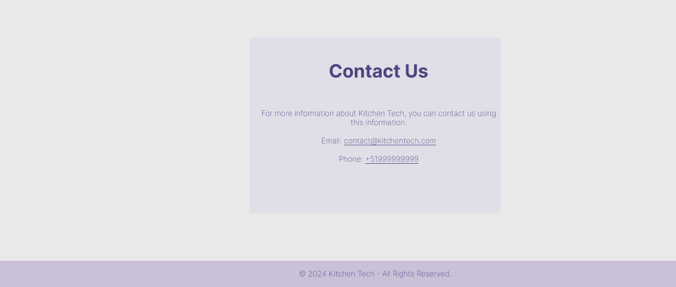

# Capítulo IV: Product Design

## 4.1. Style Guidelines
A continuación, se presentan las directrices generales de estilo que definirán la presentación y consistencia visual de nuestra solución, enfocada los servicios de nuestros clientes. Estas guías aseguran que el diseño mantenga una coherencia en todos los puntos de contacto con el usuario, garantizando una experiencia visual fluida y profesional. 

### 4.1.1. General Style Guidelines
#### Branding

#### Typography

#### Colors

#### Spacing
El diseño utiliza un sistema de espaciado basado en múltiplos de 8px para asegurar consistencia entre los distintos elementos de la interfaz. Este sistema permite mantener un ritmo visual agradable y ordenado, mejorando la experiencia de usuario.

Margen y Padding: 8px, 16px, 32px 

Separación entre secciones principales: 64px 
#### Icons

#### Images or Illustrations

### 4.1.2 Web Style Guidelines
En nuestras pautas de estilo web, priorizamos la adaptación de nuestros principios de diseño a la experiencia de usuario en entornos de navegación en línea. Esto incluye:

+ **Diseño Responsivo:** Establecemos directrices para la adaptación de la interfaz a diferentes tamaños de pantalla, como los formatos 16:9, desde computadoras de escritorio hasta tabletas. Garantizamos que la experiencia de usuario sea óptima en diversos dispositivos.
+ **Navegación:** Para una navegación intuitiva, utilizaremos una barra de navegación (Navbar) para organizar los menús en el caso de la landing page, para la web app utilizaremos un sidebar para un mayor entendimiento y mayor rapidez en la adaptabilidad del usuario para con la aplicación. Además, como parte de las prácticas de diseño responsivo, implementaremos un "Botón hamburguesa" en el menú para facilitar la navegación en pantallas más pequeñas.

### 4.1.3 Mobile Style Guidelines
#### 4.1.3.1  iOS Mobile Style Guidelines
Para nuestra versión móvil, nos enfocamos en optimizar la experiencia en dispositivos móviles, asegurando una interfaz eficiente y amigable para el usuario. Esto incluye: 

+ **Diseño de Pantalla:** Definimos la disposición de elementos en pantallas más pequeñas, considerando proporciones específicas para Android y iOS, para garantizar una usabilidad efectiva y una navegación sencilla. 
+ **Adaptación de Contenido:** Ofrecemos recomendaciones para adaptar y priorizar el contenido en dispositivos móviles, manteniendo su relevancia y utilidad, y asegurando una experiencia de usuario coherente en diferentes sistemas operativos móviles. 
+ **Compatibilidad de Dispositivos:** Aseguramos que la aplicación móvil sea compatible con una amplia variedad de dispositivos y sistemas operativos móviles, abarcando tanto Android como iOS.

#### 4.1.3.2 Android Mobile Style Guidelines
Para la versión móvil de Android, nos enfocamos en optimizar la experiencia del usuario en dispositivos móviles, asegurando una interfaz eficiente y amigable. Esto incluye:

+ **Diseño de Pantalla:** Definimos la disposición de elementos en pantallas más pequeñas, considerando proporciones específicas para Android y iOS, para garantizar una usabilidad efectiva y una navegación sencilla.
+ **Adaptación de Contenido:** Ofrecemos recomendaciones para adaptar y priorizar el contenido en dispositivos móviles, manteniendo su relevancia y utilidad, y asegurando una experiencia de usuario coherente en diferentes sistemas operativos móviles.
+ **Compatibilidad de Dispositivos:** Aseguramos que la aplicación móvil sea compatible con una amplia variedad de dispositivos y sistemas operativos móviles, abarcando tanto Android como iOS.
+ **IoT Style Guidelines:** Nuestro enfoque en las pautas de estilo para dispositivos IoT, como sensores de movimiento y sonido, se centra en la presentación clara de datos y la eficiencia en la comunicación de información esencial. Aquí están los aspectos clave: 
Tendremos una seccion  de simulación donde consumiremos las respuestas de los sensores y en base a este en la seccion de simulación se mostrará una imagen representativa del estado de los comensales en una mesa.

## 4.2 Information Architecture
### 4.2.1 Organization Systems
Establecer una jerarquía visual clara es fundamental para la creación de una página web altamente optimizada. Esto se debe a la forma en que nuestros sistemas visuales están interconectados; tenemos la tendencia natural de escanear y procesar rápidamente diversos elementos visuales, como bordes, contrastes, tamaños y movimientos, para evaluar y comprender nuestro entorno. Esta dinámica es aplicable tanto si estamos contemplando un paisaje impactante como si estamos navegando por una página web. Luego se presentarán ejemplos de la jerarquía visual que se prevé implementar en nuestras aplicaciones. 

El flujo que deseamos que los usuarios experimenten al ingresar a la aplicación se describe de la siguiente manera: 

+ En principio, el usuario ingresa sesión o se registra, para poder acceder a los servicios que brindamos este debe primero adquirir uno de nuestros planes de subscripción. 
+ Luego de iniciar sesión y adquirir una licencia, el usuario puede acceder a nuestros servicios que están ordenados en un sidebar para un mayor entendimiento por parte del usuario. 
+ El flujo es el siguiente, el usuario registra una nueva cuenta indicando la cantidad de comensales, su engargado y más datos relevantes mediante un formulario. 
+ Luego de realizar ello, pasamos a una sección de simulación donde se definirá el estado de los comensales y su mesa en sí, gracias a los datos devueltos por los sensores de movimientos y sonidos. 
+ Con estos datos, la aplicación puede ofrecer un servicio personalizado automático con alertas que se delegará a los meseros, que podrán revisar en qué estado se encuentra cada mesa y cómo afecta a su flujo.

### 4.2.2 Labelling System
En esta sección, presentaremos el sistema de etiquetado que proporcionará una descripción concisa y clara de la información presentada en cada aplicación. Comenzaremos detallando los encabezados que estarán disponibles en nuestra Landing page. \

+ **Inicio/Home:** Esta sección preseleccionada por defecto ofrecerá una breve descripción que representará la aplicación y proporcionará una idea del objetivo principal de esta. 
+ **Conócenos/About Us:** En esta sección, los clientes podrán obtener información sobre nuestro equipo, ver nuestra misión, visión, conocer quiénes somos y qué hacemos. 
+ **IoT:** En esta sección, los clientes pueden ver información sobre cómo se implementará IoT en la aplicación y como este mejorará la administración del negocio del sector alimenticio. 
+ **Servicios/Services:** La sección de características se encuentra dividida en segmentos objetivos, donde mostraremos los beneficios que nuestro sistema ofrece para cada uno de ellos. 
+ **Team:**  En esta sección los clientes pueden ver al equipo de desarrollo de la aplicación. 
+ **Contact:** En esta sección, los clientes pueden comunicarse con el equipo de Kitchentech.

### 4.2.3 SEO Tags and Meta Tags

Para mejorar la visibilidad del servicio en los motores de busqueda, se añadiran etiquetas SEO y meta etiquetas en nuestra landing page. Los títulos y funciones core de nuestra appp están optimizados para atraer a los usuarios y a los motores de búsqueda.

### 4.2.4 Searching System

El sistema de búsquedas de la aplicación permitirá a los meseros buscar sus productos en una lista. Asi mismo, permitira guardarlos en favoritos de manera que aparezcan en la pagina principal a manera de tarjeta para un seleccionado mas eficiente. De la misma manera se desplegaran los pedidos pendientes y las mesas.

### 4.2.5 Navigation System
El sistema de navegacion princpial de la aplicacion sera una barra lateral la cual contara con accesos rapidos a todas las funcionalidades de la aplicacion: Caja, pedidos guardados, historial de ventas, reporte de ventas, inventario, movimientos de caja y productos

## 4.3 Landing Page UI Design
### 4.3.1 Landing Page Wireframe

### 4.3.2 Landing Page Mock-up

## 4.4 Mobile Applications UX/UI Design
### 4.4.1 Mobile Application Wireframes

### 4.4.2 Mobile Application Wireflow Diagrams

### 4.4.3 Mobile Application Mock-ups

### 4.4.4 Mobile Application User Flow Diagrams

## 4.5 Mobile Applications Prototyping
### 4.5.1 Android Mobile Application Prototyping
Para la aplicación móvil de Android, se ha desarrollado un prototipo que permite a los usuarios interactuar con las funcionalidades principales de la aplicación. Este prototipo incluye pantallas para el registro de usuarios, inicio de sesión, gestión de pedidos y visualización de datos en tiempo real. A continuación se presentan algunas capturas de pantalla del prototipo:

### 4.5.2 iOS Mobile Application Prototyping
Para la aplicación móvil de iOS, se ha creado un prototipo que permite a los usuarios experimentar con las funcionalidades clave de la aplicación. Este prototipo incluye pantallas para el registro de usuarios, inicio de sesión, gestión de pedidos y visualización de datos en tiempo real. A continuación se presentan algunas capturas de pantalla del prototipo:

## 4.6 Web Application UX/UI Design
### 4.6.1 Web Application Wireframes
#### Wireframes Web Application

#### Wireframes Web Application - Segmento Meseros

#### Wireframes Web Application - Segmento Administradores

### 4.6.2 Web Application WireFlow Diagrams

### 4.6.3 Web Application Mock-ups
#### Mock-ups Web Application

#### Mock-ups Web Application - Segmento Meseros

#### Mock-ups Web Application - Segmento Administradores

### 4.6.4 Web Application User Flow Diagrams

## 4.7 Web Applications Prototyping

Link del Figma: https://www.figma.com/design/nyBckh8w59BwWU4cN4DRW9/IoT?node-id=0-1&t=utGFI0ZMZzi5lOJL-1

## 4.8 Domain-Driven Software Architecture 

### 4.8.1 Sofware Architecture Context Diagram
Este diagrama desglosa el contexto a un nivel más detallado, mostrando las interacciones entre los usuarios y el sistema en términos de roles y permisos. Aquí, tanto los Usuarios como los Administradores tienen acceso al Sistema de Gestión Empresarial, pero interactúan de manera diferente, con los usuarios accediendo a características específicas como pagos a través de la API, y los administradores gestionando la autenticación de usuarios.

### 4.8.2 Software Architecture Container Diagram
Aquiespecificamos los contenedores de software que soportan la arquitectura, como la Aplicación Web (Web App), la Aplicación Móvil (Mobile App), el Backend y los Dispositivos IoT Gestionados (Managed IoT Devices). Aquí también se destacan las conexiones con el Sistema de Autenticación y la API de Pago, lo que proporciona un mapa claro de cómo los distintos módulos del sistema se comunican entre sí y con componentes externos.

### 4.8.3 Software Architecture Components Diagram
Este diagrama muestra la arquitectura de software a nivel de componentes dentro de un contexto limitado (Bounded Context). Incluye diferentes componentes del sistema, como servicios o módulos, que interactúan entre sí y con una base de datos central. Cada componente representa una parte del sistema que maneja responsabilidades específicas, y las líneas entre ellos indican el flujo de comunicación. La base de datos actúa como un punto central para el almacenamiento y recuperación de datos, conectando a los distintos componentes. Este diagrama es fundamental para comprender cómo se organiza el sistema en términos de módulos funcionales y su interacción.

Este diagrama muestra la arquitectura a nivel de componentes dentro de un contexto limitado. Incluye componentes como el Authentication API, User Service, y User Profile Service que se comunican entre sí y con una base de datos central. Representa cómo cada componente se encarga de una funcionalidad específica del sistema y cómo se intercambian mensajes entre ellos para cumplir con los requisitos del negocio. La base de datos se presenta como el repositorio central de datos al que acceden los servicios. Este diagrama es crucial para entender la organización modular del sistema y cómo se orquesta el flujo de información entre componentes.

Este diagrama muestra la organización de los principales componentes de software dentro de un contexto limitado (Bounded Context). Incluye componentes como el Environment Service, Tag Service, Customer Service, y User Service, que interactúan entre sí y con una base de datos central. Cada componente se encarga de una parte específica de la funcionalidad del sistema, como la gestión de entornos, etiquetas y clientes. El diagrama también muestra cómo estos componentes se comunican a través de APIs y colas de mensajería. La base de datos centralizada es el punto de conexión para el almacenamiento y acceso a los datos. Este nivel de vista ayuda a comprender cómo se organiza el sistema en módulos y cómo se gestionan las interacciones entre ellos.

Vemos el diagrama a nivel de componentes de arquitectura de software. En él se destacan varios componentes y su relación con un servidor en la nube, representando cómo se comunican entre sí y con el exterior. Cada componente parece tener una función específica dentro del sistema y se conectan entre ellos mediante líneas de interacción.

Este es un diagrama de componentes de arquitectura de software, donde los distintos módulos del sistema interactúan entre sí. Este diagrama presenta elementos como "Subscription", "PaymentGateway" y otros, conectados por líneas que indican flujos de datos o interacción. Además, hay representación de un almacenamiento central, probablemente una base de datos, que respalda estas interacciones.

Este diagrama a nivel de componentes donde varios módulos del sistema, como "NotificationManager" y "User", están conectados a una base de datos central. Estos componentes parecen intercambiar información, representando el flujo de datos entre diferentes elementos del sistema, probablemente en relación con la gestión de notificaciones y usuarios.

El diagrama muestra la interacción entre un servicio web REST y la base de datos a través de diferentes capas de lógica de negocio. El cliente interactúa con un Controller, que llama a Business Logic y Data Access Layer (DAL) para realizar operaciones. Luego, la DAL accede a la base de datos.

## 4.9 Software Object-Oriented Design

### 4.9.1 Class Diagrams
#### Bounded Context: Profile Management

#### Bounded Context: Identity and Access Management

#### Bounded Context: Business Management System

#### Bounded Context: IoT Asset Management

#### Bounded Context: Subscription and Payments

#### Bounded Context: Notification Management

#### Bounded Context: Data Report and Analytics

### 4.9.2 Class Dictionary
#### Bounded Context: Profile Management
| Class Name | Description                                                                                           |
|------------|-------------------------------------------------------------------------------------------------------|
| Role       | Representa los diferentes roles de usuario en el sistema, como administrador, mesero, etc.            |
| User       | Representa a los usuarios del personal, como meseros y administradores, que tienen acceso al sistema. |
| Restaurant | Representa un restaurante, incluyendo su nombre, ubicación y otros detalles relevantes.               |

#### Bounded Context: Identity and Access Management
| Class Name            | Description                                                             |
|-----------------------|-------------------------------------------------------------------------|
| IdentityAccessManager | Gestiona la autenticación y autorización de los usuarios en el sistema. |
| FireBaseAuth          | Proporciona la funcionalidad de autenticación utilizando Firebase.      |

#### Bounded Context: Business Management System
| Class Name | Description                                                                                              |
|------------|----------------------------------------------------------------------------------------------------------|
| Client     | Representa a los clientes del restaurante, incluyendo su información de contacto y preferencias.         |
| Account    | Representa la cuenta de un cliente, incluyendo detalles de facturación y pagos.                          |
| Product    | Representa los productos ofrecidos por el restaurante, incluyendo su nombre, precio y categoría.         |
| Supply     | Representa los suministros necesarios para la operación del restaurante, incluyendo su cantidad y costo. | |

#### Bounded Context: IoT Asset Management
| Class Name | Description                                                               |
|------------|---------------------------------------------------------------------------|
| Table      | Representa una mesa en el restaurante, incluyendo su número y capacidad.  |
| Sensor     | Representa un sensor IoT, incluyendo su tipo y estado.                    |
| Location   | Representa la ubicación de un sensor o dispositivo IoT en el restaurante. |
| SensorType | Representa el tipo de sensor, como sensor de movimiento o sonido.         |

#### Bounded Context: Subscription and Payments
| Class Name          | Description                                                                                               |
|---------------------|-----------------------------------------------------------------------------------------------------------|
| SubscriptionManager | Gestiona las suscripciones de los clientes, incluyendo la activación y cancelación.                       |
| PaymentGateway      | Proporciona la funcionalidad de procesamiento de pagos, incluyendo la integración con servicios externos. |
| PaymentPolicy       | Define las políticas de pago, incluyendo métodos aceptados y términos de servicio.                        |

#### Bounded Context: Notification Management
| Class Name          | Description                                                                              |
|---------------------|------------------------------------------------------------------------------------------|
| NotificationManager | Gestiona las notificaciones enviadas a los usuarios, incluyendo alertas y recordatorios. |
| Notification        | Representa una notificación, incluyendo su tipo, contenido y estado.                     |
| CustomerAlert       | Representa una alerta enviada a un cliente, incluyendo su contenido y estado.            |

#### Bounded Context: Data Report and Analytics
| Class Name     | Description                                                                                |
|----------------|--------------------------------------------------------------------------------------------|
| SoundManager   | Gestiona los sonidos y alertas emitidos por el sistema, incluyendo su configuración.       |
| MotionManager  | Gestiona los datos de movimiento de los sensores, incluyendo su análisis y almacenamiento. |
| PaymentManager | Gestiona los pagos realizados por los clientes, incluyendo su procesamiento y registro.    |

## 4.10. Database Design
## 4.10.1. Relational/Non-Relational Database Diagram. 

#### Bounded Context: Profile Management

#### Bounded Context: Identity and Access Management

#### Bounded Context: Business Management System

#### Bounded Context: IoT Asset Management

#### Bounded Context: Subscription and Payments

#### Bounded Context: Notification Management

#### Bounded Context: Data Report and Analytics

