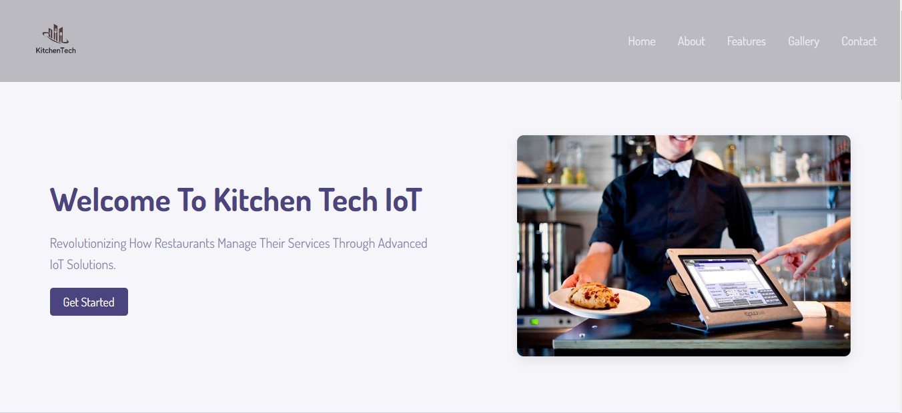
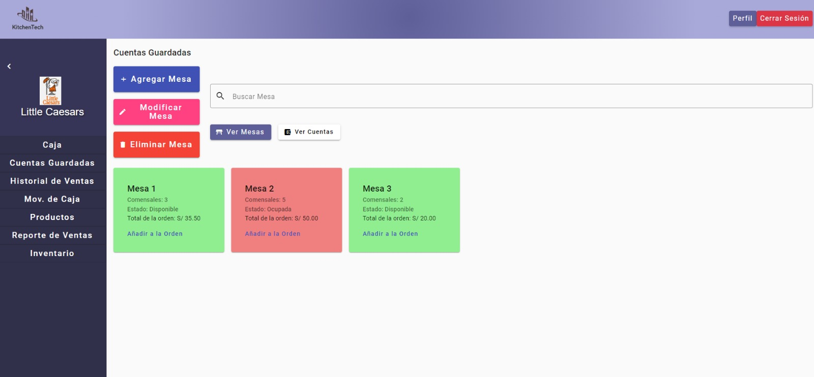
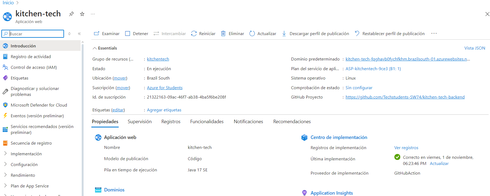

# Capitulo V: Product Implamentation

## 5.1 Software Configuration Management 
### 5.1.1 Software Development Environment Configuration
En esta sección se presentan los softwares correspondientes utilizados por los miembros del equipo y los enlaces utilizados para que cada uno tenga asignado el rol de administrador y pueda ejecutar sus cambios al proyecto:  
- **Miro:** Event Storming, Candidate Context Discovery, Domain Message Flows Modeling, Bounded Context Canvases
*Imagen*

Enlace del miro: https://miro.com/app/board/uXjVKkI6spU=/ 

- *Lucidchart:* Context Mapping, DDD Bounded Context Class Diagram
  
*Imagen*

- *Structurizr:* C4 Model System, Container, Component Diagram
  
*Imagen*

- *Vertabelo:* DDD Database Diagram
  
*Imagen*

- *Visual Paradigm:* Bounded Context Component Diagram
  
*Imagen*

- *Visual Studio Code:* Software Development
  
*Imagen*

  
- *Figma:* Web/Mobile Prototype & User Flow
  
*Imagen*

Enlace del figma: https://www.figma.com/design/nyBckh8w59BwWU4cN4DRW9/IoT?node-id=27-667&node-type=canvas&t=yWeXn4Jr6F7oE6yY-0 

### 5.1.2 Source Code Management
El manejo y la gestión de las diferentes modificaciones que se llevaron a cabo, fueron mediante una organización de GitHub para nuestro Startup. 

Organización: https://github.com/Techstudents-SW74 

Repositorio de Landing Page: https://github.com/Techstudents-SW74/LandingPage 

Deployment del Landing Page: https://techstudents-sw74.github.io/ 

Asimismo, se establecieron dos ramas correspondientes para el desarrollo:  

- Main: esta rama cuenta con la versión estable de nuestra landing page luego de que cada componente haya sido aprobado mediante una pull request. 

- develop: esta rama cuenta con versiones donde se pusieron a prueba los componentes que cada integrante implemento a la landing page

### 5.1.3 Source Code Style Guide & Conventions

###HTML:
Se aplicarán las directrices de “HTML Style Guide and Coding” de W3Schools, destacando convenciones clave como declarar siempre el tipo de documento (<!DOCTYPE>), utilizar etiquetas y atributos en minúsculas para mantener un código limpio y organizado, y cerrar todas las etiquetas para prevenir errores. Se colocarán comillas en los valores de los atributos y se especificarán siempre los atributos alt, width y height en las imágenes para mejorar la accesibilidad y el SEO. Además, no se omitirán las etiquetas <head> y los metadatos esenciales para la optimización en motores de búsqueda.

### CSS:
Basado en la “Google HTML/CSS Style Guide”, se seguirán prácticas recomendadas como usar nombres de clase generales, cortos y descriptivos, empleando guiones para separar palabras. Se evitarán los selectores de ID, priorizando selectores de clase, y se utilizarán propiedades abreviadas como margin, padding, y border para mejorar la legibilidad y reducir el número de líneas de código. Estas convenciones aseguran un estilo CSS más limpio y escalable.

### JavaScript:
Se implementarán las “JavaScript Best Practices” recomendadas por el W3C, priorizando nombres cortos y fáciles de entender para variables y funciones. Se evitará el uso de variables globales (var), prefiriendo let o const para evitar colisiones de nombres y errores a largo plazo. Se documentarán y comentarán solo las partes necesarias del código, explicando las secciones complejas, y se adoptarán notaciones y operadores sencillos para manipular estructuras de datos.

### Gherkin:
Para las pruebas, se seguirá la guía “Gherkin Conventions for Readable Specifications”, organizando claramente los bloques Given-When-Then mediante la indentación adecuada y el uso de la palabra clave "And" para pasos adicionales. Se utilizarán tablas cuando los pasos requieran mayor información y se emplearán comillas simples para los parámetros en los escenarios, mejorando la legibilidad. Los escenarios múltiples se separarán con comentarios para facilitar la organización visual.

### Frontend y Backend:
La landing page y las aplicaciones web seguirán las pautas de diseño de Material Design, utilizando Angular Material como biblioteca de componentes de UI. El frontend será desarrollado en Angular Framework, combinando HTML5, CSS3 y JavaScript/TypeScript para los aspectos estáticos y lógicos de las aplicaciones. En el backend, se implementarán servicios web bajo el estilo arquitectónico RESTful API usando Spring Boot y Java como lenguaje principal.

### Control de versiones:
El control de versiones será gestionado con GIT desde GitHub, siguiendo las prácticas de GitFlow Workflow junto con Conventional Commits y Semantic Versioning. Esto permitirá una integración continua, con despliegues automáticos y manejo eficiente de hotfixes.

### 5.1.4 Software Deployment Configuration
La siguiente tabla presenta los commits del repositorio del landing page en GitHub:

| Id del commit                            | Commit                                                                  |
|------------------------------------------|-------------------------------------------------------------------------|
| babf1bf8b1439d841dc4fde5b33f2aac61105ce0 | Initial commit                                                          |
| 6aff73d0b39a7c9a4d5ae1c99d9338f9c6bd662d | Part 1                                                                  |
| b001457e48e36f514a12f978dbb9475c25c50e06 | Part 2                                                                  |
| -                                        | Merge branch 'main' of https://github.com/Techstudents-SW74/LandingPage |
| 70f08b4f25df21ae3535a38c6a58269014181cfd | Part 3                                                                  |
| bd7bee8feec07792a080e8d29913ebeb7db84b6e | Part 4                                                                  |
| d38272d239da0f26d26452496e6d3e89f8a871fe | (feat) "add header & footer"                                            |

## 5.2 Produt Implementation & Deployment
En esta sección, se explicará y evidenciará el proceso de despliegue para la Landing page de nuestro startup, utilizando la herramienta de despliegue. Para lograr este objetivo se utilizó el CLI de esta herramienta y el GitHub donde se creó el repositorio. 

### 5.2.1 Sprint Backlogs

<table>
  <tr>
    <th colspan="2">Sprint #</th>
    <th colspan="6">Sprint </th>
  </tr>
  <tr>
    <th colspan="2">User Story</th>
    <th colspan="6">Work-Item / Task</th>
  </tr>
  <tr>
    <th>Id</th>
    <th>Title</th>
    <th>Id</th>
    <th>Title</th>
    <th>Description</th>
    <th>Estimation (Hours)</th>
    <th>Assigned to</th>
    <th>Status</th>
  </tr>
  <tr>
    <th>US001</th>
    <th>Seccion de Header </th>
    <th>2</th>
    <th>Seccion de Header</th>
    <th>COMO usuario QUIERO visualizar un encabezado de página que contenga opciones PARA una mejor navegación por la página. </th>
    <th>2</th>
    <th>Fabrizzio Castro</th>
    <th>Done</th>
  </tr>
</table>

### 5.2.2 Implemented Landing Page Evidence
Vistas desarrolladas: Landing page (Hero section):

Landing page (About us):

Landing page (Members):

Landing page (IOT features):

Landing page (Galelry section):

Landing page (Contact section y footer):

### 5.2.3 Implemented Frontend-Web Application Evidence

Vistas desarrolladas: Web app (profile):

Web app (login):

Web app (sign up):

Web app (caja):

Web app (cuentas guardadas):

Web app (mov. de caja):

Web app (productos):

### 5.2.4. Implemented Native-Mobile Application Evidence

### 5.2.5. Implemented RESTful API and/or Serverless Backend Evidence

Esta sección recopila la evidencia del despliegue de software realizado durante el Sprint. Se incluyen capturas y registros que muestran el proceso de implementación en el entorno correspondiente, verificando que el despliegue se llevó a cabo correctamente y que el sistema cumple con los requisitos definidos para el Sprint Review.

### 5.2.6. RESTful API documentation

### 5.2.7. Team Collaboration Insights

## 5.3. Video About-the-Product.

Link del video: 

https://www.youtube.com/watch?v=rSsDI6MaP-4
