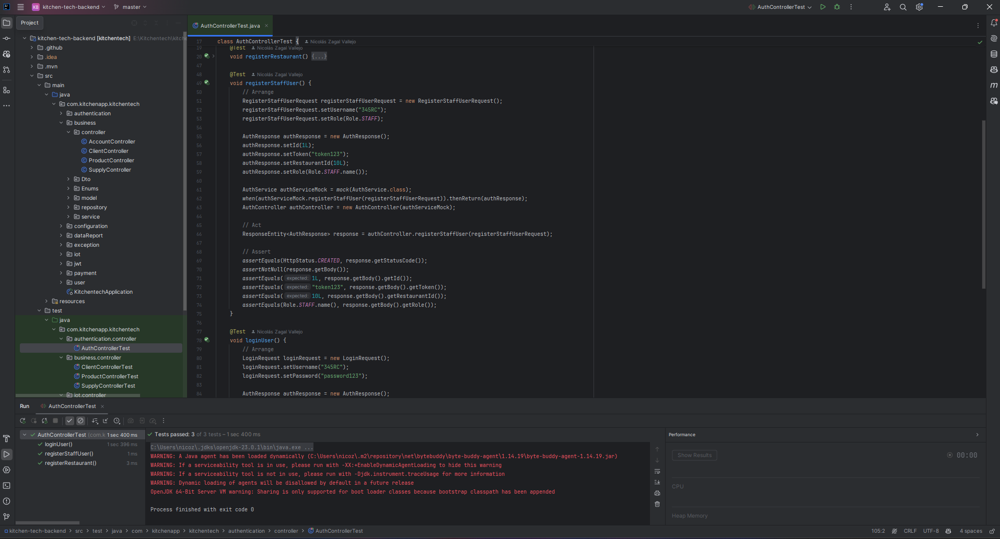
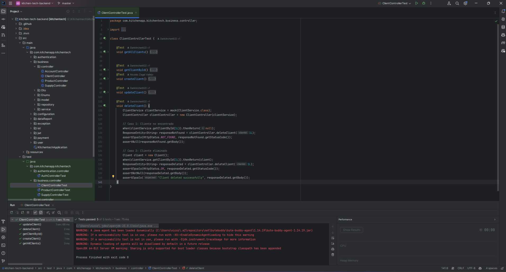
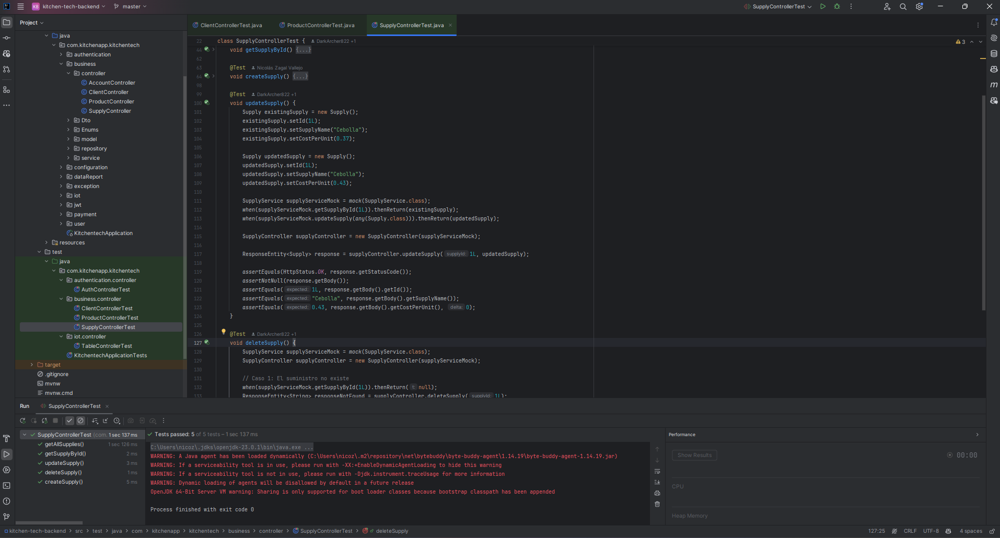
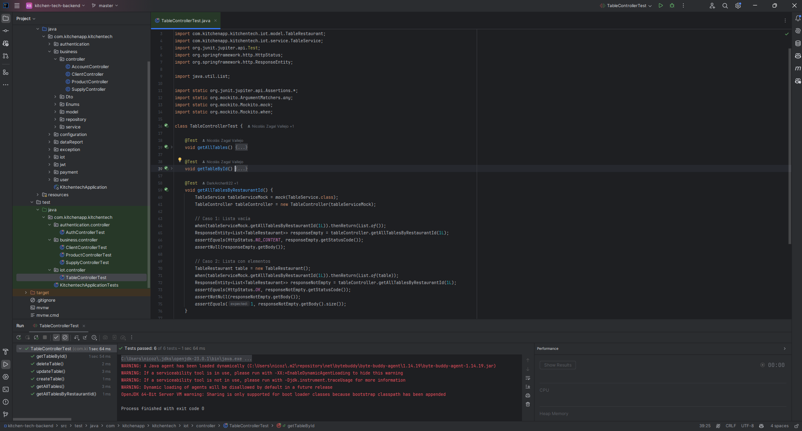
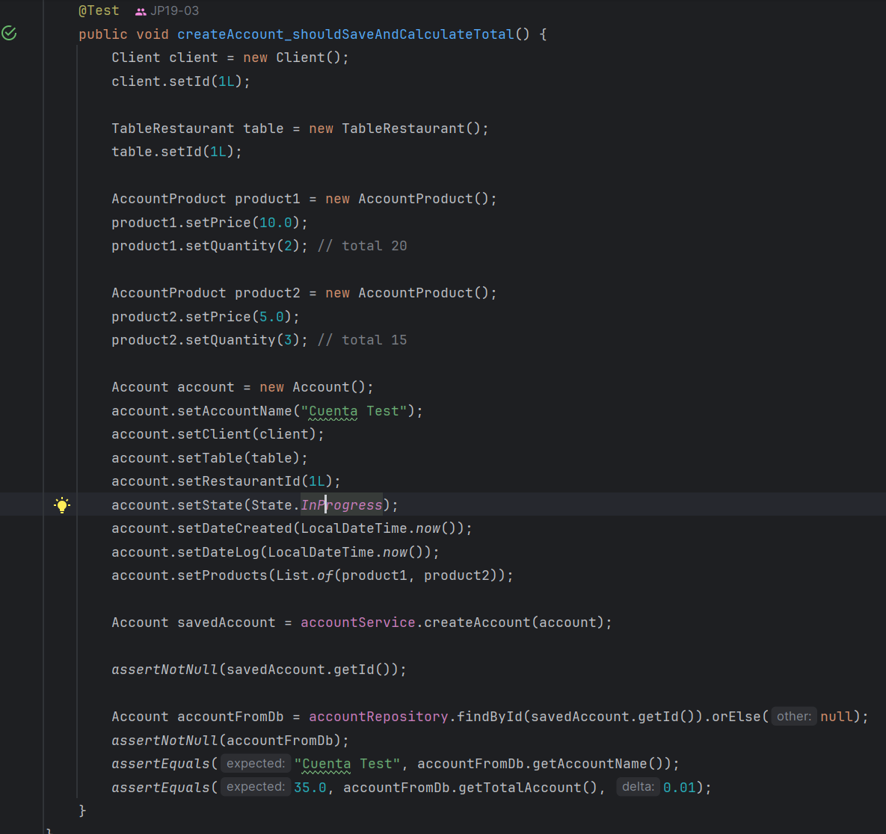
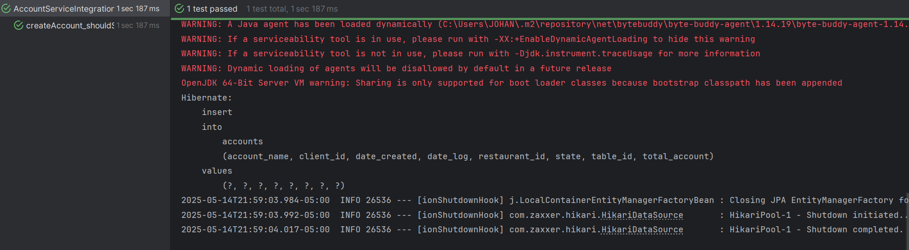
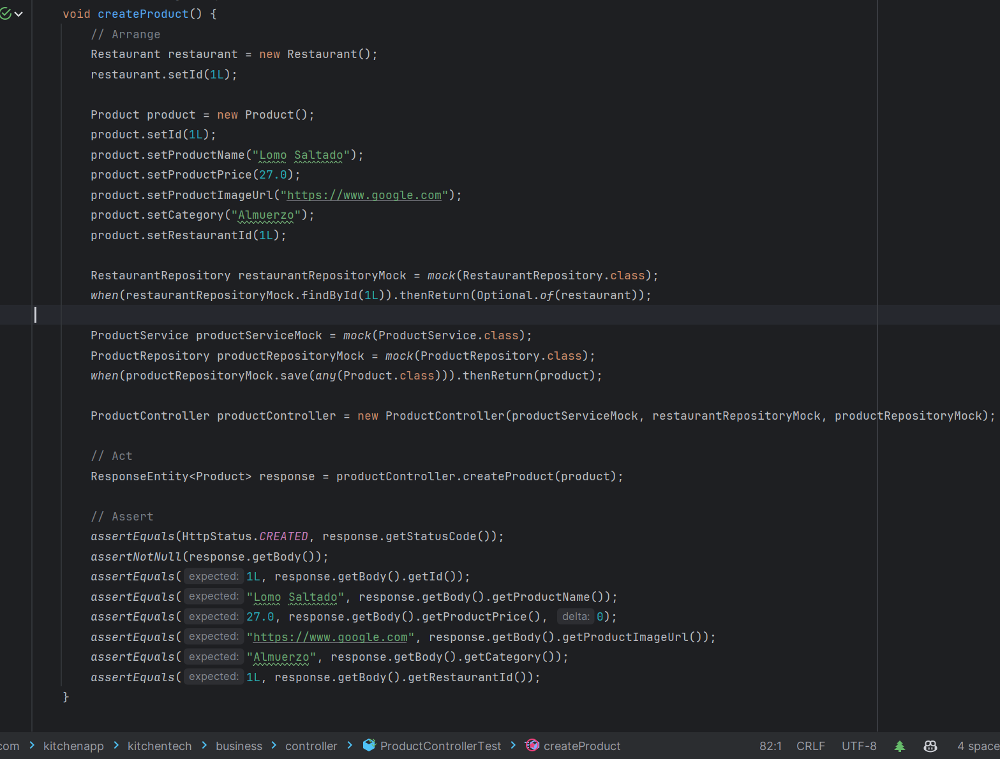
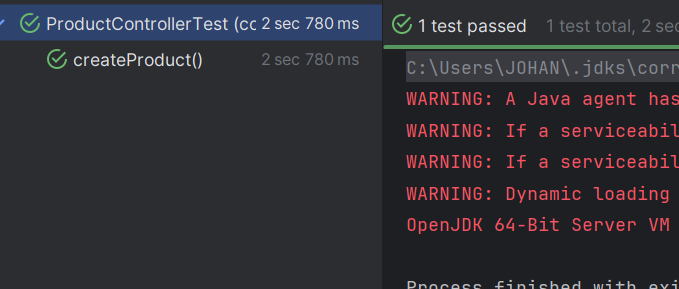

# Capitulo VI: Product Verification & Validation

## 6.1 Testing Suites & Validation
### 6.1.1 Core Entities Unit Tests
Realizar pruebas unitarias a las distintas entidades del sistema y sus metodos es fundamental para asegurar que cada componente funcione de manera independiente y cumpla con los requisitos establecidos. En este caso, se han realizado pruebas unitarias a las entidades de la aplicación web KitchenTech, utilizando la herramienta "JUnit" y "Mockito" para validar el correcto funcionamiento de las clases y métodos implementados.

Para ello, se han creado pruebas unitarias para las siguientes entidades:
### **Authentication**

### **Client**

### **Product**

### **Supply**

### **Table**

### 6.1.2 Core Integration Tests

Esta prueba verifica que el servicio de cuentas (`AccountService`) funcione correctamente cuando interactúa con su repositorio y la base de datos, específicamente para el proceso de creación de cuentas y cálculo automático del total.

#### Componentes bajo prueba:
- **AccountServiceImpl**: Servicio principal que contiene la lógica de negocio
- **AccountRepository**: Repositorio para persistencia y recuperación de datos

#### Flujo de integración:
1. Se preparan los objetos necesarios (cliente, mesa, productos)
2. Se crea una cuenta con productos asociados
3. Se invoca `accountService.createAccount()` que debe:
    - Guardar la información en la base de datos
    - Calcular el total sumando los productos
4. Se recupera la cuenta desde el repositorio para verificar la persistencia

#### Verificaciones:
- Se genera un ID válido para la cuenta creada
- La cuenta persiste correctamente en la base de datos
- El nombre de la cuenta se guarda correctamente
- El cálculo del total es correcto: 35.0 (10×2 + 5×3)

Esta prueba verifica que el método `createProduct` del `ProductController` funcione correctamente al crear un nuevo producto en el sistema. El método debe validar la existencia del restaurante, mapear los datos del producto y persistirlo en la base de datos.

#### Componentes simulados:
- **RestaurantRepository**: Para verificar la existencia del restaurante
- **ProductRepository**: Para persistir el nuevo producto
- **ProductService**: Servicio de productos (aunque no se utiliza directamente en este método)

#### Flujo del proceso verificado:
1. Se recibe un objeto Product como cuerpo de la petición
2. Se verifica que el restaurante asociado exista
3. Se mapean los datos del producto desde el DTO recibido
4. Se persiste el producto en la base de datos
5. Se devuelve el producto creado con un código HTTP 201 (CREATED)

#### Verificaciones:
- El código de respuesta HTTP es 201 (CREATED)
- El objeto devuelto no es nulo
- Todos los campos del producto devuelto coinciden con los valores esperados:
    - ID: 1
    - Nombre: "Lomo Saltado"
    - Precio: 27.0
    - URL de imagen: "https://www.google.com"
    - Categoría: "Almuerzo"
    - ID de Restaurante: 1

### 6.1.3 Core Behavior-Driven Development
Esta sección se centra en cómo el equipo definirá y validará el comportamiento esperado de nuestra aplicación web KitchenTech directamente desde la perspectiva de nuestros usuarios. Utilizaremos Cucumber como nuestra herramienta principal, redactando escenarios de usuario claros y concisos que describan el flujo de interacción con KitchenTech. Estos escenarios serán comprobados utilizando selenium.

| Historia de Usuario | E07_US030                                |
|---------------------|------------------------------------------|
|Descripción          | Ingresar nuevos productos al inventario. |
|Cucumber             | Scenario: Se agrega producto nuevo   Given que el usuario agrega un producto nuevo   When hace click en "add Supply" and completa el formulario and hace click en "save"   Then el producto se añade a la lista de productos             |
|Resultado            | Se puede observar que la funcionalidad de añadir un nuevo producto es funcional para los usuarios y puede ser automatizada. |

| Historia de Usuario | E07_US032                                |
|---------------------|------------------------------------------|
|Descripción          | Editar insumos existentes. |
|Cucumber             | Scenario: Se selecciona un insumo existente   Given que el usuario edite el insumo seleccionado   When hace click en "Edit" and renueve los datos en el formulario and hace click en "Update"   Then los datos se actualizan en la lista de insumos                |
|Resultado            | Se puede observar que la funcionalidad de editar un insumo existente es funcional para los usuarios y puede ser automatizada. |

### 6.1.4 Core System Tests
Para llevar a cabo las core system test se ha utilizado "Lighthouse" como herramienta. Con esta herramienta se han realizado las pruebas de rendimiento general de la aplicación web kitchentech ya desplegada, accesibilidad y mejores prácticas. La siguiente figura muestra los resultados de dichas pruebas.

