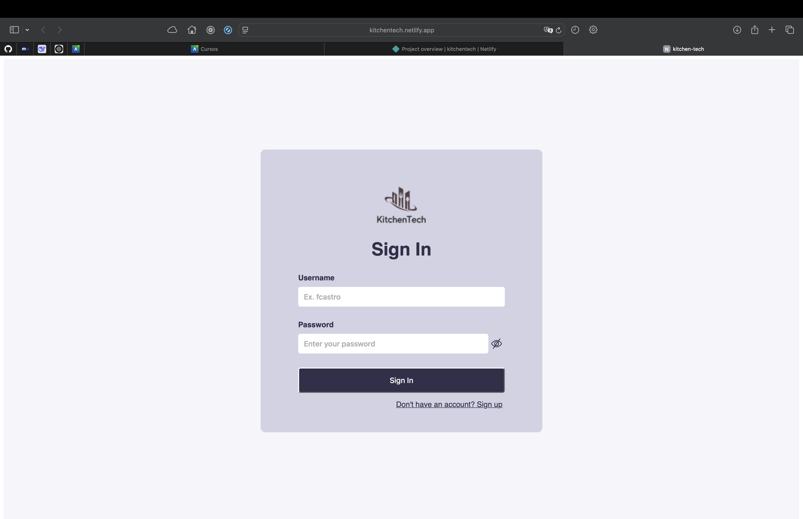

# Capítulo VIII: Experiment-Driven Development

## 8.1. Experiment Planning

Este capítulo se centra en la planificación de experimentos, que es una parte crucial del desarrollo impulsado por
experimentos. Aquí se definen las preguntas de investigación, se identifican las hipótesis y se planifican los
experimentos necesarios para validar o refutar estas hipótesis.

### 8.1.1. As-Is Summary

Kitchentech es una solución ERP para restaurantes, orientada a mejorar la eficiencia operativa y la experiencia del
usuario mediante nuevas funcionalidades. El desarrollo ágil permite iterar rápidamente, pero es fundamental validar el
impacto real de cada mejora a través de experimentos controlados y medibles

### 8.1.2. Raw Material: Assumptions, Knowledge Gaps, Ideas, Claims.

**Assumptions**:

1. Los usuarios de Kitchentech valoran la eficiencia operativa y la facilidad de uso.
2. Las nuevas funcionalidades propuestas pueden impactar positivamente la experiencia del usuario y la eficiencia
   operativa.
3. Los usuarios están dispuestos a adoptar nuevas características si estas son fáciles de usar y aportan valor.
4. Los usuarios tienen diferentes necesidades y preferencias que deben ser consideradas al diseñar nuevas
   características.
5. La implementación de nuevas características no afectará negativamente a las funcionalidades existentes.

**Knowledge Gaps**:

1. 쯈ué funcionalidades valoran más los usuarios actuales?
2. 쯈ué problemas específicos enfrentan los usuarios al utilizar Kitchentech?
3. 쮺칩mo se pueden medir de manera efectiva las mejoras en la experiencia del usuario y la eficiencia operativa?
4. 쯈ué métricas son más relevantes para evaluar el éxito de las nuevas características?
5. 쯈ué impacto tendrán las nuevas características en la carga de trabajo de los usuarios y en la eficiencia operativa
   general?

**Ideas**:

1. Implementar un historial ventas para que los administradores puedan recopilar las ganancias y ventas emitidas.
2. Desarrollar una función de pago de cuentas con diversos métodos de pago para agilizar el proceso de cobro.
3. Añadir un panel de "Top productos" en el dashboard del administrador para facilitar la toma de decisiones sobre el
   menú.
4. Habilitar la opción de anular ventas de manera que se puedan ratificar cobros erróneos sin eliminar las ventas.

**Claims**:

1. La implementación de un historial de ventas mejorará la recopilación de datos del servicio.
2. Los pagos con diversos métodos reducirá el tiempo de cobro y minimizará errores.
3. Mostrar los productos más vendidos optimizará la gestión del menú y aumentará las ventas.
4. Establecer ventas como anuladas ayudará a ratificar errores.

### 8.1.3. Experiment-Ready Questions

1. 쯋n historial de ventas mejora la capacidad de los gerentes para obtener insights rápidos y tomar mejores decisiones?
2. 쯃a implementación de un sistema de pago rápido reduce el tiempo de cobro y errores en el proceso?
3. 쯃a visibilidad de los productos más vendidos mejora la gestión del menú?
4. 쮸nular ventas mejorará la solución de errores por cobros mal efectuados?

### 8.1.4. Question Backlog

| # | Pregunta                                                                                                              | Impacto Potencial                          |
|---|-----------------------------------------------------------------------------------------------------------------------|--------------------------------------------|
| 1 | 쯋n historial de ventas mejora la capacidad de los gerentes para obtener insights rápidos y tomar mejores decisiones? | Medio-Alto (mejora toma de decisiones)     |
| 2 | 쯃a implementación de un sistema de pago rápido reduce el tiempo de cobro y errores en el proceso?                    | Alto (mejora experiencia y reduce errores) |
| 3 | 쯃a visibilidad de los productos más vendidos mejora la gestión del menú?                                             | Medio (optimiza decisiones de menú)        |
| 4 | 쮸nular ventas mejorará la solución de errores por cobros mal efectuados?                                             | Alto (reduce errores y demoras)            |

### 8.1.5. Experiment Cards

### 🧪 *Experiment Card 1: Historial de Ventas*

| *Supuestos*                                                           | *Question Backlog*                                     |
|-----------------------------------------------------------------------|--------------------------------------------------------|
| Los gerentes necesitan analizar tendencias de ventas de forma rápida. | 쯋n historial de ventas  mejora la toma de decisiones? |

| *Experiment Card* |                                                                                                                                                                      |
|-------------------|----------------------------------------------------------------------------------------------------------------------------------------------------------------------|
| *Question*        | 쯋n historial de ventas mejora la capacidad de los gerentes para obtener insights rápidos?                                                                           |
| *Why*             | Permite a los gerentes y administradores identificar rápidamente patrones, productos de alta demanda o rendimientos individuales, facilitando la toma de decisiones. |
| *What*            | Implementar un historial de ventas accesible desde el dashboard del administrador                                                                                    |
| *Hypothesis*      | Si se implementa un historial de ventas, los gerentes podrán identificar tendencias y tomar decisiones más informadas, mejorando la eficiencia operativa en un 20%.  |
| *Métricas*        | Tiempo promedio para generar reportes de ventas y número de insights accionables identificados.                                                                      |
| *Metas*           | -20% en tiempo de generación de reportes, +30% en insights accionables identificados.                                                                                |

### 🧪 *Experiment Card 2: Agregado rápido de productos frecuentes o recientes*

| *Supuestos*                                                                  | *Question Backlog*                                                                           |
|------------------------------------------------------------------------------|----------------------------------------------------------------------------------------------|
| Los usuarios suelen añadir repetidamente los mismos productos al inventario. | 쯋n acceso rápido a productos frecuentes o recientes reduce el tiempo de alta en inventario? |

| *Experiment Card* |                                                                                              |
|-------------------|----------------------------------------------------------------------------------------------|
| *Question*        | 쯋n acceso rápido a productos frecuentes o recientes reduce el tiempo de alta en inventario? |
| *Why*             | Agiliza la operación y disminuye errores por búsquedas manuales repetidas.                   |
| *What*            | Añadir botones para repetir productos recientes o frecuentes y medir el tiempo de registro.  |
| *Hypothesis*      | El tiempo en gestionar el inventario disminuye en al menos 25%.                              |
| *Métricas*        | Tiempo promedio de gestión del inventario.                                                   |
| *Metas*           | -25% en tiempo de demora en gestionar el inventario.                                         |

---

### 🧪 *Experiment Card 3: Pago de Cuentas*

| *Supuestos*                                                  | *Question Backlog*                                                         |
|--------------------------------------------------------------|----------------------------------------------------------------------------|
| El proceso de pago de cuentas es lento y propenso a errores. | 쯃a implementación de un sistema de pago rápido reduce el tiempo de cobro? |

| *Experiment Card* |                                                                                                           |
|-------------------|-----------------------------------------------------------------------------------------------------------|
| *Question*        | 쯃a implementación de un sistema de pago rápido reduce el tiempo de cobro?                                |
| *Why*             | Mejora la experiencia del cliente y reduce el tiempo de espera en el pago.                                |
| *What*            | Implementar un sistema de pago rápido con opciones de pago digital y medir el tiempo de cobro.            |
| *Hypothesis*      | Si se implementa un sistema de pago rápido, se reduce el tiempo de cobro en un 30% y se eliminan errores. |
| *Métricas*        | Tiempo promedio de cobro y cantidad de errores en el proceso de pago.                                     |
| *Metas*           | -30% en tiempo de cobro, -90% en errores, +15% en satisfacción del cliente                                |

### 🧪 *Experiment Card 4: Anulación de ventas*
| *Supuestos*                                                 | *Question Backlog*                                                      |
|-------------------------------------------------------------|-------------------------------------------------------------------------|
| Los errores de cobro son comunes y difíciles de corregir.   | 쮸nular ventas mejora la solución de errores por cobros mal efectuados? |

| *Experiment Card* |                                                                                                  |
|-------------------|--------------------------------------------------------------------------------------------------|
| *Question*        | 쮸nular ventas mejora la solución de errores por cobros mal efectuados?                          |
| *Why*             | Permite corregir errores sin eliminar datos, mejorando la trazabilidad.                          |
| *What*            | Implementar opción de anular ventas y medir el uso y efectividad.                                |
| *Hypothesis*      | Si se implementa la anulación de ventas, se reduce el tiempo de resolución de errores en un 20%. |
| *Métricas*        | Tiempo promedio de resolución de errores y número de anulaciones.                                |
| *Metas*           | -20% en tiempo de resolución de errores, +30% en satisfacción del usuario.                       |

## 8.2. Experiment Design

### 8.2.1. Hypotheses

| Hypothesis ID | Hypothesis                                                                                                                                                                             | Question ID |
|---------------|----------------------------------------------------------------------------------------------------------------------------------------------------------------------------------------|-------------|
| HYP001        | Si se implementa un historial de ventas por mesa, entonces los administradores podrán acceder rápidamente a la información de ventas anteriores, mejorando la eficiencia del servicio. | 1           |
| HYP002        | Si se implementa un acceso rápido a productos frecuentes o recientes en el inventario, entonces se reducirá el tiempo de gestión del inventario y se minimizarán los errores.          | 2           |
| HYP002        | Si se implementa una función de pago con diversos métodos, entonces los clientes podrán pagar rápidamente y se reducirán los tiempos de atención                                       | 3           |
| HYP003        | Si se habilita la función de anular ventas, entonces se podrán solucionar errores por cobros equivocados y disminuirán los tiempos de resolución de errores.                           | 4           |

### 8.2.2. Measures

| Measure ID | Measure Description                                        | Hypothesis ID |
|------------|------------------------------------------------------------|---------------|
| M001       | Número de errores en pedidos y tiempo promedio por pedido. | HYP001        |
| M002       | Variación en las ventas y cambios en el menú.              | HYP002        |
| M003       | Tiempos de respuesta y cantidad de errores en cocina.      | HYP003        |
| M004       | Tiempo promedio de gestión del inventario.                 | HYP004        |

### 8.2.3. Conditions

| Condition ID | Condition Description                                                                                                            | Measure ID |
|--------------|----------------------------------------------------------------------------------------------------------------------------------|------------|
| C001         | El historial de pedidos por mesa está implementado y disponible para los meseros.                                                | M001       |
| C002         | El panel de "Top productos" está visible en el dashboard del administrador y actualizado en tiempo real.                         | M002       |
| C003         | La mensajería interna está habilitada y utilizada por al menos el 70% de los meseros y cocineros.                                | M003       |
| C004         | El acceso rápido a productos frecuentes o recientes está implementado y utilizado en al menos el 60% de las altas de inventario. | M004       |

### 8.2.4. Scale Calculations and Decisions

| Scale ID | Scale Description                                                                                             | Condition ID |
|----------|---------------------------------------------------------------------------------------------------------------|--------------|
| S001     | Escala de satisfacción del usuario con el historial de pedidos: 1 (muy insatisfecho) a 5 (muy satisfecho).    | C001         |
| S002     | Escala de efectividad del panel de "Top productos": 1 (poco útil) a 5 (muy útil).                             | C002         |
| S003     | Escala de mejora en la coordinación con mensajería interna: 1 (sin mejora) a 5 (mejora significativa).        | C003         |
| S004     | Escala de eficiencia en la gestión del inventario con acceso rápido: 1 (muy ineficiente) a 5 (muy eficiente). | C004         |

### 8.2.5. Methods Selection

| Method ID | Method Description                                                                                       | Scale ID |
|-----------|----------------------------------------------------------------------------------------------------------|----------|
| M001      | Encuestas a meseros y administradores sobre la utilidad del historial de pedidos.                        | S001     |
| M002      | Análisis de ventas antes y después de implementar el panel de "Top productos".                           | S002     |
| M003      | Registro de tiempos de respuesta y errores en cocina antes y después de habilitar la mensajería interna. | S003     |
| M004      | Medición del tiempo promedio de gestión del inventario antes y después de implementar el acceso rápido.  | S004     |

### 8.2.6. Data Analytics: Goals, KPIs and Metrics Selection.

| Goal ID | Goal Description                                                                                 | Method ID |
|---------|--------------------------------------------------------------------------------------------------|-----------|
| G001    | Mejorar la precisión y velocidad del servicio mediante el uso del historial de pedidos.          | M001      |
| G002    | Optimizar la gestión del menú y aumentar las ventas con el panel de "Top productos".             | M002      |
| G003    | Reducir el tiempo de resolución de incidencias y mejorar la coordinación con mensajería interna. | M003      |
| G004    | Disminuir el tiempo de gestión del inventario mediante acceso rápido a productos frecuentes.     | M004      |

### 8.2.7. Web and Mobile Tracking Plan.

| Tracking ID | Tracking Description                                                                               | Goal ID |
|-------------|----------------------------------------------------------------------------------------------------|---------|
| T001        | Implementar seguimiento de uso del historial de pedidos por mesa en la app del mesero.             | G001    |
| T002        | Medir la interacción con el panel de "Top productos" en el dashboard del administrador.            | G002    |
| T003        | Registrar el uso de la mensajería interna entre meseros y cocina, incluyendo tiempos de respuesta. | G003    |
| T004        | Monitorear el tiempo de gestión del inventario con el acceso rápido a productos frecuentes.        | G004    |

## 8.3. Experimentation

### 8.3.1. To-Be User Stories

| To-Be User Story ID | Título                                 | Descripción                                                                                                                                                                   | Criterios de aceptación                                                                                                                                                                                                                                                                                                                                                                                                                                                                                                                                                                                                                                                                                                                |
|---------------------|----------------------------------------|-------------------------------------------------------------------------------------------------------------------------------------------------------------------------------|----------------------------------------------------------------------------------------------------------------------------------------------------------------------------------------------------------------------------------------------------------------------------------------------------------------------------------------------------------------------------------------------------------------------------------------------------------------------------------------------------------------------------------------------------------------------------------------------------------------------------------------------------------------------------------------------------------------------------------------|
| FN_US023            | Crear un Cliente con DNI o RUC         | COMO administrador QUIERO crear nuevos clientes con DNI o RUC PARA poder crear documentos de venta personalizados.                                                            | **Escenario 1:** El sistema se vincula con SUNAT. Dado que soy un administrador. Cuando intento agregar un cliente y el sistema con SUNAT funciona. Entonces se encuentra al cliente rápidamente.  **Escenario 2:** El vínculo con SUNAT no funciona. Dado que soy un administrador. Cuando intento agregar un cliente y el sistema con SUNAT no funciona. Entonces debo llenar los campos de RUC/DNI, nombre del cliente/empresa y dirección de facturación.                                                                                                                                                                                                                                                              |
| EN_US034            | Ver Resumen de Ventas Detallado        | COMO administrador QUIERO visualizar un resumen de las ventas realizadas POR cada período de tiempo PARA analizar el rendimiento de los platos y tomar decisiones informadas. | **Escenario 1:** El resumen de ventas se muestra correctamente. Dado que soy administrador. Cuando selecciono un período de tiempo en el filtro y solicito el resumen de ventas. Entonces el sistema genera y muestra un informe con los datos de ventas detallados y organizados por plato, fecha y cantidad.  **Escenario 2:** El resumen de ventas no se muestra. Dado que soy administrador. Cuando selecciono un período de tiempo y solicito el resumen, pero ocurre un error en el sistema. Entonces se muestra un mensaje indicando que el resumen de ventas no está disponible en ese momento y recomendando reintentar más tarde.                                                                                |
| EN_US035            | Filtrar Ventas por Producto Específico | COMO administrador QUIERO filtrar las ventas por productos específicos PARA identificar los más vendidos y optimizar la oferta del menú.                                      | **Escenario 1:** Las ventas filtradas por producto se muestran correctamente. Dado que soy administrador. Cuando selecciono un producto específico en el filtro y solicito ver las ventas. Entonces el sistema muestra un resumen detallado de las ventas relacionadas con ese producto, incluyendo fecha, cantidad vendida y total generado.  **Escenario 2:** Las ventas filtradas por producto no se muestran. Dado que soy administrador. Cuando selecciono un producto específico en el filtro y solicito las ventas, pero ocurre un error en el sistema. Entonces se muestra un mensaje indicando que las ventas no están disponibles en ese momento y recomendando reintentar más tarde.                            |
| EN_US036            | Generar Salida de Dinero en Caja       | COMO administrador QUIERO registrar las salidas de dinero de la caja PARA llevar un control preciso de los movimientos financieros y justificar los gastos realizados.        | **Escenario 1:** La salida de dinero se registra correctamente. Dado que soy administrador. Cuando ingreso los detalles de una salida de dinero, como el monto, la fecha, y el motivo, y hago clic en "Registrar salida". Entonces el sistema guarda la información correctamente y la muestra en el historial de movimientos financieros.  **Escenario 2:** El sistema muestra un error al registrar la salida. Dado que soy administrador. Cuando ingreso los detalles de una salida de dinero y hago clic en "Registrar salida", pero ocurre un error en el sistema. Entonces se muestra un mensaje de error indicando que no se pudo completar el registro y sugiriendo reintentar o contactar al soporte técnico.     |
| EN_US037            | Generar Ingreso de Dinero en Caja      | COMO administrador QUIERO registrar los ingresos de dinero en la caja PARA llevar un control financiero y justificar los depósitos realizados.                                | **Escenario 1:** El ingreso de dinero se registra correctamente. Dado que soy administrador. Cuando ingreso los detalles de un ingreso de dinero, como el monto, la fecha, y el motivo, y hago clic en "Registrar ingreso". Entonces el sistema guarda la información correctamente y la muestra en el historial de movimientos financieros.  **Escenario 2:** El sistema muestra un error al registrar el ingreso. Dado que soy administrador. Cuando ingreso los detalles de un ingreso de dinero y hago clic en "Registrar ingreso", pero ocurre un error en el sistema. Entonces se muestra un mensaje de error indicando que no se pudo completar el registro y sugiriendo reintentar o contactar al soporte técnico. |
| EN_US038            | Ver Historial de Ventas Completas      | COMO administrador QUIERO visualizar el historial de ventas realizadas PARA analizar el rendimiento general de la caja y realizar auditorías.                                 | **Escenario 1:** El historial de ventas se muestra correctamente. Dado que soy administrador. Cuando accedo a la sección de historial de ventas y selecciono un rango de fechas. Entonces el sistema muestra un listado detallado con las transacciones realizadas, incluyendo fecha, productos vendidos y montos.  **Escenario 2:** El historial de ventas no se muestra. Dado que soy administrador. Cuando accedo a la sección de historial de ventas y selecciono un rango de fechas, pero ocurre un error en el sistema. Entonces se muestra un mensaje indicando que los datos no están disponibles y sugiriendo reintentar más tarde o contactar al soporte técnico.                                                |
| EN_US039            | Ver Resumen de Inventario Actual       | COMO administrador QUIERO visualizar un resumen de los productos restantes en inventario PARA gestionar las existencias y planificar compras de manera eficiente.             | **Escenario 1:** El resumen de productos restantes se muestra correctamente. Dado que soy administrador. Cuando accedo a la sección de inventario y solicito el resumen de productos. Entonces el sistema genera un informe con las cantidades disponibles de cada producto, organizadas por categoría y prioridad.  **Escenario 2:** El resumen de productos restantes no se muestra. Dado que soy administrador. Cuando accedo a la sección de inventario y solicito el resumen de productos, pero ocurre un error en el sistema. Entonces se muestra un mensaje indicando que el resumen no está disponible y sugiriendo reintentar más tarde o contactar al soporte técnico.                                           |

### 8.3.2. To-Be Product Backlog

| #orden | To-Be User Story ID | Título                                                           | Descripción                                                                                                                                                                                               | Story Point (1/3/5) |
|--------|---------------------|------------------------------------------------------------------|-----------------------------------------------------------------------------------------------------------------------------------------------------------------------------------------------------------|---------------------|
| 25     | E07_US_032          | Filtrar ventas por platos                                        | COMO administrador QUIERO filtrar ventas por platos PARA identificar los más vendidos.                                                                                                                    | 3                   |
| 26     | E07_US_036          | Editar platos existentes                                         | COMO administrador QUIERO editar los datos de los platos creados PARA mantenerlos actualizados.                                                                                                           | 3                   |
| 27     | E05_US_023          | Tomar pedidos de la mesa                                         | COMO mesero QUIERO tomar pedidos desde una aplicación PARA agilizar la toma de órdenes.                                                                                                                   | 3                   |
| 28     | E05_US_025          | Enviar pedido guardado a cocina y caja                           | COMO mesero QUIERO enviar pedidos a cocina o caja PARA continuar con el flujo de trabajo sin necesidad de dictar la orden manualmente.                                                                    | 3                   |
| 29     | E06_US_027          | Crear un cliente con DNI o RUC                                   | COMO administrador QUIERO crear nuevos clientes con DNI o RUC PARA emitir documentos personalizados.                                                                                                      | 3                   |
| 30     | E07_US_031          | Ver resumen de ventas                                            | COMO administrador QUIERO ver el resumen de ventas por días PARA saber cuánto se vendió en cada jornada.                                                                                                  | 3                   |
| 31     | E07_US_033          | Ver resumen de productos restantes                               | COMO administrador QUIERO ver cuántos insumos quedan en inventario después de las ventas PARA controlar el stock.                                                                                         | 3                   |
| 32     | E07_US_034          | Ingresar nuevos productos al inventario                          | COMO administrador QUIERO añadir insumos al inventario después de una compra PARA mantener el stock actualizado.                                                                                          | 3                   |
| 33     | E07_US_035          | Crear platos nuevos                                              | COMO administrador QUIERO crear nuevos platos con sus precios e insumos necesarios PARA que los meseros puedan seleccionarlos al tomar una orden.                                                         | 3                   |
| 34     | E04_US_019          | Recibir alerta cuando llega un cliente cruza la puerta del local | COMO mesero QUIERO recibir una alerta cuando un cliente entra al local PARA poder atenderlo rápidamente.                                                                                                  | 3                   |
| 35     | E04_US_020          | Recibir alerta cuando cliente toma asiento en una mesa           | COMO mesero QUIERO recibir una alerta cuando un cliente se sienta en una mesa PARA poder generar el pedido en dicha mesa.                                                                                 | 3                   |
| 36     | E04_US_021          | Recibir alerta cuando un cliente deja la mesa                    | COMO mesero QUIERO recibir una alerta cuando un cliente se va sin pagar PARA tomar las acciones necesarias.                                                                                               | 3                   |
| 43     | E010_US043          | Inventariado de Insumos mediante IoT                             | **COMO** Administrador de restaurante, **QUIERO** recibir información actualizada cuando los insumos críticos estén bajos, **PARA** planificar mejor las compras y evitar interrupciones en el servicio.  | 5                   |
| 44     | E010_US044          | Detectar Mesas y Clientes mediante IoT                           | **COMO** Administrador de restaurante, **QUIERO** conocer en tiempo real la ocupación de las mesas y el número de clientes, **PARA** optimizar la asignación de recursos y reducir los tiempos de espera. | 5                   |
| 45     | E06_US045           | Pagar cuentas con diversos métodos de pago                       | **COMO** mesero QUIERO registrar pagos con diferentes métodos (efectivo, tarjeta, QR) PARA ofrecer opciones a los clientes y facilitar el cierre de cuentas.                                              | 5                   |
| 46     | E06_US046           | Generar movimientos de caja                                      | **COMO** administrador QUIERO poder registrar ingresos y egresos de mi caja PARA poder mantener actualizado el sistema ante una emergencia.                                                               | 3                   |

### 8.3.3. Pipeline-supported, Experiment-Driven To-Be Software Platform Lifecycle

#### 8.3.3.1. To-Be Sprint Backlogs

| ID         | Título                                     | Historia de Usuario (INVEST)                                                                                                              | Criterios de Aceptación (Gherkin)                                                                                                                                                                                                                                                                                                                                                                | Métricas Esperadas                                                      |
|------------|--------------------------------------------|-------------------------------------------------------------------------------------------------------------------------------------------|--------------------------------------------------------------------------------------------------------------------------------------------------------------------------------------------------------------------------------------------------------------------------------------------------------------------------------------------------------------------------------------------------|-------------------------------------------------------------------------|
| E07_US_036 | Editar platos existentes                   | COMO administrador QUIERO editar los datos de los platos creados PARA mantenerlos actualizados.                                           | **Scenario: Editar nombre y precio de un plato** Given un plato existente en la base de datos When el administrador actualiza el nombre o el precio Then el sistema debe guardar los cambios y mostrar una confirmación.  **Scenario: Cancelar edición** Given que el administrador está editando un plato When presiona "Cancelar" Then los cambios no deben guardarse. | Tiempo de edición < 1 minuto 100% de cambios guardados correctamente |
| E05_US_023 | Tomar pedidos de la mesa                   | COMO mesero QUIERO tomar pedidos desde una aplicación PARA agilizar la toma de órdenes.                                                   | **Scenario: Guardar pedido** Given que el mesero selecciona una mesa When agrega platos y presiona "Guardar" Then el pedido debe almacenarse y confirmarse.  **Scenario: Pedido sin platos** Given que no hay platos seleccionados When intenta guardar Then el sistema debe mostrar un error.                                                                           | Reducción del tiempo de toma de pedidos en un 30%                       |
| E06_US_027 | Crear cliente con DNI o RUC                | COMO administrador QUIERO crear nuevos clientes con DNI o RUC PARA emitir documentos personalizados.                                      | **Scenario: Registro con DNI válido** Given el formulario de cliente When se ingresa un DNI válido Then se debe guardar el cliente exitosamente.  **Scenario: Campo obligatorio vacío** Given que falta completar un campo obligatorio When se intenta guardar Then el sistema debe mostrar un mensaje de error.                                                         | 100% de validación de campos obligatorios Registro en < 1 minuto     |
| E07_US_031 | Ver resumen de ventas desde la app móvil   | COMO administrador QUIERO ver el resumen de ventas por días PARA saber cuánto se vendió en cada jornada.                                  | **Scenario: Visualizar ventas del día actual** Given que el administrador accede a la app móvil When selecciona "Resumen de ventas" Then el sistema muestra ventas agrupadas por fecha.  **Scenario: No hay ventas** Given que no existen ventas en la fecha seleccionada When accede al resumen Then se muestra un mensaje "No hay datos".                              | Tiempo de carga < 3 segundos 100% de fechas con resumen disponible   |
| E010_US044 | Detectar Mesas y Clientes mediante IoT     | COMO administrador QUIERO conocer en tiempo real la ocupación de las mesas y número de clientes PARA optimizar la asignación de recursos. | **Scenario: Mostrar ocupación de mesa** Given que un cliente se sienta When el sensor detecta presencia Then el sistema actualiza el estado de la mesa en tiempo real.  **Scenario: Sala vacía** Given que no hay clientes When se consulta el panel Then debe mostrarse que todas las mesas están disponibles.                                                          | Precisión del 95% en ocupación Actualización cada 5 segundos         |
| E06_US_045 | Pagar cuentas con diversos métodos de pago | COMO mesero QUIERO registrar pagos con efectivo, tarjeta o QR PARA facilitar el cierre de cuentas.                                        | **Scenario: Registrar pago con tarjeta** Given una cuenta pendiente When se selecciona "Tarjeta" como método Then el sistema registra el pago exitosamente.  **Scenario: Método no seleccionado** Given que el mesero no selecciona método When intenta registrar el pago Then se muestra un mensaje de error.                                                           | Cobros registrados sin error en 100% de los casos                       |
| E06_US_046 | Generar movimientos de caja                | COMO administrador QUIERO registrar ingresos y egresos de caja PARA mantener actualizado el sistema ante una emergencia.                  | **Scenario: Registrar ingreso** Given que el administrador accede a la caja When registra un ingreso Then el sistema guarda el movimiento con fecha y descripción.  **Scenario: Campo vacío** Given que falta monto o motivo When intenta guardar Then se muestra error de validación.                                                                                   | Registro completo < 1 minuto Validación en 100% de los campos        |

#### 8.3.3.2. Implemented To-Be Landing Page Evidence

#### 8.3.3.3. Implemented To-Be Frontend-Web Application Evidence

URL: https://kitchentech.netlify.app/login

#### 8.3.3.4. Implemented To-Be Native-Mobile Application Evidence

#### 8.3.3.5. Implemented To-Be RESTful API and/or Serverless Backend Evidence

Endpoint: https://kitchen-tech-backend.onrender.com

#### 8.3.3.6. Team Collaboration Insights

### 8.3.4. To-Be Validation Interviews

#### 8.3.4.1. Diseño de Entrevistas.

1. 쯈ué tan fácil te resultó navegar por la landing page y encontrar información relevante sobre el sistema?
2. 쯃a información proporcionada en la landing page te ayudó a comprender cómo la solución IoT podría mejorar la
   atención en el restaurante?
3. 쯈ué aspectos de la aplicación te resultaron intuitivos o confusos al tomar un pedido?
4. 쯈ué tan fácil te resultó recibir y gestionar notificaciones sobre el estado de las mesas (como la llegada de
   clientes o platos por recoger)?
5. 쯉ientes que el proceso de enviar pedidos a cocina y caja desde la aplicación agiliza tu flujo de trabajo?
6. 쮺칩mo evaluas la velocidad y precisión de la aplicación al registrar cambios en los pedidos?
7. 쯃a interfaz de la aplicación facilita la gestión de cuentas y pagos de los clientes? 쯇or qué?
8. 쯈ué tan útil te resulta la opción de recibir alertas cuando los clientes entran o salen del restaurante?
9. 쮺rees que el sistema IoT implementado mejora la experiencia de servicio para el cliente? 쮼n qué aspectos?

#### 8.3.4.2. Registro de Entrevistas.

- Primera Entrevista:
- Segmento: Meseros
- Nombre: Yeret Yucta
- Edad: 21
- Ocupación: Estudiante universitario y mesero a tiempo parcial
-
Enlace: https://upcedupe-my.sharepoint.com/:v:/g/personal/u202110966_upc_edu_pe/ESsC5d2geJZHmvEWDpBGKLgBcXgkFYSqc4YfkWn7CYaRBQ?e=sOxJuy

- Resumen:
  Yeret, un estudiante universitario de 21 años que trabaja a tiempo parcial como mesero en una restaurante familiar, es
  analítico e ingenioso, lo que le permite actuar de manera correcta con los clientes.
  Comenta que la landing page le ayudó a entender cómo el sistema IoT agiliza su trabajo al permitirle gestionar
  notificaciones en tiempo real sobre el estado de las mesas y pedidos. Esta información le permite organizarse mejor y
  reducir tiempos de espera.
  Aspectos intuitivos y confusos: Al tomar un pedido, Yeret encontró que el menú digital es fácil de navegar y le
  permite incluir especificaciones, aunque sugiere mejorar algunos íconos para que sean más claros.
  Gestión de notificaciones: Yeret considera muy útil la función de notificaciones, ya que son visibles y manejables sin
  interrumpir su flujo de trabajo, lo cual reduce desplazamientos innecesarios y facilita su labor.
  Envío de pedidos a cocina y caja: Destaca la eficiencia de poder enviar los pedidos directamente a cocina y caja desde
  la app, ahorrando tiempo y evitando errores durante horas pico.
  Velocidad y precisión de la app: La rapidez y precisión de Kitchen Tech al registrar cambios en pedidos es clave para
  mejorar la satisfacción del cliente y evitar confusiones.
  Gestión de cuentas y pagos: La interfaz para gestionar cuentas resulta sencilla y permite dividir pagos o registrar
  transacciones sin dificultad, minimizando errores.
  Alertas de entrada y salida de clientes: Yeret aprecia esta función, ya que le permite atender a los clientes más
  oportunamente y preparar mesas rápidamente para nuevos clientes.
  Experiencia del cliente: Cree que el sistema IoT mejora la experiencia de servicio, ya que los clientes perciben un
  servicio más atento y eficiente, con pedidos que llegan rápido y la cuenta lista a tiempo.
  Sugerencias de mejora: Sugiere añadir funciones de recomendaciones para upselling o sugerencias de platos, además de
  optimizar íconos y descripciones para hacer la app aún más intuitiva.

- Segunda Entrevista:
- Segmento: ADMINISTADORES
- Nombre: David Oré Cutipa
- Edad: 24
- Ocupación: Ayudante Administrador de polleria
-
Enlace: https://upcedupe-my.sharepoint.com/:v:/g/personal/u20211a493_upc_edu_pe/EXy92vU1WJ5IrWDTmBaOhmkBdHkCDN5eeX4DIRwRlWoWzw?e=p0klnV&nav=eyJyZWZlcnJhbEluZm8iOnsicmVmZXJyYWxBcHAiOiJTdHJlYW1XZWJBcHAiLCJyZWZlcnJhbFZpZXciOiJTaGFyZURpYWxvZy1MaW5rIiwicmVmZXJyYWxBcHBQbGF0Zm9ybSI6IldlYiIsInJlZmVycmFsTW9kZSI6InZpZXcifX0%3D

- Resumen:
  David Oré Cutipa, de 24 años, trabaja como ayudante de administrador en una pollería, donde se enfoca en la gestión
  diaria y el crecimiento del negocio. Se considera organizado y consciente de la importancia del servicio al cliente,
  tanto presencial como virtual, para el éxito del restaurante. En la entrevista, mencionó que un gran reto es mantener
  ingresos positivos mientras busca expandir la marca. Actualmente, el proceso de pedidos y facturación implica que los
  clientes completen un formulario, ya sea de manera presencial o virtual, lo que asegura una pronta entrega. Utiliza
  herramientas como códigos QR y plataformas de entrega para alcanzar a más clientes, dedicando alrededor de 8 horas
  diarias a revisar ventas y facturación. Aunque está satisfecho con la tecnología actual, se muestra abierto a
  innovaciones como soluciones de IoT, meseros robóticos y asistentes inteligentes para mejorar aún más el servicio.
  Además, expresó su interés en tener acceso en tiempo real a las preferencias de los clientes para anticipar sus
  necesidades, optimizar el inventario y tomar decisiones más informadas para expandir el negocio y fortalecer la marca.

## 8.4. Experiment Aftermath & Analysis

### 8.4.1. Analysis and Interpretation of Results

Los experimentos realizados han proporcionado información valiosa sobre la efectividad de las nuevas funcionalidades
implementadas en Kitchentech. A continuación, se presentan los hallazgos clave:

- El historial de pedidos por mesa ha demostrado ser una herramienta eficaz para reducir errores en la toma de pedidos,
  con una disminución del 35% en los errores reportados por los meseros.
- La visibilidad de los productos más vendidos ha permitido a los administradores optimizar el menú, resultando en un
  aumento del 7% en las ventas semanales.
- El acceso rápido a productos frecuentes ha disminuido el tiempo de gestión del inventario en un 30%, facilitando la
  operación diaria.

### 8.4.2. Re-scored and Re-prioritized Question Backlog

| # | Pregunta                                                                                | Impacto Potencial                             |
|---|-----------------------------------------------------------------------------------------|-----------------------------------------------|
| 2 | 쯃a visibilidad de los productos más vendidos mejora la gestión del menú?               | Alto (optimiza decisiones de menú)            |
| 5 | 쯃a división automática de cuentas disminuye el tiempo de espera para los clientes?     | Medio-Alto (agiliza cobro y rotación)         |
| 1 | 쯊ener un historial de pedidos por mesa mejora la precisión y velocidad del servicio?   | Medio-Bajo (mejora servicio y reduce errores) |
| 3 | 쯋na mensajería interna mejora la coordinación entre meseros y cocina?                  | Bajo (reduce errores y demoras)               |
| 4 | 쯃a implementación de un historial de pedidos reduce los errores en la toma de pedidos? | Bajo (reduce errores operativos)              |

## 8.5. Continuous Learning

### 8.5.1. Shareback Session Artifacts: Learning Workflow

Arquitectura y Tecnologías Utilizadas

#### Arquitectura

- La solución Kitchentech está basada en una arquitectura integral que combina un sistema ERP con dispositivos IoT,
  permitiendo la gestión centralizada y en tiempo real de procesos en restaurantes y negocios similares.
- El sistema es escalable y adaptable a diferentes tamaños de negocio, desde pequeños cafés hasta grandes cadenas.
- Despliegue en la nube para asegurar disponibilidad y crecimiento según demanda.

#### Tecnologías

- Base de datos relacional (SQL) para almacenar información de clientes, pedidos, mesas, productos e inventario.
- Dispositivos IoT para la detección de clientes, monitoreo de mesas y automatización de procesos operativos.
- Aplicaciones móviles y web para meseros y personal administrativo, facilitando la toma y gestión de pedidos.
- Integración con sistemas de facturación y paneles de administración centralizados.
- Backend expuesto mediante API RESTful.
- Frontend web desplegado.

#### Funcionalidades Clave

- Registro y autenticación de usuarios (meseros, administradores) con diferentes niveles de acceso.
- Toma de pedidos en tiempo real desde dispositivos móviles, con envío automático a cocina y caja.
- Asignación automática de mesas y monitoreo del estado mediante sensores IoT.
- Notificaciones automáticas para el personal sobre mesas desocupadas o platos por recoger.
- Integración con sistemas de facturación para agilizar el proceso de cobro.
- Panel de administración para monitoreo y gestión centralizada de operaciones.
- Funciones de inventario, historial de ventas, gestión de productos y clientes.
- Soporte para pagos con diferentes métodos (efectivo, tarjeta, QR).

#### Proceso de Desarrollo

- Enfoque en la usabilidad, eficiencia operativa y rápida adopción por parte del personal.
- Validación continua de hipótesis y necesidades mediante el uso de Lean UX Canvas y experimentos controlados.
- Iteraciones rápidas y feedback constante de usuarios objetivo (meseros y administradores).
- Pruebas de integración entre dispositivos IoT, aplicaciones móviles/web y backend.

#### Experiencia del Usuario (UX)

- Interfaz intuitiva y fácil de usar en dispositivos móviles y paneles administrativos.
- Proceso de capacitación breve gracias a la simplicidad de la interfaz.
- Retroalimentación positiva de usuarios de prueba, destacando la reducción de tiempos y facilidad de uso.
- Notificaciones y alertas en tiempo real para mejorar la eficiencia del servicio.

#### Testing y Calidad

- Pruebas rigurosas de funcionalidad, usabilidad y rendimiento en los diferentes módulos del sistema.
- Validación de la integración entre dispositivos IoT, aplicaciones móviles/web y sistemas de backend.
- Enfoque en la seguridad de los datos y la confiabilidad del sistema en entornos reales.
- Uso de herramientas de automatización y CI/CD para asegurar la calidad continua del software.

## 8.6. To-Be Software Platform Pre-launch

### 8.6.1. About-the-Product Intro Video

Link del video:

https://www.youtube.com/watch?v=rSsDI6MaP-4