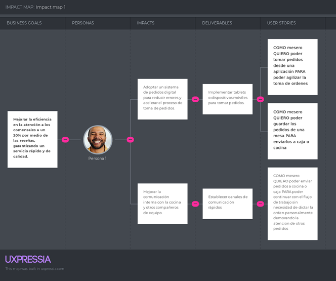

# Capítulo III: Requirements Specification

## 3.1. To-Be Scenario Mapping.
En el siguiente apartado, presentaremos el Mapeo de Escenarios Futuros específicamente diseñado para el proyecto. Este mapa representa una visión de cómo se implementan cambios y mejoras en los procesos y sistemas. A continuación, se incluye una representación gráfica del mismo: 
- Segmento de Mesero:

- Segmento de Administrador

## 3.2. User Stories.

<table>
  <tr>
    <th>Epic / Story ID</th>
    <th>Title</th>
    <th>Descripción</th>
    <th>Criterios de Aceptación</th>
  </tr>
  <tr>
    <td colspan="4"><strong>Épica 1: Landing page</strong> Como usuario Quiero visualizar una página dedicada a la aplicación Para saber acerca de ella e ingresar a la aplicación</td>
  </tr>
  <tr>
    <td>E01_USO 01</td>
    <td>Desarrollar el header de la web</td>
    <td>COMO usuario QUIERO visualizar un encabezado de página que contenga opciones de navegación PARA poder desplazarme por la página</td>
    <td><strong>Escenario 1:</strong> Se visualiza el header Dado que se visualiza el header. Cuando se ubique en la parte superior de la página. Entonces podrá visualizar las distintas opciones disponibles para navegar por la página.  <strong>Escenario 2:</strong> No se visualiza el header. Dado que no se visualiza el header.      Cuando se ubique en la parte superior de la página. Entonces no podrá navegar fácilmente.</td>
  </tr>
  <tr>
    <td>E01_US002</td>
    <td>Desarrollar el footer de la web</td>
    <td>COMO usuario QUIERO visualizar un pie de página que contenga información relevante del negocio PARA un mejor entendimiento del mismo. </td>
    <td><strong>Escenario 1:</strong> Se visualiza el footer Dado que se visualiza el footer. Cuando se ubique en la parte inferior de la página. Entonces podrá visualizar informacion relevante del negocio.   <strong>Escenario 2:</strong> No se visualiza el footer Dado que no se visualiza el header. Cuando se ubique en la parte inferior de la pagina. Entonces no podra visualizar informacion relevante del negocio</td>
  </tr>
  <tr>
    <td>E01_US003</td>
    <td>Desarrollar Barra de Navegación</td>
    <td>COMO usuario QUIERO presionar botones en el header del landing page que me lleven a otras partes de la página PARA poder desplazarme con facilidad.</td>
    <td><strong>Escenario1:</strong> Los botones funcionan correctamente. Dado que se visualiza el header. Cuando se presione un boton de navegacion. Entonces el usuario sera redireccionado a otra seccion de la web.   <strong>Escenario 2:</strong> Los botones no funcionan. Dado que se visualiza el header. Cuando se presione un boton de navegacion. Entonces el usuario se mantendra en la seccion actual sin ningun cambio</td>
  </tr>
  <tr>
    <td>E01_US004</td>
    <td>Implementar seccion sobre Descripción de la Start-Up</td>
    <td>COMO usuario QUIERO observar una descripcion del negocio PARA poder conocer sobre qué trata.</td>
    <td><strong>Escenario 1:</strong> Se visualiza la descripcion de la Start-Up Dado que se visualiza la descripcion de la Start-Up. Cuando se presione el boton de descripcion. Entonces la vista del usuario se desplazara a la seccion de la descripcion.  <strong>Escenario 2:</strong> No se visualiza la descripcion de la Start-Up Dado que no se visualiza la descripcion de la Start-Up. Cuando se presione el boton de descripcion. Entonces la vista del usuario se desplazara a la seccion de la descripcion pero no muestra informacion. </td>
  </tr>
  <tr>
    <td>E01_US005</td>
    <td>Implementar Botón para ver más información </td>
    <td>COMO usuario QUIERO visualizar más información PARA poder comprender y entender más sobre la start-up.</td>
    <td><strong>Escenario 1:</strong> El boton funciona correctamente Dado que el usuario se encuentra en la landing page. Cuando se presione el boton de ver mas. Entonces el usuario sera redireccionado a una seccion con mayor detalle del negocio.   <strong>Escenario 2:</strong> El boton no funciona.  Dado que el usuario se encuentra en la landing page. Cuando se presione el boton de ver mas. Entonces el usuario se mantendra en la seccion actual. </td>
  </tr>
  <tr>
    <td>E01_US006</td>
    <td>Desarrollar Sección de contacto</td>
    <td>COMO usuario QUIERO observar una seccion de “Contacto” PARA poder comunicarme directamente con el equipo de desarrollo.</td>
    <td><strong>Escenario 1:</strong> Se visualiza la informacion de contacto  Dado que se visualiza la informacion de contacto. Cuando se presione el boton de contacto. Entonces la vista del usuario se desplazara a la seccion de contacto.   <strong>Escenario 2:</strong> No se visualiza la informacion de contacto. Dado que no se visualiza la informacion de contacto. Cuando se presione el boton de contacto. Entonces la vista del usuario se mantendra en la seccion actual.</td>
  </tr>
  <tr>
    <td>E01_US007</td>
    <td>Desarrollar Sección de información del equipo </td>
    <td>COMO usuario QUIERO poder observar informacion del equipo de desarrollo PARA conocer más de ellos </td>
    <td><strong>Escenario 1:</strong> Se visualiza la informacion del equipo. Dado que se visualiza la informacion del equipo. Cuando se presione el boton de "Equipo". Entonces la vista del usuario se desplazara a la seccion de equipo.   <strong>Escenario 2:</strong> No se visualiza la informacion del equipo. Dado que no se visualiza la informacion del equipo.Cuando se presione el boton de "Equipo".Entonces la vista del usuario se mantendra en la seccion actual.</td>
  </tr>
  <tr>
    <td colspan="4""><strong>Épica 2: Funcionalidades de Autenticación y Seguridad </strong> Como usuario Quiero validar mis datos y poder navegar en la aplicación Para mantener mi cuenta segura y encontrar todos los apartados de forma rápida</td>
  </tr>
  <tr>
    <td>E02_US008</td>
    <td>Implementar Login con PIN/clave</td>
    <td>COMO usuario QUIERO acceder a la aplicacion mediante un usuario y contraseña PARA mantener mi informacion del negocio segura</td>
    <td><strong>Escenario 1:</strong> El usuario ingresa correctamente el usuario y contraseña. Dado que el cliente ingresa sus credenciales válidas. Cuando de click al botón de "Ingresar". Entonces será dirigido a la página principal de la app.    <strong>Escenario 2:</strong> El usuario ingresa un usuario o contraseña incorrecto.  Dado que el cliente ingreso sus credenciales invalidas. Cuando de click al boton de "Ingresar". Entonces mostrara un mensaje de error </td>
  </tr>
  <tr>
    <td>E02_US009</td>
    <td>Implementar boton para Cerrar Sesion</td>
    <td>COMO usuario QUIERO salir de la aplicación PARA evitar el uso de mi cuenta en manos de otras personas.</td>
    <td><strong>Escenario 1:</strong> El usuario cierra sesión correctamente. Dado que el usuario quiere cerrar su sesión. Cuando le de click al botón de “Cerrar sesión”. Entonces se cerrara la sesion del usuario y se redireccionara a la pagina principal.    <strong>Escenario 2:</strong> El usuario no puede cerrar sesion.  Dado que el usuario quiere cerrar su sesion. Cuando le de click al botón de “Cerrar sesión”. Entonces se mostrara un mensaje de error y se mantendra en la vista actual.</td>
  </tr>
  <tr>
    <td>E02_US010</td>
    <td>Implementar metodo de Recuperacion de contraseña</td>
    <td>COMO cliente QUIERO recuperar mi contraseña PARA ingresar a la aplicación. </td>
    <td><strong>Escenario 1:</strong> El usuario recuperar su contraseña con exito. Dado que el usuario olvido su contraseña. Cuando el usuario presione el botón de “Recuperar contraseña”. Entonces será dirigido a una página donde se realizará una validación mediante su correo electrónico, dirigiendolo a una nueva pagina para cambiar su contraseña.   <strong>Escenario 2:</strong> El usuario no tiene acceso a su correo vinculado. Dado que el usuario olvido su contraseña y presiono el botón de “Recuperar contraseña”. Cuando se le envia el correo de confirmacion y no pueda acceder a el. Entonces no puede restablecer su contraseña    <strong>Escenario 3:</strong> El usuario falla al crear una nueva constraseña. Dado que el usuario olvido su contraseña y presiono el botón de “Recuperar contraseña”. Cuando se le envia el correo de confirmacion y  se le solicite crear una nueva contraseña y no cumpla con los requisitos. Entonces se mostrara una alerta solicitando modificar la contraseña.</td>
  </tr>
  <tr>
    <td>E02_US011</td>
    <td>Implementar navegacion mediante Menú.</td>
    <td>COMO usuario QUIERO visualizar un menú PARA acceder a las funciones de la aplicación de forma más rápida y sencilla.</td>
    <td><strong>Escenario 1:</strong> El usuario visualiza el menu y funcionan correctamente los botones. Dado que el usuario visualiza correctamente el menu. Cuando da click en algun boton de este. Entonces es redirigido a la seccion correspondiente.    <strong>Escenario 2:</strong> El usuario visualiza el menu pero no funcionan los botones Dado que el usuario visualiza correctamente el menu. Cuando da click en algun boton de este. Entonces no ocurre nada manteniendose en la seccion en la que se encuentra.   <strong>Escenario 3:</strong> El usuario no visualiza el menu  Dado que el usuario no visualiza el menu. Cuando intente navegar por la aplicacion. Entonces tendra dificultades para llegar a la seccion deseada de manera rapida</td>
  </tr>
  <tr>
    <td>E02_US012</td>
    <td>Implementar vista de inicio de sesión.</td>
    <td>COMO usuario QUIERO poder ingresar a mi cuenta PARA poder acceder a las funcionalidades.</td>
    <td><strong>Escenario 1:</strong> El usuario visualiza la vista de iniciar sesion.  Dado que el usuario visualiza el inicio de sesion. Cuando intente ingresar sus credenciales. Entonces podra ingresar a la aplicacion.   <strong>Escenario 2:</strong> El usuario no visualiza la vista de iniciar sesion. Dado que el usuario no puede visualizar el inicio de sesion. Cuando no encuentre como ingresar a la aplicacion. Entonces el usuario generara un reporte al negocio por un mal funcionamiento de la plataforma.</td>
  </tr>
  <tr>
    <td>E02_US013</td>
    <td>Implementar Sección de regístrate.</td>
    <td>COMO usuario QUIERO visualizar una opcion que me permita registrarme con un plan para mi negocio PARA poder tener acceso a las funcionalidades de la aplicacion.</td>
    <td><strong>Escenario 1:</strong>  El usuario crea correctamente su usuario.  Dado que el usuario intenta crear un usuario. Cuando realice todos los pasos y seleccione un plan. Entonces su usuario sera creado y sera redireccionado a la pestaña de Login.   <strong>Escenario 2:</strong>El usuario no puede crear su usuario  Dado que el usuario intenta crear un usuario. Cuando realice todos los pasos y seleccione un plan pero exista una falla en el sistema. Entonces se desplegara una alerta informando que se intente nuevamente mas tarde.  <strong>Escenario 3:</strong> El usuario no puede crear su usuario por no seleccionar un plan. Dado que el usuario intenta crear un usuario. Cuando realice todos los pasos y seleccione un plan pero no seleccione un plan de pago. Entonces se desplegara una alerta informando que debe seleccionar un plan y configurar un metodo de pago.</td>
  </tr>
  <tr>
    <td colspan="4"><strong>Épica 3: Gestión de perfil y preferencias de usuario  </strong> Como usuario Quiero visualizar un apartado para mi perfil Para saber los datos que tengo y poder modificarlos cuando quiera</td>
  </tr>
  <tr>
    <td>E03_US014</td>
    <td>Dirigir a perfil de usuario.</td>
    <td>COMO usuario QUIERO ir a mi perfil PARA cambiar cualquier dato que necesite actualización.</td>
    <td><strong>Escenario 1:</strong> El usuario es redireccionado a su perfil.  Dado que el perfil de usuario funciona. Cuando el usuario de click en el boton de perfil. Entonces sera redirigido a su perfil.    <strong>Escenario 2:</strong> El usuario no es redireccionado a su perfil.  Dado que el perfil de usuario no se encuentra en funcionamiento. Cuando el usuario de click en el boton de perfil. Entonces no sera redirigido a su perfil, en cambio se mantendra en la vista actual.</td>
  </tr>
  <tr>
    <td>E03_US015</td>
    <td>Ver y editar datos de usuario.</td>
    <td>COMO usuario QUIERO ver y editar mi información PARA mantenerla actualizada.</td>
    <td><strong>Escenario 1:</strong>  El usuario visualiza su información  Dado que el usuario desea ver su informacion. Cuando da click en el boton perfil. Entonces visualiza su informacion    <strong>Escenario 2:</strong> El usuario modifica su informacion. Dado que el usuario quiere modificar su informacion y el sistema funciona correctamente. Cuando da click en el boton de moficar perfil dentro del perfil, cambia su informacion y da click en el boton guardar. Entonces actualiza su informacion correctamente.  <strong>Escenario 3:</strong> El usuario no es capaz de modificar su informacion.  Dado que el usuario quiere modificar su informacion y el sistema no funciona segun lo esperado. Cuando da click en el boton de moficar perfil dentro del perfil, cambia su informacion y da click en el boton guardar. Entonces se mostrará una alerta indicando que hubo un error en el sistema.</td>
  </tr>
  <tr>
    <td colspan="4"><strong>Épica 4: Notificacion de servicio.</strong> Como usuario mesero Quiero poder recibir notificaciones sobre el estado de un cliente y su orden. Para poder tener mayor eficiencia al atender.</td>
  </tr>
  <tr>
    <td>E04_US016</td>
    <td>Recibir alerta cuando un cliente cruza la puerta del local.</td>
    <td>COMO mesero QUIERO recibir una alerta cuando un cliente cruza la puerta del local PARA poder atenderlo a la brevedad.</td>
    <td><strong>Escenario 1:</strong> Una notificacion es mandada al sistema.  Dado que soy un mesero y el sistema funciona correctamente. Cuando un cliente cruza la puerta del local. Entonces visualizo en el sistema una alerta de ello.    <strong>Escenario 2:</strong> No se envia correctmante la notificacion.  Dado que soy un mesero pero el sistema no funciona segun lo esperado. Cuando un cliente cruza la puerta del local Entonces no se visualiza ninguna alerta en el sistema.</td>
  </tr>
  <tr>
    <td>E04_US017</td>
    <td>Recibir alerta cuando un cliente se sienta en alguna mesa.</td>
    <td>COMO mesero QUIERO recibir una alerta cuando un cliente se sienta en alguna mesa PARA poder generar el pedido en dicha mesa.</td>
    <td><strong>Escenario 1:</strong> Se recibe una alerta cuando un cliente se sienta. Dado que un cliente ingresa al local. Cuando se sienta en alguna mesa. Entonces se muestra una alerta en el sistema indicando el hecho.    <strong>Escenario 2:</strong> No se recibe la alerta cuando un cliente se sienta.  Dado que un cliente ingresa al local. Cuando se sienta en alguna silla. Entonces no se muestra ninguna alerta, dificultando su atención.</td>
  </tr>
  <td>E04_US018</td>
    <td>Dirigir a perfil de usuario.</td>
    <td>COMO usuario QUIERO ir a mi perfil PARA cambiar cualquier dato que necesite actualización.</td>
    <td><strong>Escenario 1:</strong> Se muestra una alerta cuando un cliente deja la mesa.  Dado que un cliente ha consumido en el local. Cuando deja su mesa. 
y se muestra una alerta en el sistema indicando esto asi como un link a su cuenta. Entonces puedo verificar si su cuenta fue cancelada.   <strong>Escenario 2:</strong> No se muestra una alerta cuando un cliente deja la mesa.  Dado que un cliente ha consumido en el local. Cuando deja su mesa y no se muestra una alerta en el sistema. Entonces no puedo estar atento de verificar si su cuenta fue cancelada.</td>
  </tr>
  <tr>
    <td>E04_US019</td>
    <td>Recibir alerta cuando hay platos en la mesa y no hay cliente sentado.</td>
    <td>COMO mesero QUIERO recibir una alerta cuando hay platos en la mesa y no hay cliente en ella PARA darme cuenta y recoger los platos sucios.</td>
    <td><strong>Escenario 1:</strong> Se envia una alerta de platos en mesa.  Dado que un cliente consumio y dejo su mesa. Cuando hayan platos en la mesa y no un cliente sentado. Entonces se enviara una alerta para recoger los platos.    <strong>Escenario 2:</strong> No se envia ninguna alerta de platos en mesa.  Dado que un cliente consumio y dejo su mesa pero el sistema no funcione. Cuando hayan platos en la mesa y no un cliente sentado. Entonces no se enviara una alerta evitando que el mesero se percate de ello dejando el local sucio.</td>
  </tr>
  <td colspan="4"><strong>Épica 5: Toma de pedidos.</strong> Como usuario mesero Quiero poder tomar pedidos y enviarlos a otras áreas. Para poder agilizar el flujo de trabajo.</td>
  <tr>
    <td>E05_US020</td>
    <td>Tomar pedidos de la mesa.</td>
    <td>COMO mesero QUIERO poder tomar pedidos desde una aplicación PARA poder agilizar la toma de ordenes.</td>
    <td><strong>Escenario 1:</strong> La funcion de agregar pedidos a la orden funciona correctamente. Dado que soy un mesero. Cuando quiero agregar un producto al pedido. Entonces se agrega correctamente a la orden.   <strong>Escenario 2:</strong> La funcion de agregar pedidos a la orden no funciona. Dado que soy un mesero. Cuando quiero agregar un producto al pedido y no funciona el sistema. Entonces no se agrega el producto y debo tomarlo manualmente perdiendo tiempo.</td>
  </tr>
  <tr>
    <td>E05_US021</td>
    <td>Guardar orden.</td>
    <td>COMO mesero QUIERO poder guardar las ordenes de una mesa PARA enviarlos a caja o cocina.</td>
    <td><strong>Escenario 1:</strong> La funcion de guardar ordenes funciona correctamente. Dado que soy un mesero. Cuando quiero guardar un pedido. Entonces se guarda correctamente.    <strong>Escenario 2:</strong> La funcion de guardar ordenes no funciona. Dado que soy un mesero. Cuando quiero guardar la orden y no funciona el sistema. Entonces no se guarda y debo tomarlo manualmente perdiendo tiempo.</td>
  </tr>
  <tr>
    <td>E05_US022</td>
    <td>Enviar pedido guardado a cocina y caja.</td>
    <td>COMO mesero QUIERO poder enviar pedidos a cocina o caja PARA poder continuar con el flujo de trabajo sin necesidad de dictar la orden personalmente demorando la atencion de otros pedidos.</td>
    <td><strong>Escenario 1:</strong> La funcion de enviar ordenes funciona correctamente.  Dado que soy un mesero. Cuando quiero enviar una orden a cocina o caja y el sistema funciona. Entonces se envia correctamente.    <strong>Escenario 2:</strong> La funcion de enviar ordenes no funciona.  Dado que soy un mesero. Cuando quiero enviar una orden a cocina o caja y el sistema no funciona. Entonces se no se envia la orden provocando que lo tenga que llevar manualmente.</td>
  </tr>
  <td colspan="4"><strong>Épica 6: Facturación del negocio.</strong> Como usuario administrador Quiero realizar facturaciones. Para brindarle al cliente su comprobante de pago.</td>
  <tr>
    <td>E06_US023</td>
    <td>Crear un cliente con DNI o RUC.</td>
    <td>COMO administrador QUIERO crear nuevos clientes con DNI o RUC PARA poder crear documentos de venta personalizados.</td>
    <td><strong>Escenario 1:</strong> El sistema se vincula con SUNAT. Dado que soy un administrador. Cuando intento agregar un clinete y el sistema con SUNAT funciona. Entonces se encuentra al cliente rapidamente.   <strong>Escenario 2:</strong> El vinculo con SUNAT no funciona. Dado que soy un administrador. Cuando intento agregar un clinete y el sistema con SUNAT no funciona. Entonces debo llenar los campos de RUC/DNI, nombre del cliente/empresa y direccion de facturacion.</td>
  </tr>
  <tr>
    <td>E06_US024</td>
    <td>Imprimir Pre-cuenta.</td>
    <td>COMO administrador QUIERO poder imprimir el resumen de una orden PARA poder brindarle al cliente previo al pago.</td>
    <td><strong>Escenario 1:</strong> Se imprimer la pre-cuenta correctamente.  Dado que soy un administrador. Cuando me solicitan imprimir la precuenta y le doy click al boton correspondiente. Entonces se imprime y se la entrego al cliente o mesero.    <strong>Escenario 2:</strong> No se imprime la pre-cuenta.  Dado que soy un administrador. Cuando me solicitan imprimir la precuenta y le doy click al boton correspondiente pero no funciona. Entonces no se imprime y el cliente o mesero queda inconforme.</td>
  </tr>
  <tr>
    <td>E06_US025</td>
    <td>Cobrar orden.</td>
    <td>COMO administrador QUIERO poder cobrar la orden de un cliente con diversos metodos de pago PARA brindar comodidad al cliente.</td>
    <td><strong>Escenario 1:</strong> Se cobra la orden.  Dado que soy un administrador. Cuando quiero cobrar la orden con diversos metodos de pago. Entonces los metodos de pago son añadidos y se cobra la orden.    <strong>Escenario 2:</strong> No se cobra la orden.  Dado que soy un administrador. Cuando quiero cobrar la orden con diversos metodos de pago y el sistema no funciona. Entonces no se añaden los metodos de pago y no puedo cobrar la orden.</td>
  </tr>
  <tr>
    <td>E06_US026</td>
    <td>Boletear o facturar la orden.</td>
    <td>COMO administrador QUIERO poder boletear o facturar la orden del cliente cerrando la orden PARA poder emitir los documentos a la SUNAT.</td>
    <td><strong>Escenario 1:</strong> Se emite documento de venta.  Dado que soy un administrador. Cuando quiero emitir un documento de venta y el sistema funciona. Entonces se imprime el documento.    <strong>Escenario 2:</strong> No se emite documento de venta.  Dado que soy un administrador. Cuando quiero emitir un documento de venta y el sistema no funciona. Entonces no se imprime el documento y se muestra un error en pantalla.</td>
  </tr>
  <td colspan="4"><strong>Épica 7: Control de inventarios.</strong> Como usuario administrador Quiero poder ver un resumen de los platos vendidos y cuanto se consumió en cada uno.  Para poder llevar un control de mis inventarios como negocio.</td>
  <tr>
    <td>E07_US027</td>
    <td>Ver resumen de ventas.</td>
    <td>COMO administrador QUIERO poder ver el resumen de ventas por dias PARA poder saber cuanto se vendio.</td>
    <td><strong>Escenario 1:</strong> Se puede ver el resumen de ventas.  Dado que soy administrador. Cuando ingreso a la seccion de reportes de ventas. Entonces puedo ver un grafico con el resumen de ventas y diversos filtros.    <strong>Escenario 2:</strong> El resumen de ventas no carga correctamente.  Dado que soy administrador. Cuando ingreso a la seccion de reportes de ventas y no funciona. 
Entonces no se generan los graficos y se muestra un error indicando que no se pudo cargar el reporte.</td>
  </tr>
  <tr>
    <td>E07_US028</td>
    <td>Filtrar ventas por platos.</td>
    <td>COMO administrador QUIERO poder filtrar las ventas por platos PARA saber que platos se vendieron mas que otros.</td>
    <td><strong>Escenario 1:</strong> La funcion de filtrar ventas por platos funciona.  Dado que soy un administrador. Cuando selecciono la opcion de filtrar por plato en el reporte. Entonces puedo ver la lista de ventas segun cada plato.    <strong>Escenario 2:</strong> Dado que soy un administrador. Cuando selecciono la opcion de filtrar por plato en el reporte y este no funciona. Entonces se muestra un error indicando que no se pudo seleccionar el filtro.</td>
  </tr>
  <tr>
    <td>E07_US029</td>
    <td>Ver resumen de productos restantes.</td>
    <td>COMO administrador QUIERO saber cuantos insumos me quedan en stock despues de haber vendido los platos PARA poder llevar un buen inventario.</td>
    <td><strong>Escenario 1:</strong> La seccion de ver resumen de productos restantes funciona.  Dado que soy administrador. Cuando accedo a la sección de inventario. Entonces puedo ver una lista detallada de todos los insumos en stock, incluyendo su cantidad.    <strong>Escenario 2:</strong> No se actualiza el reporte en tiempo real Dado que soy administrador. Cuando accedo a la seccion de inventario y no se actualiza con las ventas de platos. Entonces se muestra un mensaje indicando que los datos podrian estar desactualizados.</td>
  </tr>
  <tr>
    <td>E07_US030</td>
    <td>Ingresar nuevos productos al inventario.</td>
    <td>COMO administrador QUIERO anadir insumos a mi stock al momento de realizar una compra PARA poder mantener mi inventario actualizado.</td>
    <td><strong>Escenario 1:</strong>  Se agrega insumo nuevo correctamente.  Dado que soy administrador. Cuando quiero agregar un insumo nuevo, lleno los campos y doy click al boton crear. Entonces el producto se añade correctamente.   <strong>Escenario 2:</strong> El insumo ingresado ya existe. Dado que soy administrador. Cuando quiero agregar un producto nuevo y este ya existe. Entonces muestra una alerta indicando que se modifique el nombre del producto.  <strong>Escenario 3:</strong> No se puede agregar el nuevo insumo.  Dado que soy administrador. Cuando quiero agregar un producto nuevo, lleno los campos y doy click al boton crear pero el sistema no funciona. Entonces el insumo no se añade y muestra una alerta indicando el erro.</td>
  </tr>
  <tr>
    <td>E07_US031</td>
    <td>Crear platos nuevos.</td>
    <td>COMO administrador QUIERO poder crear nuevos platos con sus precios, insumos necesarios, etc. PARA que los meseros puedan seleccionarlos al momento de tomar una orden.</td>
    <td><strong>Escenario 1:</strong>  Se agrega plato nueva correctamente.  Dado que soy administrador. Cuando quiero agregar un plato nuevo, lleno los campos y doy click al boton crear. Entonces el plato se añade correctamente.    <strong>Escenario 2:</strong> El plato ingresado ya existe.  Dado que soy administrador. Cuando quiero agregar un plato nuevo y este ya existe. Entonces muestra una alerta indicando que se modifique el nombre del plato.  <strong>Escenario 3:</strong> No se puede agregar el nuevo plato.  Dado que soy administrador. Cuando quiero agregar un plato nuevo, lleno los campos y doy click al boton crear pero el sistema no funciona. Entonces el plato no se añade y muestra una alerta indicando el error.</td>
  </tr>
  </tr>
  <tr>
    <td>E07_US032</td>
    <td>Editar platos existentes.</td>
    <td>COMO administrador QUIERO poder editar los datos de los platos que ya tengo creados PARA poder actualizarlos en caso sea necesario.</td>
    <td><strong>Escenario 1:</strong> Se modifica el plato correctemante.  Dado que soy administrador. Cuando quiero modificar un plato y le doy click al boton guardar. Entonces el plato se modifica correctamente.    <strong>Escenario 2:</strong> No es posible modificar el plato   Dado que soy administrador. Cuando quiero modificar un plato y le doy click al boton guardar pero el sistema no funciona. Entonces el plato no se modifica y se muestra una alerta indicando el error.</td>
  </tr>
  </tr>
  <tr>
    <td>E07_US033</td>
    <td>Eliminar platos existentes.</td>
    <td>COMO administrador QUIERO Poder eliminar los platos existentes PARA mantener mis platos actualizados.</td>
    <td><strong>Escenario 1:</strong>  El producto se elimina correctamente. Dado que soy administrador. Cuando doy click al boton de eliminar producto. Entonces el producto se elimina correctamente.    <strong>Escenario 2:</strong> El producto no ha sido eliminado Dado que soy administrador. Cuando doy click al boton de eliminar producto pero el sistema no funciona. Entonces el producto no se elimina y muestra un mensaje de error</td>
  </tr>
</table>

## 3.3. Impact Mapping.

**Segmento Mesero**

El mesero es un elemento fundamental en el sector de la restauración, ya que su desempeño influye directamente en la satisfacción del cliente. Enfrenta desafíos diarios relacionados con la gestión de múltiples pedidos y la necesidad de mantener una comunicación efectiva con la cocina. Al comprender las necesidades y problemas que enfrenta, se puede diseñar una estrategia que optimice su flujo de trabajo, mejorando así tanto su eficiencia como la experiencia del cliente. Este enfoque permitirá no solo reducir la carga de trabajo del mesero, sino también fomentar un ambiente más positivo y productivo en el restaurante.

**Segmento Administrador**

El administrador del restaurante juega un papel crucial en la supervisión y optimización de las operaciones del negocio. Su responsabilidad incluye garantizar que las actividades se realicen de manera eficiente y rentable, así como tomar decisiones informadas basadas en el rendimiento del personal y las ventas. Al identificar las necesidades y desafíos que enfrenta, se puede desarrollar una estrategia que mejore su capacidad para analizar datos y gestionar recursos, lo que no solo optimiza las operaciones, sino que también potencia el éxito y la rentabilidad del restaurante.

