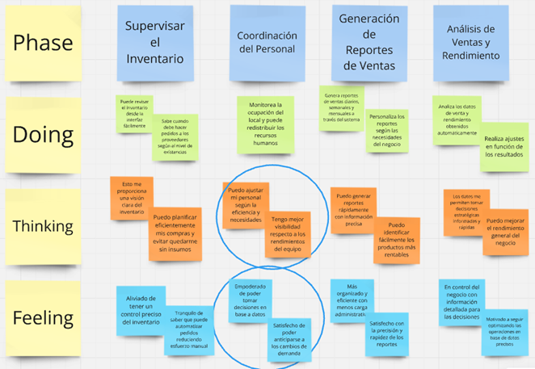

# Capítulo III: Requirements Specification

## 3.1. To-Be Scenario Mapping.
En el siguiente apartado, presentaremos el Mapeo de Escenarios Futuros específicamente diseñado para el proyecto. Este mapa representa una visión de cómo se implementan cambios y mejoras en los procesos y sistemas. A continuación, se incluye una representación gráfica del mismo: 
- Segmento de Mesero:

- Segmento de Administrador

## 3.2. User Stories.

Epics:

| Epic / Story ID | Titulo | Descripción                                           | Criterios de Aceptación                                                                                                                                                                                  | Relacionado con (Epic ID) |
| ------ | ------ | ------------------------------------------------ | -------------------------------------------------------------------------------------------------------------------------------------------------------------------------------------------- | ----------------------- |
|   E01_US001    | Apartado de Header  | COMO usuario QUIERO visualizar un encabezado de página que contenga opciones PARA una mejor navegación por la página.| Escenario: El usuario se encuentra en el landing page.Dado que el usuario se encuentra en el landing page. Cuando se ubique en la parte superior de la página. Entonces podrá visualizar las distintas opciones disponibles para navegar por la página. | 1                       |
| E01_US002      | Apartado de Footer | COMO usuario QUIERO visualizar pie de página que contenga información PARA un mejor entendimiento de la página.                      | Escenario: El usuario se encuentra en el landing page. Dado que el usuario se encuentra en el landing page. Cuando se ubique en la parte inferior de la página. Entonces podrá visualizar información importante del landing page.                              |       1              |
| E01_US003      | Barra de Navegación  | COMO usuario QUIERO presionar botones en el encabezado del landing page que me lleven a otras partes de la página PARA poder desplazarme con facilidad.                      | Escenario: El usuario tiene la página abierta en una computadora. Dado que el usuario se encuentra en la E01_US001. Cuando presiones los botones de la barra de navegación. Entonces lo llevará a las secciones respectivas del Landing page al cual pertenecen.                           | 1                       |
| E01_US004      | Descripción de la Start-Up  | COMO usuario QUIERO observar un apartado que contenga información de la página PARA poder conocer sobre qué se trata.                      | Escenario: El usuario se encuentra en el landing page.Dado que el usuario se encuentra en el landing page.Cuando bajes al primer apartado de la página.Entonces podrá visualizar la información acerca de nuestra start-up.                           | 1                       |
| E01_US005      | Botón para ver más información  | COMO usuario QUIERO ver más información sobre la página PARA poder comprender y entender más sobre la start-up.                      | Escenario: El usuario se encuentra en el landing page.Dado que el usuario se encuentra en la LYW06.Cuando le des click al botón “+ INFO”.Entonces se le redirigirá a una página donde se mostrará más información sobre la start-up.                          | 1                       |
| E01_US006      | Sección de contacto | COMO usuario QUIERO observar un apartado “Contacto” PARA poder comunicarme directamente con el equipo de desarrollo.                     | Escenario: El usuario se encuentra en ellanding page.Dado que el usuario se encuentra en el landing page.Cuando presiones la sección “Contacto” que se encuentra en el E01_US003.Entonces podrá visualizar el apartado de Contacto y poder comunicarse con alguien del equipo de desarrollo.                          | 1                       |
| E01_US007      | Sección de información del equipo  | COMO usuario QUIERO observar en el encabezado un apartado de información del equipo PARA conocer más a fondo su desarrollo.                     | Escenario: El usuario se encuentra en el landing page.Dado que el usuario se encuentra en el E01_US003.Cuando presiones el botón “Equipo”.Entonces podrá visualizar un apartado con información adicional sobre el equipo encargado del desarrollo.                         | 1                       |

## 3.3. Impact Mapping.

**Segmento Mesero**

El mesero es un elemento fundamental en el sector de la restauración, ya que su desempeño influye directamente en la satisfacción del cliente. Enfrenta desafíos diarios relacionados con la gestión de múltiples pedidos y la necesidad de mantener una comunicación efectiva con la cocina. Al comprender las necesidades y problemas que enfrenta, se puede diseñar una estrategia que optimice su flujo de trabajo, mejorando así tanto su eficiencia como la experiencia del cliente. Este enfoque permitirá no solo reducir la carga de trabajo del mesero, sino también fomentar un ambiente más positivo y productivo en el restaurante.

**Segmento Administrador**

El administrador del restaurante juega un papel crucial en la supervisión y optimización de las operaciones del negocio. Su responsabilidad incluye garantizar que las actividades se realicen de manera eficiente y rentable, así como tomar decisiones informadas basadas en el rendimiento del personal y las ventas. Al identificar las necesidades y desafíos que enfrenta, se puede desarrollar una estrategia que mejore su capacidad para analizar datos y gestionar recursos, lo que no solo optimiza las operaciones, sino que también potencia el éxito y la rentabilidad del restaurante.

