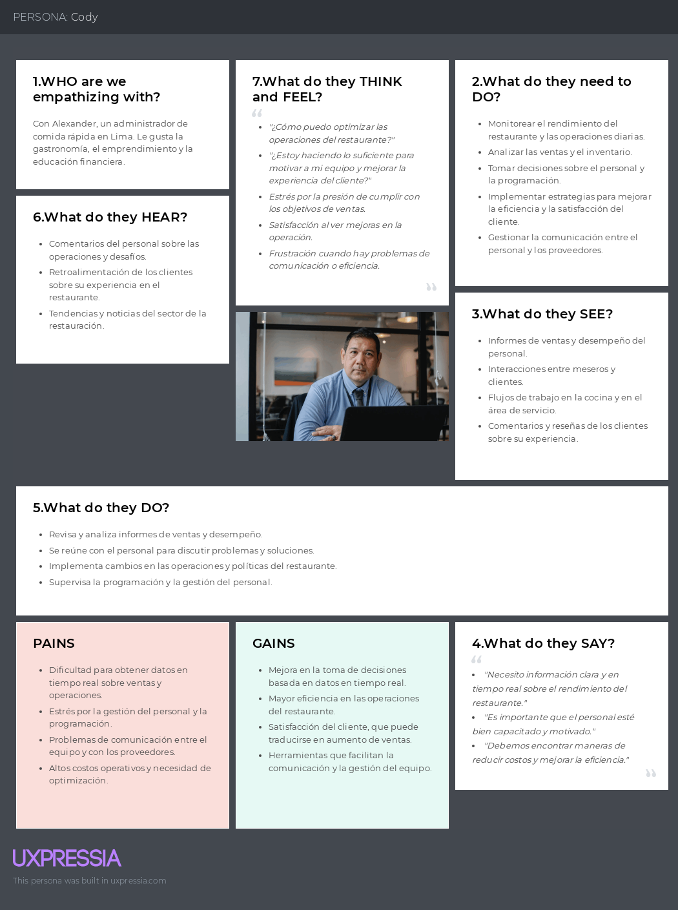

# Capítulo II: Requirements Elicitation & Analysis

## 2.1. Competidores.

### 2.1.1. Análisis competitivo.

<table>
  <tr>
    <th colspan="2"></th>
    <th>
      

        
      

      

        Long Range Systems
      

    </th>
    <th>
      

        
      

      

        Toast
      

    </th>
    <th>
      

        
      

      

        Lightspeed
      

    </th>
  </tr>
  <tr>
    <td rowspan="2"><strong>Perfil</strong></td>
    <td>Overview</td>
    <td>Es una empresa que ofrece soluciones tecnológicas avanzadas para la gestión de restaurantes, enfocándose en la optimización de operaciónes y mejora de la experiencia del cliente</td>
    <td>Un Sistema de punto de venta (POS) diseñado específicamente para restaurantes, que ofrece herramientas avanzadas para la gestión de pedidos, facturación y análisis de datos.</td>
    <td>Una plataforma de gestión empresarial y puntos de venta que sirve a diversos sectores, incluyendo restauración, con un enfoque en la integración de operaciónes y análisis de ventas.</td>
  </tr>
  <tr>
    <td>Ventaja competitiva ¿Qué valor ofrece a los clientes?</td>
    <td>Ofrece un sistema integral que mejora la eficiencia operativa, reduciendo tiempos de espera y aumentando la satisfacción del cliente.</td>
    <td>Integración completa de operaciones de restaurante en una sola plataforma, facilitando la gestión de pedidos, la comunicación con la cocina y procesamiento de pagos</td>
    <td>Ofrece una solución altamente flexible y escalable que permite a los negocios personalizar la plataforma según sus necesidades específicas, con un enfoque en la gestión de inventarios y la analítica de ventas.</td>
  </tr>
  <tr>
    <td rowspan="2"><strong>Perfil Marketing</strong></td>
    <td>Mercado Objetivo</td>
    <td>Restaurantes medianos y grandes</td>
    <td>Restaurante de cualquier tamaño, especialmente pequeñas y medianas</td>
    <td>Pequeñas y medianas empresas en la industria de la restauración</td>
  </tr>
  <tr>
    <td>Estrategias de marketing</td>
    <td>Enfoque Business to Business, destacando estudios de caso y testimonios de clientes</td>
    <td>Marketing digital enfocado en la facilidad de uso y la integración si complicaciones.</td>
    <td>Marketing business to business, con un enfoque en la flexibilidad y personalización de la plataforma. Demostraciones en vivo y estudios de caso.</td>
  </tr>
  <tr>
    <td rowspan="3"><strong>Perfil de Producto</strong></td>
    <td>Productos & Servicios</td>
    <td>Sistema de gestión de mesas, optimización del flujo de trabajo, integración de pedidos y soluciones de pago</td>
    <td>Punto de venta, gestión de pedidos, procesamiento de pagos, herramientas de marketing y analítica de datos</td>
    <td>Punto de venta, gestión de inventarios, procesamiento de pagos, herramientas de CRM y analítica avanzada</td>
  </tr>
  <tr>
    <td>Precios & Costos</td>
    <td>45 dólares a más de 200 dólares dependiendo del tipo de producto que se desee.</td>
    <td>Precios basados en suscripción, empezando con la Starter kit (0 $), Point of Sale (69 $ al mes) y personalizado.</td>
    <td>Modelo de precios basado en suscripción, con 189$ en el paquete de "Essential" y 399 $ el premium</td>
  </tr>
  <tr>
    <td>Canales de distribución (Web y/o Móvil)</td>
    <td>Disponibilidad en plataformas y móviles, con dispositivos de punto de venta (POS)</td>
    <td>En plataformas web y móviles con soporte para dispositivos POS.</td>
    <td>Disponible en plataformas web y móvil con dispositivos POS</td>
  </tr>
  <tr>
    <td rowspan="5"><strong>Análisis SWOT</strong></td>
  </tr>
  <tr>
    <td>Fortalezas</td>
    <td>
      - Solución integral y personalizable 
      - Alta escalabilidad para negocios en crecimiento
    </td>
    <td>
      - Plataforma fácil de usar y ampliamente reconocida.
      - Amplia gama de funcionalidades integradas.
   </td>
    <td>
      - Alta personalización y escalabilidad.
      - Solución integral que abarca desde inventarios hasta ventas.
    </td>
  </tr>
  <tr>
    <td>Debilidades</td>
    <td>
      - Puede ser complejo de implementar en pequeños restaurantes
      - Costos elevados para negocios pequeños
    </td>
    <td>
      - Los costos pueden aumentar rápidamente con funcionalidades adicionales.
      - Dependencia de hardware propietario
    </td>
    <td>
      - Complejidad en la configuración inicial
      - Costos elevados para pequeñas empresas con necesidades básicas
    </td>
  </tr>
  <tr>
    <td>Oportunidades</td>
    <td>Expansión en mercados emergentes con creciente demanda</td>
    <td>Ampliación de servicios en mercados internacionales y expansión a nuevos verticales dentro de la hospitalidad.</td>
    <td>Expansión de mercados verticales relacionados con hospitalidad y el comercio minorista.</td>
  </tr>
  <tr>
    <td>Amenazas</td>
    <td>Competencia de otras soluciones integrales más accesibles para pequeños y medianos negocios</td>
    <td>Competencia con otros sistemas POS que ofrecen soluciones más asequibles o especificas</td>
    <td>Presión competitiva de soluciones más asequibles o especializadas en ciertos nichos del mercado.</td>
  </tr>
</table>

### 2.1.2. Estrategias y tácticas frente a competidores.
-  Analizar las fortalezas y debilidades de tus competidores para identificar oportunidades y amenazas en el mercado.
-  Utilizar herramientas de investigación de mercado para comprender mejor a nuestros clientes y sus necesidades.
-  Incentivar a los usuarios a compartir su experiencia en las redes sociales y dejar reseñas positivas para mejorar la reputación de la marca.
-  vigilancia constante sobre las tendencias del mercado y las tecnologías emergentes para seguir siendo competitivo a largo plazo.

## 2.2. Entrevistas.
### 2.2.1. Diseño de entrevistas.
**Preguntas Generales** 
- Nombre completo
- Edad
- Ocupación
- Años de experiencia
- 
**LISTADO DE PREGUNTAS SEGMENTO MESEROS**
1.	¿Cuáles son las principales dificultades que enfrentas al atender a los comensales?
2.	¿Cuánto tiempo promedio dedicas a tomar pedidos y entregarlos a la cocina?
3.	¿Qué herramientas o tecnologías utilizas actualmente para gestionar los pedidos?
4.	¿Cómo impacta el tiempo de espera de los clientes en tu trabajo diario?
5.	¿Has utilizado alguna tecnología IoT en tu lugar de trabajo? Si es así, ¿cómo ha sido tu experiencia?
6.	¿Crees que un sistema que detecte automáticamente cuando un cliente necesita atención o cuándo recoger platos sería útil? ¿Por qué?
7.	¿Qué características te gustaría ver en una herramienta que te ayude a gestionar los pedidos de manera más eficiente?

**LISTADO DE PREGUNTAS SEGMENTO ADMINISTADORES**
1.	¿Cuáles son los principales retos que enfrentas al gestionar la operación diaria del negocio?
2.	¿Qué importancia le das a la eficiencia en el servicio al cliente en tu negocio?
3.	¿Cómo realizas actualmente el seguimiento de los pedidos y la facturación en el negocio?
4.	¿Qué tan satisfecho estás con las herramientas tecnológicas actuales que utilizas para administrar el negocio?
5.	¿Cuánto tiempo dedicas a revisar las ventas y la facturación diariamente?
6.	¿Consideras que la implementación de un sistema IoT podría mejorar la eficiencia operativa y el servicio al cliente? ¿Por qué?
7.	¿Qué información te gustaría recibir en tiempo real para tomar decisiones más informadas sobre la operación del negocio?

### 2.2.2. Registro de entrevistas.
-  Primera Entrevista:
-  Segmento: Meseros
-  Nombre: Jhonny Ruiz
-  Edad: 22
-  Ocupación: Estudiante universitario y mesero a tiempo parcial
-  Enlace: https://drive.google.com/file/d/1LK6Rrf3d5Qc78yCVRLBQN9ohIZkfFp3B/view?usp=drive_link 

-  Resumen:
Jhonny es un estudiante universitario de 24 años que trabaja a tiempo parcial como mesero en una pollería. Su personalidad es proactiva y observadora, lo que le permite tener un entendimiento claro de los diferentes tipos de clientes que frecuentan el local. Muestra interés en la adopción de nuevas tecnologías para mejorar la experiencia del cliente y la eficiencia operativa del negocio.

Durante la entrevista, mencionó que uno de los principales desafíos es la optimización del tiempo de respuesta entre el cliente y el mesero, así como entre el mesero y la cocina. Cree que la implementación de un sistema digital de pedidos o llamados a la mesa mejoraría significativamente estos tiempos. Este sistema no solo permitiría a los clientes hacer pedidos de manera más rápida y precisa, sino también hacer solicitudes adicionales como recoger los platos, cambiar los cubiertos o añadir más ítems al pedido sin tener que buscar la atención visual o auditiva del mesero.

En términos de tecnología, Jhonny está familiarizado con el uso de dispositivos móviles y tabletas para la gestión de pedidos. Sugiere que un sistema basado en aplicaciones móviles o tabletas integradas en las mesas podría ser una solución viable. También destacó la importancia de la fluidez en la interacción mediante dispositivos que usen interfaces sencillas, accesibles tanto para los clientes como para los meseros.

Al ser consultado sobre sus influencias, mencionó que ha visto sistemas similares en cadenas de restaurantes más grandes, y cree que estas tecnologías podrían adaptarse perfectamente a un negocio como la pollería en la que trabaja. Además, considera que el uso de browsers modernos y dispositivos como teléfonos inteligentes facilitaría la implementación de este tipo de sistemas.

- Segunda Entrevista:
- Segmento: Mesero
- Nombre: Rodrigo Torres
- Edad: 23
- Ocupación: Mesero
- Enlace: Entrevista con Segmento Mesero

Resumen:
Rodrigo, de 32 años, trabaja como mesero en una reconocida cadena de restaurantes familiares, donde su capacidad para manejar grandes volúmenes de comensales a lo largo de su jornada laboral es clave. Su personalidad es diligente y organizada, pero reconoce las limitaciones del método tradicional de tomar pedidos manualmente con lápiz y papel. En la entrevista, destacó que este sistema presenta un alto riesgo de errores, especialmente cuando se atienden grupos grandes. Esto genera confusión y retrasos en el servicio, afectando tanto la eficiencia del equipo como la experiencia de los clientes.

Rodrigo considera que la implementación de un sistema digital de pedidos o de llamadas de mesa sería una mejora significativa para el restaurante. Señala que este tipo de tecnología no solo aceleraría el proceso de atención al cliente, sino que también contribuiría a reducir los errores en los pedidos, lo que incrementaría la calidad del servicio. Además, Rodrigo mencionó que un sistema así aliviaría la carga de trabajo de los meseros, permitiéndoles concentrarse en brindar un servicio más personalizado y eficiente.

En términos tecnológicos, Rodrigo está familiarizado con el uso de sistemas digitales en otros contextos y cree que la transición a una plataforma basada en dispositivos como tabletas o smartphones sería intuitiva para los empleados. También sugirió que un sistema de notificaciones, a través de dispositivos móviles o terminales en la cocina, podría mejorar la comunicación entre los meseros y el personal de cocina, reduciendo aún más los tiempos de espera.

Rodrigo ha observado cómo otras cadenas de restaurantes ya han adoptado tecnologías similares y cree que esto ha influido positivamente en su eficiencia operativa. En cuanto a los canales de interacción, consideró que un sistema basado en aplicaciones móviles o pantallas táctiles instaladas en las mesas podría ser el canal más eficaz tanto para los clientes como para los empleados.

- Tercera Entrevista:
- Segmento: Meseros
- Nombre: Martin Cifuentes
- Edad: 20
- Ocupación: Mesero a tiempo parcial en chilis
- Enlace: https://drive.google.com/file/d/1L8E_H6pFC90pOep6bz4UvaYJ3TwM7G5x/view?usp=drive_link

Resumen:
Martin Cifuentes, un joven de 20 años, trabaja como mesero a tiempo parcial en una conocida cadena de restaurantes familiares, Chilis. Su estilo de trabajo sigue el enfoque tradicional de tomar pedidos a mano y enviar las cartillas a la cocina para mantener el orden. Martin se describe a sí mismo como una persona metódica y comprometida con su labor, siempre buscando mejorar la experiencia del cliente en el restaurante.

Durante la entrevista, Martin mencionó que el tiempo del cliente es un factor crucial en la experiencia dentro del local. Según él, la rapidez y precisión con que se toman y envían los pedidos impacta directamente en la satisfacción del cliente. Destacó que muchas veces, al tener que estar pendiente de varios clientes al mismo tiempo, se complica el proceso de atención. Esto puede llevar a que el mesero pierda la oportunidad de atender inmediatamente solicitudes adicionales, como agregar ítems al pedido o cambiar cubiertos, ya que depende de la interacción visual y auditiva para atender esas peticiones.

En cuanto a su percepción sobre las mejoras tecnológicas, Martin considera que sería útil implementar un sistema que permita a los meseros comunicarse con los clientes de manera más eficiente, sin necesidad de estar constantemente vigilando a cada mesa. Mencionó que, en su opinión, un sistema de llamadas de mesa o de pedidos automatizados podría agilizar el proceso, mejorar la organización de las comandas y evitar errores. Además, cree que el uso de dispositivos tecnológicos como tablets o smartphones integrados en el sistema del restaurante facilitaría la adopción de estas mejoras sin generar complicaciones.

Aunque Martin está familiarizado con tecnologías de consumo diarias como smartphones, considera que cualquier sistema que se implemente debe ser intuitivo y de fácil uso, tanto para los meseros como para los clientes. Por último, señaló que la comunicación entre el cliente y el mesero no debería depender exclusivamente de la atención visual, lo que permitiría una experiencia más fluida y personalizada para los comensales.

- Cuarta Entrevista: 
- Segmento: ADMINISTADORES
- Nombre: David Oré Cutipa
- Edad: 24
- Ocupación: Ayudante Administrador de polleria

- Resumen:
David Oré Cutipa, de 24 años, trabaja como ayudante de administrador en una pollería, donde asume responsabilidades clave en la gestión diaria del negocio. David se describe como una persona organizada y enfocada en el crecimiento del restaurante, tanto en términos de popularidad como en el fortalecimiento de la marca. Durante la entrevista, destacó que uno de los mayores retos que enfrenta es mantener ingresos positivos mientras busca expandir el negocio.

David considera que el servicio al cliente, tanto en la atención presencial como en la virtual, es un factor crítico para el éxito de la pollería. Para él, es fundamental que los clientes se sientan cómodos, ya sea por el ambiente del restaurante, la calidad de la atención o la puntualidad en la entrega de los pedidos, ya que esto influye directamente en el prestigio de la marca.

En cuanto a la gestión de pedidos y facturación, el proceso actual incluye que el cliente complete un formulario, ya sea de manera presencial o virtual, el cual se verifica antes de comprobar el inventario. Esto asegura que los pedidos estén listos para ser entregados lo antes posible, lo cual es una prioridad para mantener la satisfacción del cliente. David destacó que el sistema actual de pedidos y facturación, basado en la utilización de códigos QR para la cartilla de precios y plataformas como PedidosYa y Glovo para pedidos online, ha sido eficiente y le ha permitido alcanzar a más clientes.

Dedica aproximadamente 8 horas al día a revisar ventas y facturación, ajustando su tiempo según la demanda de clientes y los días de mayor actividad. Está satisfecho con las herramientas tecnológicas que utiliza actualmente, ya que le brindan eficiencia en su trabajo diario. Sin embargo, también está abierto a la implementación de nuevas tecnologías, como soluciones de IoT. Mencionó que el uso de meseros robóticos y asistentes inteligentes podría optimizar aún más el servicio, ahorrando tiempo tanto al negocio como a los clientes, y mejorando la experiencia general.

Finalmente, David expresó su interés en contar con acceso en tiempo real a las preferencias de los clientes, ya que esto le permitiría anticiparse a sus necesidades y mantener un inventario optimizado. También cree que con esta información podría tomar decisiones más informadas sobre las inversiones, lo que contribuiría a seguir expandiendo el negocio y fortaleciendo el reconocimiento de la marca de su restaurante.

- Quinta Entrevista:
- Segmento: Administrasdores
- Nombre: Jorge Rojas
- Edad: 21
- Ocupación: Administrador de un restaurante
- Enlace: https://drive.google.com/file/d/1m5zHGkXGYi23zdqufEjVRE7YN850g_L9/view?usp=drive_link
 
- Resumen:
Jorge, administrador de un negocio en el sector gastronómico, enfrenta diversos retos en la gestión diaria del restaurante. Durante la entrevista, señaló que su principal objetivo es mantener el flujo de los procesos sin interrupciones, lo que incluye coordinar los equipos de trabajo, manejar imprevistos como la falta de insumos o la rotación de personal, y gestionar los costos operativos. Además, destaca la importancia de mantener la consistencia en la calidad del servicio, lo cual es clave para la satisfacción del cliente.

Para Jorge, la eficiencia en el servicio al cliente es un pilar fundamental del éxito del negocio. Según su experiencia, los clientes valoran tanto la rapidez en la atención como el trato personalizado, lo que contribuye a una experiencia positiva en el restaurante. Actualmente, el seguimiento de pedidos y la facturación se realizan mediante un sistema POS (Point of Sale), el cual le permite llevar un control en tiempo real de los tiempos de servicio y facilitar el proceso de facturación. Sin embargo, Jorge también reconoce que existen oportunidades para mejorar la integración tecnológica, especialmente en áreas como la gestión de inventarios y el análisis de datos.

En cuanto a la adopción de nuevas tecnologías, Jorge expresó interés en la implementación de soluciones basadas en IoT (Internet of Things). Considera que el uso de sensores y dispositivos conectados podría proporcionar información en tiempo real sobre los niveles de inventario, el rendimiento de los equipos y la productividad del personal. Además, cree que las alertas automáticas sobre el comportamiento de los clientes podrían ayudar a anticipar sus necesidades, optimizando la operatividad del negocio y mejorando la experiencia del cliente.

Jorge dedica aproximadamente una hora diaria a revisar las ventas y la facturación, prestando especial atención a los patrones de pedidos, las quejas de los clientes y el cumplimiento de las metas comerciales. Estas revisiones le permiten ajustar las estrategias operativas y comerciales de acuerdo con los datos obtenidos, aunque reconoce que la integración de más herramientas analíticas podría facilitar aún más este proceso y ofrecer una visión más detallada del desempeño del negocio.

- Sexta Entrevista:
- Segmento: admnistradores
- Nombre: José Eduardo
- Edad: 20
- Ocupación: Administrador
- Enlace:  https://drive.google.com/file/d/1jFM97hO6cg-0LFss7j3m652epf_1CjAj/view?usp=drive_link 

- Resumen:
 
 
José Eduardo, de 20 años, es administrador de un restaurante y describe su enfoque de gestión como clásico, siguiendo procesos tradicionales que son comunes en el negocio. Sin embargo, durante la entrevista, José manifestó su interés en adoptar tecnologías que puedan agilizar estos procesos, permitiéndole tomar decisiones de manera más rápida y eficiente. Señala que la implementación de tecnologías innovadoras podría convertirse en un diferenciador clave frente a la competencia.

En cuanto al uso de herramientas tecnológicas, José menciona que el uso de dispositivos IoT es poco común en sus competidores, lo que, en su opinión, representa una oportunidad para mejorar la atención al cliente. Considera que optimizar la experiencia del cliente es esencial para el éxito del restaurante. Uno de los aspectos que más le gustaría mejorar es el tiempo de respuesta en la toma de pedidos, ya que cree que una respuesta rápida y eficiente impacta directamente en la satisfacción del cliente.

José también mencionó que le gustaría implementar un sistema en el que los cambios en los pedidos se reflejen de inmediato en la cocina, lo que permitiría una mejor coordinación entre el personal y una experiencia más fluida para los comensales. Este tipo de integración tecnológica no solo aceleraría los procesos internos, sino que también brindaría a los clientes un servicio más personalizado y eficiente.

En términos generales, José Eduardo se mostró receptivo a la idea de integrar más tecnología en la operación diaria del restaurante, con el objetivo de mejorar tanto la eficiencia operativa como la experiencia del cliente. Aunque actualmente su enfoque sigue siendo tradicional, considera que adoptar herramientas tecnológicas más avanzadas, como IoT, le ayudaría a posicionarse mejor en el mercado y diferenciarse de sus competidores.

### 2.2.3. Análisis de entrevistas.

- Análisis Generales – Segmentos Objetivo
- Segmento Objetivo: Administradores

Con base en las entrevistas realizadas a administradores del sector de la restauración, se identificaron varios desafíos recurrentes en la gestión diaria. El 75% de los administradores entrevistados mencionaron que uno de los principales retos es mantener un flujo de trabajo continuo, obstaculizado por imprevistos como la rotación de personal y la falta de insumos. Estos factores impactan directamente en la eficiencia operativa y la calidad del servicio, y representan una preocupación constante para la gestión del negocio.

En cuanto a la gestión de costos y la expansión, el 60% de los administradores señaló que mantener la rentabilidad mientras se incrementa la popularidad del establecimiento es un desafío significativo. Aumentar los ingresos sin comprometer la calidad del servicio es una de las principales metas para los administradores.

El 85% de los administradores considera que la atención al cliente es un factor clave para el éxito del restaurante. La rapidez en el servicio y la atención personalizada son percibidas como aspectos fundamentales para ofrecer una experiencia positiva al cliente, y los administradores reconocen que estos elementos son decisivos para la fidelización. En cuanto a los sistemas actuales de facturación y gestión de pedidos, el 70% de los entrevistados indicó que sus sistemas permiten un control en tiempo real, aunque también señalaron que se podría mejorar mediante una mayor integración tecnológica, como la vinculación con la gestión de inventarios y el análisis de datos.

Además, el 55% de los administradores expresó interés en adoptar tecnologías avanzadas, como el Internet de las Cosas (IoT), para optimizar la operativa. La implementación de estas tecnologías les permitiría obtener información en tiempo real sobre los niveles de inventario, el rendimiento de los equipos y la productividad del personal, lo que facilitaría la toma de decisiones de forma más rápida y eficiente.

Por último, un 65% de los administradores indicó que contar con acceso a información en tiempo real sobre las preferencias y necesidades de los clientes sería de gran valor. Este tipo de datos les permitiría anticiparse a las demandas del mercado, ajustar el inventario de manera óptima y tomar decisiones estratégicas para el crecimiento del negocio. Herramientas tecnológicas, como meseros robóticos o asistentes inteligentes, también fueron mencionadas por el 50% de los entrevistados como posibles soluciones para mejorar tanto la eficiencia operativa como la experiencia del cliente.

Este análisis evidencia que las características objetivas y subjetivas derivadas de las entrevistas, como los retos de gestión, la importancia del servicio al cliente y el uso potencial de tecnologías, son comunes entre los administradores entrevistados y son necesarias para la construcción de los arquetipos correspondientes.

- Segmento Objetivo: Meseros

Con base en las entrevistas realizadas a meseros, se identificó que el 70% de ellos enfrenta dificultades al utilizar métodos tradicionales, como la toma de pedidos en papel, lo que resulta en un incremento de errores y desorganización, especialmente cuando se atienden grupos grandes. Estos problemas generan una sobrecarga en el trabajo de los meseros y afectan negativamente la experiencia del cliente, creando tiempos de espera más largos y una percepción de servicio deficiente.

El 80% de los meseros entrevistados manifestó la necesidad de optimizar la comunicación entre los comensales, los meseros y la cocina. La propuesta de implementar un sistema de pedidos digitales o de llamadas de mesa fue bien recibida por este grupo, quienes ven en esta tecnología una forma de reducir errores en la toma de pedidos y mejorar la organización. Este tipo de sistemas también permitiría a los meseros recibir notificaciones en tiempo real de las solicitudes de los comensales (como cambiar cubiertos, agregar ítems o recoger platos), sin depender únicamente de señales visuales o auditivas, algo que el 65% de los entrevistados considera fundamental para reducir los tiempos de espera y aumentar la eficiencia del servicio.

Además, el 75% de los meseros cree que la implementación de tecnologías como sistemas de pedidos digitales ayudaría a aligerar su carga de trabajo, permitiéndoles centrarse en ofrecer una atención más personalizada y eficaz. La integración de estas soluciones mejoraría la comunicación con la cocina, acelerando el proceso de preparación de los pedidos y, por lo tanto, optimizando el tiempo de servicio. Esto no solo impactaría positivamente en la satisfacción del cliente, sino también en la percepción del restaurante en general.

En resumen, las entrevistas muestran que un sistema de gestión digital de pedidos y comunicaciones en los restaurantes no solo tiene el potencial de mejorar la eficiencia operativa y reducir los errores, sino que también podría incrementar la calidad del servicio al cliente, algo que el 85% de los meseros ve como una oportunidad para ofrecer una mejor experiencia en sus interacciones con los comensales.

Este análisis refleja las características objetivas y subjetivas comunes entre los meseros entrevistados, y la información estadística sustenta la construcción de arquetipos basados en sus necesidades y experiencias.

## 2.3. Needfinding.

El Needfinding es una metodología cualitativa y colaborativa utilizada principalmente en el proceso de diseño e innovación para complementar el proceso de diseño de productos. A causa de ello, se presentará a continuación los siguientes puntos:

### 2.3.1. User Personas.
Segmento Objetivo: Meseros
Los meseros son el personal clave en la atención directa al cliente, responsables de gestionar varios pedidos al mismo tiempo mientras aseguran una experiencia satisfactoria para los comensales. Crear un user persona de meseros nos permite entender mejor sus desafíos diarios, como la presión de manejar múltiples mesas y mantener un servicio rápido y preciso. Al identificar sus necesidades, podremos desarrollar soluciones que les ayuden a desempeñar su trabajo de manera más eficiente y mejorar su interacción con los clientes.
 

 Segmento Objetivo : Administrador de Negocio
Los administradores son los encargados de supervisar y coordinar todos los aspectos operativos del restaurante, desde la asignación de mesas hasta la gestión de facturación y recursos. Desarrollar un user persona de administradores nos permite profundizar en sus responsabilidades y preocupaciones, como mantener el flujo de trabajo fluido y tomar decisiones rápidas y acertadas. Al entender sus objetivos y puntos de dolor, podemos crear soluciones que optimicen sus tareas diarias y faciliten su trabajo.
 

### 2.3.2. User Task Matrix.

El User Task Matrix es una herramienta que nos permite identificar las tareas clave que cada tipo de usuario realiza dentro del sistema. Para cada user persona, se detallan las actividades que deben completar, lo que nos ayuda a priorizar las funcionalidades más importantes y asegurar que el producto responda a sus necesidades específicas. Este enfoque garantiza que las soluciones que implementemos estén alineadas con las responsabilidades y expectativas de cada usuario, facilitando una mejor experiencia de uso y mayor eficiencia en su trabajo.

- Segmento Objetivo: Meseros
 

- Segmento Objetivo: Administrador de Negocio
 

### 2.3.3. User Journey Mapping.

El User Journey Mapping es una herramienta esencial para visualizar el recorrido que los usuarios realizan al interactuar con un producto o servicio. Este mapa nos permite identificar cada punto de contacto, desde que los usuarios inician su actividad hasta que completan sus tareas. Al detallar cada etapa del proceso, podemos comprender mejor sus emociones, frustraciones y necesidades, lo que nos ayuda a diseñar soluciones que optimicen su experiencia en todo el recorrido.

 

### 2.3.4. Empathy Mapping.

-Segmento Objetivo 1:
El Empathy Map para los meseros nos permite profundizar en su experiencia al identificar lo que piensan, sienten, ven y hacen en su entorno laboral. Al comprender sus emociones y motivaciones, podemos identificar las frustraciones que enfrentan, como la presión por atender múltiples mesas y la necesidad de ser rápidos y precisos en su trabajo. Este mapa nos ayudará a desarrollar soluciones que no solo faciliten sus tareas diarias, sino que también mejoren su bienestar y satisfacción en el servicio.

 

-Segmento Objetivo 2:
El Empathy Map para los administradores se centra en sus perspectivas y desafíos en la gestión operativa del restaurante. Al explorar sus pensamientos y sentimientos, podemos identificar las preocupaciones que tienen sobre la eficiencia del flujo de trabajo y la toma de decisiones rápidas. Este entendimiento nos permitirá crear herramientas que les brinden un control más efectivo sobre las operaciones, ayudándoles a cumplir sus objetivos y a mejorar la experiencia tanto para el personal como para los clientes.

 

### 2.3.5. As-is Scenario Mapping.
En el siguiente apartado, presentaremos el Mapeo de Escenarios Actuales específicamente diseñado para el proyecto. A continuación, se incluye una representación gráfica del mismo: 

- Segmento de Meseros:
En el escenario actual, los meseros enfrentan varias fases en su proceso de atención al cliente. Comienzan con la atención al cliente, donde deben gestionar múltiples mesas y tomar pedidos, lo que puede resultar en errores. Luego, durante la entrega de comida, coordinan con la cocina para asegurar que los pedidos sean correctos. En la fase de estar atentos, deben observar y responder a las necesidades de los clientes, lo cual es complicado en un ambiente ajetreado. Finalmente, en la fase de pago del cliente, manejan la facturación, lo que puede causar demoras y frustraciones.
  
 

- Segmento de Administrador:
En el escenario actual, los administradores pasan por varias fases en la gestión operativa. Comienzan con la supervisión del inventario, realizando un seguimiento manual que puede ser ineficiente. Luego, en la fase de coordinación del personal, asignan tareas y horarios sin herramientas adecuadas. En la fase de generación de reportes de ventas, deben compilar datos manualmente, lo que consume tiempo. Finalmente, en la fase de análisis de ventas y rendimiento, interpretan datos que pueden no estar actualizados, dificultando la toma de decisiones y afectando la operación general.

 

## 2.4. Ubiquitous Language.
Para el desarrollo de nuestro proyecto, es esencial establecer un lenguaje claro y conciso para asegurar su comprensión y que refleje las necesidades y expectativas de todos los usuarios. Por esta razón, hemos identificado los siguientes términos clave. (Actualizar)

 
 

 
En este caso se presentan algunos ejemplares, con el fin de poder visualizar más de Ubiquitous language, compartimos enlace:
Miro: https://miro.com/app/board/uXjVKkI6spU=/ 

