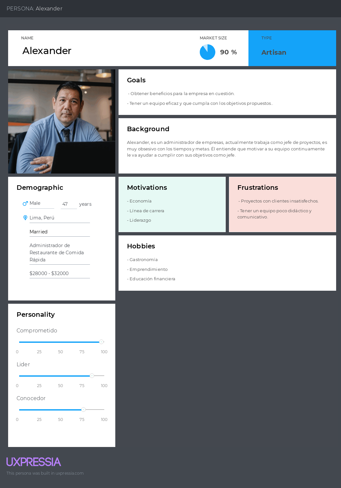

# Capítulo II: Requirements Elicitation & Analysis

## 2.1. Competidores.

### 2.1.1. Análisis competitivo.

<table>
  <tr>
    <th colspan="2"></th>
    <th>
      

        
      

      

        Long Range Systems
      

    </th>
    <th>
      

        
      

      

        Toast
      

    </th>
    <th>
      

        
      

      

        Lightspeed
      

    </th>
  </tr>
  <tr>
    <td rowspan="2"><strong>Perfil</strong></td>
    <td>Overview</td>
    <td>Es una empresa que ofrece soluciones tecnológicas avanzadas para la gestión de restaurantes, enfocándose en la optimización de operaciónes y mejora de la experiencia del cliente</td>
    <td>Un Sistema de punto de venta (POS) diseñado específicamente para restaurantes, que ofrece herramientas avanzadas para la gestión de pedidos, facturación y análisis de datos.</td>
    <td>Una plataforma de gestión empresarial y puntos de venta que sirve a diversos sectores, incluyendo restauración, con un enfoque en la integración de operaciónes y análisis de ventas.</td>
  </tr>
  <tr>
    <td>Ventaja competitiva ¿Qué valor ofrece a los clientes?</td>
    <td>Ofrece un sistema integral que mejora la eficiencia operativa, reduciendo tiempos de espera y aumentando la satisfacción del cliente.</td>
    <td>Integración completa de operaciones de restaurante en una sola plataforma, facilitando la gestión de pedidos, la comunicación con la cocina y procesamiento de pagos</td>
    <td>Ofrece una solución altamente flexible y escalable que permite a los negocios personalizar la plataforma según sus necesidades específicas, con un enfoque en la gestión de inventarios y la analítica de ventas.</td>
  </tr>
  <tr>
    <td rowspan="2"><strong>Perfil Marketing</strong></td>
    <td>Mercado Objetivo</td>
    <td>Restaurantes medianos y grandes</td>
    <td>Restaurante de cualquier tamaño, especialmente pequeñas y medianas</td>
    <td>Pequeñas y medianas empresas en la industria de la restauración</td>
  </tr>
  <tr>
    <td>Estrategias de marketing</td>
    <td>Enfoque Business to Business, destacando estudios de caso y testimonios de clientes</td>
    <td>Marketing digital enfocado en la facilidad de uso y la integración si complicaciones.</td>
    <td>Marketing business to business, con un enfoque en la flexibilidad y personalización de la plataforma. Demostraciones en vivo y estudios de caso.</td>
  </tr>
  <tr>
    <td rowspan="3"><strong>Perfil de Producto</strong></td>
    <td>Productos & Servicios</td>
    <td>Sistema de gestión de mesas, optimización del flujo de trabajo, integración de pedidos y soluciones de pago</td>
    <td>Punto de venta, gestión de pedidos, procesamiento de pagos, herramientas de marketing y analítica de datos</td>
    <td>Punto de venta, gestión de inventarios, procesamiento de pagos, herramientas de CRM y analítica avanzada</td>
  </tr>
  <tr>
    <td>Precios & Costos</td>
    <td>45 dólares a más de 200 dólares dependiendo del tipo de producto que se desee.</td>
    <td>Precios basados en suscripción, empezando con la Starter kit (0 $), Point of Sale (69 $ al mes) y personalizado.</td>
    <td>Modelo de precios basado en suscripción, con 189$ en el paquete de "Essential" y 399 $ el premium</td>
  </tr>
  <tr>
    <td>Canales de distribución (Web y/o Móvil)</td>
    <td>Disponibilidad en plataformas y móviles, con dispositivos de punto de venta (POS)</td>
    <td>En plataformas web y móviles con soporte para dispositivos POS.</td>
    <td>Disponible en plataformas web y móvil con dispositivos POS</td>
  </tr>
  <tr>
    <td rowspan="5"><strong>Análisis SWOT</strong></td>
  </tr>
  <tr>
    <td>Fortalezas</td>
    <td>
      - Solución integral y personalizable 
      - Alta escalabilidad para negocios en crecimiento
    </td>
    <td>
      - Plataforma fácil de usar y ampliamente reconocida.
      - Amplia gama de funcionalidades integradas.
   </td>
    <td>
      - Alta personalización y escalabilidad.
      - Solución integral que abarca desde inventarios hasta ventas.
    </td>
  </tr>
  <tr>
    <td>Debilidades</td>
    <td>
      - Puede ser complejo de implementar en pequeños restaurantes
      - Costos elevados para negocios pequeños
    </td>
    <td>
      - Los costos pueden aumentar rápidamente con funcionalidades adicionales.
      - Dependencia de hardware propietario
    </td>
    <td>
      - Complejidad en la configuración inicial
      - Costos elevados para pequeñas empresas con necesidades básicas
    </td>
  </tr>
  <tr>
    <td>Oportunidades</td>
    <td>Expansión en mercados emergentes con creciente demanda</td>
    <td>Ampliación de servicios en mercados internacionales y expansión a nuevos verticales dentro de la hospitalidad.</td>
    <td>Expansión de mercados verticales relacionados con hospitalidad y el comercio minorista.</td>
  </tr>
  <tr>
    <td>Amenazas</td>
    <td>Competencia de otras soluciones integrales más accesibles para pequeños y medianos negocios</td>
    <td>Competencia con otros sistemas POS que ofrecen soluciones más asequibles o especificas</td>
    <td>Presión competitiva de soluciones más asequibles o especializadas en ciertos nichos del mercado.</td>
  </tr>
</table>

### 2.1.2. Estrategias y tácticas frente a competidores.
-  Analizar las fortalezas y debilidades de tus competidores para identificar oportunidades y amenazas en el mercado.
-  Utilizar herramientas de investigación de mercado para comprender mejor a nuestros clientes y sus necesidades.
-  Incentivar a los usuarios a compartir su experiencia en las redes sociales y dejar reseñas positivas para mejorar la reputación de la marca.
-  vigilancia constante sobre las tendencias del mercado y las tecnologías emergentes para seguir siendo competitivo a largo plazo.

## 2.2. Entrevistas.
### 2.2.1. Diseño de entrevistas.
**Preguntas Generales** 
- Nombre completo
- Edad
- Ocupación
- Años de experiencia
- 
**LISTADO DE PREGUNTAS SEGMENTO MESEROS**
1.	¿Cuáles son las principales dificultades que enfrentas al atender a los comensales?
2.	¿Cuánto tiempo promedio dedicas a tomar pedidos y entregarlos a la cocina?
3.	¿Qué herramientas o tecnologías utilizas actualmente para gestionar los pedidos?
4.	¿Cómo impacta el tiempo de espera de los clientes en tu trabajo diario?
5.	¿Has utilizado alguna tecnología IoT en tu lugar de trabajo? Si es así, ¿cómo ha sido tu experiencia?
6.	¿Crees que un sistema que detecte automáticamente cuando un cliente necesita atención o cuándo recoger platos sería útil? ¿Por qué?
7.	¿Qué características te gustaría ver en una herramienta que te ayude a gestionar los pedidos de manera más eficiente?

**LISTADO DE PREGUNTAS SEGMENTO ADMINISTADORES**
1.	¿Cuáles son los principales retos que enfrentas al gestionar la operación diaria del negocio?
2.	¿Qué importancia le das a la eficiencia en el servicio al cliente en tu negocio?
3.	¿Cómo realizas actualmente el seguimiento de los pedidos y la facturación en el negocio?
4.	¿Qué tan satisfecho estás con las herramientas tecnológicas actuales que utilizas para administrar el negocio?
5.	¿Cuánto tiempo dedicas a revisar las ventas y la facturación diariamente?
6.	¿Consideras que la implementación de un sistema IoT podría mejorar la eficiencia operativa y el servicio al cliente? ¿Por qué?
7.	¿Qué información te gustaría recibir en tiempo real para tomar decisiones más informadas sobre la operación del negocio?

### 2.2.2. Registro de entrevistas.
-  Primera Entrevista:
-  Segmento: Meseros
-  Nombre: Jhonny Ruiz
-  Edad: 22
-  Ocupación: Estudiante universitario y mesero a tiempo parcial
-  Enlace: https://drive.google.com/file/d/1LK6Rrf3d5Qc78yCVRLBQN9ohIZkfFp3B/view?usp=drive_link 

-  Resumen:
Jhonny es un estudiante universitario que trabaja a tiempo parcial en una pollería, el cual conoce los tipos de clientes que son atendidos por él. Y ve con buena idea implementar un sistema de pedidos o llamados a la mesa para optimizar los tiempos de los comensales y mejorar su experiencia en el local. 
La importancia del tiempo de comunicación entre cliente con mesero y el del mesero con la cocina. Otro punto que menciona es la de atender al comensal, cuando este desea hacer alguna petición, como recoger los platos, cambiar cubiertos, agregar ítems a la mesa. El mesero pueda saber de alguna forma la petición de llamado, sin tardar por lograr ver a este o escucharlo.

- Segunda Entrevista:
- Segmento: Mesero
- Nombre: Rodrigo Torres
- Edad: 23
- Ocupación: Mesero
- Enlace: Entrevista con Segmento Mesero

Resumen:
Rodrigo trabaja como mesero en una cadena de restaurantes familiares, atendiendo a numerosos comensales a lo largo de su jornada. Observa que el método tradicional de tomar pedidos, escribiéndolos en papel, conlleva un alto riesgo de errores. Esto se agrava cuando se trata de un grupo grande, ya que el proceso se vuelve desorganizado y caótico.
Rodrigo considera que implementar un sistema de pedidos o de llamadas de mesa sería una gran mejora. Este tipo de sistema no solo facilitaría y aceleraría el proceso de atención a los comensales, sino que también aumentaría la calidad del servicio, aliviando la carga de trabajo de los meseros y mejorando la experiencia general de los clientes.

- Tercera Entrevista:
- Segmento: Meseros
- Nombre: Martin Cifuentes
- Edad: 20
- Ocupación: Mesero a tiempo parcial en chilis
- Enlace: https://drive.google.com/file/d/1L8E_H6pFC90pOep6bz4UvaYJ3TwM7G5x/view?usp=drive_link

Resumen:
La experiencia de Martin en chillis, se basa en un estilo de atención clásico, donde utiliza cartillas para enviarlo a la cocina para mantener el orden. El tiempo del cliente es vital, ya que este será uno de los actores importantes para la experiencia en el restaurante. Él considera importante la forma de comunicar con el cliente sin necesidad de ver el cliente mientras consume directamente.

- Cuarta Entrevista: 
- Segmento: ADMINISTADORES
- Nombre: David Oré Cutipa
- Edad: 24
- Ocupación: Ayudante Administrador de polleria

- Resumen:
Menciona que uno de los mayores retos al manejar el día a día del negocio es la expansión, tanto en términos de popularidad como de establecimiento de la marca. También reconoce que es difícil lograr que los ingresos sean positivos.
En cuanto al servicio al cliente, lo considera clave para el éxito del negocio, tanto en atención presencial como virtual. Es importante que los clientes se sientan cómodos, por el ambiente, la atención o la puntualidad en la entrega de pedidos, esencial para mantener el prestigio de la marca.
Para gestionar los pedidos y la facturación, utilizan un proceso donde el cliente llena un formulario (presencial o virtual), se verifican los detalles, y luego se comprueba el inventario para asegurar que todo esté listo para la entrega, priorizando que los pedidos lleguen lo antes posible.
En cuanto a las herramientas tecnológicas, está satisfecho con lo que usan actualmente, ya que les brinda eficiencia en el trabajo. Por ejemplo, la cartilla de precios actualizada mediante un código QR y los pedidos online a través de plataformas como PedidosYa y Globo, les facilitan llegar a más clientes.
Dedica unas 8 horas al día a revisar ventas y facturación, ajustando el tiempo según la cantidad de clientes y los días de apertura. Además, considera que la implementación de tecnología IoT, como meseros robóticos y asistentes inteligentes, podría ser muy beneficiosa, ya que mejoraría la eficiencia y ahorraría tiempo, tanto para el negocio como para los clientes.
Por último, le gustaría tener acceso en tiempo real a las preferencias de los clientes, para poder anticiparse a sus necesidades, mantener el inventario optimizado y tomar decisiones más informadas sobre dónde invertir para seguir creciendo y fortalecer el reconocimiento de su marca de restaurantes.

- Quinta Entrevista:
- Segmento: Administrasdores
- Nombre: Jorge Rojas
- Edad: 21
- Ocupación: Administrador de un restaurante
- Enlace: https://drive.google.com/file/d/1m5zHGkXGYi23zdqufEjVRE7YN850g_L9/view?usp=drive_link
 
- Resumen:
Los principales retos para Jorge, en la gestión diaria del negocio incluyen mantener el flujo de los procesos sin interrupciones, coordinar equipos, y enfrentar imprevistos como la falta de insumos o la rotación de personal, además de la gestión de costos y la consistencia en la calidad del servicio. La eficiencia en el servicio al cliente es fundamental, ya que los clientes valoran tanto la rapidez como la atención personalizada, lo que contribuye a una experiencia positiva. Actualmente, el seguimiento de pedidos y facturación se realiza mediante un sistema POS, que permite un control en tiempo real de los tiempos de servicio y facilita la facturación, aunque siempre hay espacio para mejoras tecnológicas que integren mejor otras áreas, como la gestión de inventarios o el análisis de datos. El uso de IoT podría mejorar la eficiencia operativa, ofreciendo información en tiempo real sobre niveles de inventario, rendimiento de equipos y empleados, además de proporcionar alertas útiles sobre el comportamiento de los clientes. Dedica alrededor de una hora diaria a revisar las ventas y facturación, prestando especial atención a patrones de pedidos, quejas y metas comerciales.

- Sexta Entrevista:
- Segmento: admnistradores
- Nombre: José Eduardo
- Edad: 20
- Ocupación: Administrador
- Enlace:  https://drive.google.com/file/d/1jFM97hO6cg-0LFss7j3m652epf_1CjAj/view?usp=drive_link 

- Resumen:
 
La manera de administrar el negocio es realmente clásica, ya que son procesos que normalmente se realizan en el negocio, le gustaría tomar tecnologías que agilicen estos procesos para tomar decisiones más rápidas y considerar un punto de diferencia de la competencia. Utiliza herramientas IoT es muy poco visto en sus competidores, lo cual permite mejorar la atención al cliente. Considera bastante la experiencia del cliente en el restaurante, por lo que ve con buenos ojos optimizar el tiempo de respuesta por parte de la toma del pedido, y ofrecer un cambio de pedido al instante reflejado directamente en la cocina.

### 2.2.3. Análisis de entrevistas.

- Análisis Generales – Segmentos Objetivo
- Segmento Objetivo: Administradores

El análisis de este administrador revela varios desafíos clave en la gestión diaria de un restaurante. Mantener un flujo de trabajo constante es complicado por imprevistos como la rotación de personal y la falta de insumos, lo que impacta la eficiencia operativa y la calidad del servicio. La gestión de costos y la expansión del negocio también son retos importantes, especialmente en un entorno donde aumentar la popularidad y mantener la rentabilidad es un desafío continuo.
La atención al cliente se percibe como un factor crítico, ya que la rapidez y la atención personalizada son fundamentales para ofrecer una experiencia positiva. Aunque el sistema de facturación y pedidos que utilizan actualmente ofrece un control en tiempo real, se reconoce que podría mejorarse mediante una mayor integración con otras áreas del negocio, como la gestión de inventarios y el análisis de datos.
El uso de tecnología IoT aparece como una oportunidad valiosa para optimizar la operación. La información en tiempo real sobre niveles de inventario, rendimiento de equipos y comportamiento del personal podría facilitar una toma de decisiones más eficiente. Además, existe interés en herramientas tecnológicas avanzadas, como meseros robóticos o asistentes inteligentes, que mejorarían tanto la eficiencia operativa como la experiencia del cliente.
Finalmente, se destaca la importancia de contar con acceso en tiempo real a las preferencias de los clientes. Esto permitiría anticiparse a sus necesidades, optimizar el inventario y tomar decisiones más informadas para impulsar el crecimiento del negocio y fortalecer su posicionamiento en el mercado.

- Segmento Objetivo: Meseros

Este análisis se centra en la necesidad de optimizar la interacción entre los comensales, los meseros, y la cocina en un restaurante. Actualmente, el uso de métodos tradicionales como tomar pedidos en papel genera errores y desorganización, especialmente en grupos grandes. Esto impacta negativamente en la experiencia del cliente y sobrecarga a los meseros.
Se propone implementar un sistema de pedidos digitales o de llamadas de mesa, que podría mejorar la eficiencia en la toma de pedidos, reducir errores, y agilizar la comunicación entre el cliente, el mesero, y la cocina. Además, este sistema permitiría a los meseros recibir notificaciones sobre peticiones de los comensales, como cambiar cquiertos o agregar ítems, sin depender de señales visuales o auditivas, lo que reduciría tiempos de espera y mejoraría la calidad del servicio.
En resumen, la implementación de tecnología para gestionar pedidos y comunicaciones en restaurantes tiene el potencial de optimizar el tiempo de servicio, mejorar la experiencia del cliente y aligerar la carga de trabajo de los meseros.

## 2.3. Needfinding.

El Needfinding es una metodología cualitativa y colaborativa utilizada principalmente en el proceso de diseño e innovación para complementar el proceso de diseño de productos. A causa de ello, se presentará a continuación los siguientes puntos:

### 2.3.1. User Personas.
Segmento Objetivo: Meseros
Los meseros son el personal clave en la atención directa al cliente, responsables de gestionar varios pedidos al mismo tiempo mientras aseguran una experiencia satisfactoria para los comensales. Crear un user persona de meseros nos permite entender mejor sus desafíos diarios, como la presión de manejar múltiples mesas y mantener un servicio rápido y preciso. Al identificar sus necesidades, podremos desarrollar soluciones que les ayuden a desempeñar su trabajo de manera más eficiente y mejorar su interacción con los clientes.
 

 Segmento Objetivo : Administrador de Negocio
Los administradores son los encargados de supervisar y coordinar todos los aspectos operativos del restaurante, desde la asignación de mesas hasta la gestión de facturación y recursos. Desarrollar un user persona de administradores nos permite profundizar en sus responsabilidades y preocupaciones, como mantener el flujo de trabajo fluido y tomar decisiones rápidas y acertadas. Al entender sus objetivos y puntos de dolor, podemos crear soluciones que optimicen sus tareas diarias y faciliten su trabajo.
 

### 2.3.2. User Task Matrix.

El User Task Matrix es una herramienta que nos permite identificar las tareas clave que cada tipo de usuario realiza dentro del sistema. Para cada user persona, se detallan las actividades que deben completar, lo que nos ayuda a priorizar las funcionalidades más importantes y asegurar que el producto responda a sus necesidades específicas. Este enfoque garantiza que las soluciones que implementemos estén alineadas con las responsabilidades y expectativas de cada usuario, facilitando una mejor experiencia de uso y mayor eficiencia en su trabajo.

- Segmento Objetivo: Meseros
 

- Segmento Objetivo: Administrador de Negocio
 

### 2.3.3. User Journey Mapping.

El User Journey Mapping es una herramienta esencial para visualizar el recorrido que los usuarios realizan al interactuar con un producto o servicio. Este mapa nos permite identificar cada punto de contacto, desde que los usuarios inician su actividad hasta que completan sus tareas. Al detallar cada etapa del proceso, podemos comprender mejor sus emociones, frustraciones y necesidades, lo que nos ayuda a diseñar soluciones que optimicen su experiencia en todo el recorrido.

 

### 2.3.4. Empathy Mapping.

-Segmento Objetivo 1:
El Empathy Map para los meseros nos permite profundizar en su experiencia al identificar lo que piensan, sienten, ven y hacen en su entorno laboral. Al comprender sus emociones y motivaciones, podemos identificar las frustraciones que enfrentan, como la presión por atender múltiples mesas y la necesidad de ser rápidos y precisos en su trabajo. Este mapa nos ayudará a desarrollar soluciones que no solo faciliten sus tareas diarias, sino que también mejoren su bienestar y satisfacción en el servicio.

 

-Segmento Objetivo 2:
El Empathy Map para los administradores se centra en sus perspectivas y desafíos en la gestión operativa del restaurante. Al explorar sus pensamientos y sentimientos, podemos identificar las preocupaciones que tienen sobre la eficiencia del flujo de trabajo y la toma de decisiones rápidas. Este entendimiento nos permitirá crear herramientas que les brinden un control más efectivo sobre las operaciones, ayudándoles a cumplir sus objetivos y a mejorar la experiencia tanto para el personal como para los clientes.

 

### 2.3.5. As-is Scenario Mapping.
En el siguiente apartado, presentaremos el Mapeo de Escenarios Actuales específicamente diseñado para el proyecto. A continuación, se incluye una representación gráfica del mismo: 

- Segmento de Meseros:
En el escenario actual, los meseros enfrentan varias fases en su proceso de atención al cliente. Comienzan con la atención al cliente, donde deben gestionar múltiples mesas y tomar pedidos, lo que puede resultar en errores. Luego, durante la entrega de comida, coordinan con la cocina para asegurar que los pedidos sean correctos. En la fase de estar atentos, deben observar y responder a las necesidades de los clientes, lo cual es complicado en un ambiente ajetreado. Finalmente, en la fase de pago del cliente, manejan la facturación, lo que puede causar demoras y frustraciones.
  
 

- Segmento de Administrador:
En el escenario actual, los administradores pasan por varias fases en la gestión operativa. Comienzan con la supervisión del inventario, realizando un seguimiento manual que puede ser ineficiente. Luego, en la fase de coordinación del personal, asignan tareas y horarios sin herramientas adecuadas. En la fase de generación de reportes de ventas, deben compilar datos manualmente, lo que consume tiempo. Finalmente, en la fase de análisis de ventas y rendimiento, interpretan datos que pueden no estar actualizados, dificultando la toma de decisiones y afectando la operación general.

 

## 2.4. Ubiquitous Language.
Para el desarrollo de nuestro proyecto, es esencial establecer un lenguaje claro y conciso para asegurar su comprensión y que refleje las necesidades y expectativas de todos los usuarios. Por esta razón, hemos identificado los siguientes términos clave. (Actualizar)

 
 

 
En este caso se presentan algunos ejemplares, con el fin de poder visualizar más de Ubiquitous language, compartimos enlace:
Miro: https://miro.com/app/board/uXjVKkI6spU=/ 

