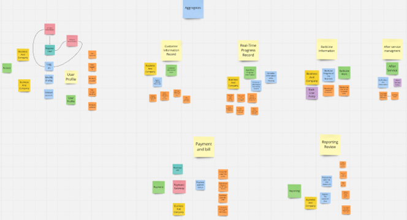

# Capítulo IV: Solution Software Design

## 4.1. Strategic-Level Domain-Driven-Design

En el siguiente apartado, se detalla una serie de enfoques clave en el proceso de Diseño Dirigido por el Dominio a nivel estratégico (Strategic-Level Domain-Driven Design). Estos enfoques fueron fundamentales para establecer una base sólida para definir y modelar dominios complejos. A través de técnicas como Event Storming, Context Mapping y la definición de la Arquitectura de Software, se logró obtener una comprensión profunda de los elementos esenciales necesarios para la creación de sistemas efectivos y bien estructurados. A continuación, se describen los puntos clave que se abordaron en esta sección.

### 4.1.1. Event Storming

Se abordó un enfoque colaborativo y visual que permitió modelar el contexto del dominio. Se exploraron las etapas de Candidate Context Discovery, Domain Message Flows Modeling y la creación de Bounded Context Canvases.

**Unstructured Exploration**

Es un enfoque visual que reúne a todas las partes interesadas para explorar el dominio de un sistema. Se utilizan notas adhesivas de diferentes colores para representar distintos elementos, facilitando la discusión y el descubrimiento de requisitos.

**Pain Points**

Son los problemas o dificultades que enfrentan los usuarios y las partes interesadas en el contexto del sistema. Identificarlos ayuda a priorizar características y soluciones que realmente aborden las necesidades del usuario.

**Timelines**

Se refiere a la secuencia de eventos que ocurren en el sistema a lo largo del tiempo. Establecer una línea de tiempo ayuda a visualizar cómo los eventos interactúan y afectan el flujo de trabajo, así como a identificar puntos críticos en el proceso.

**Pivotal Points**

Son momentos clave en el flujo de eventos que pueden cambiar el estado del sistema o influir significativamente en la experiencia del usuario. Identificar estos puntos ayuda a concentrar esfuerzos en las áreas más críticas.

**Commands**

Son las acciones o instrucciones que un usuario o sistema puede ejecutar para provocar un cambio en el estado del sistema. Por ejemplo, "Crear Pedido" o "Actualizar Inventario".

**Policies**

Son las reglas o directrices que rigen cómo se deben tomar las decisiones dentro del sistema. Pueden incluir reglas de negocio que determinan cuándo se deben ejecutar ciertos comandos o cómo se deben manejar ciertos eventos.

**Read Models**

Son las representaciones de los datos que se utilizan para responder a consultas o solicitudes de información. Los modelos de lectura están diseñados para optimizar la consulta de datos, separándose de los modelos de escritura para mejorar el rendimiento y la escalabilidad.

**External Systems**

Se refiere a otros sistemas o servicios que interactúan con el sistema principal. Identificar estos sistemas ayuda a entender las dependencias y las integraciones necesarias para el funcionamiento del sistema.

**Aggregates**

Son grupos de objetos que se tratan como una única unidad para la gestión de datos y la lógica de negocio. Un agregado garantiza la consistencia de sus partes en las operaciones y encapsula la lógica de negocio relacionada.

**Bounded Context**

Es un límite claro dentro del dominio del sistema donde un modelo particular se aplica. Define la frontera en la que un conjunto de conceptos y términos tiene un significado específico, ayudando a evitar confusiones y a manejar complejidades en sistemas grandes y distribuidos.

Link del Event Storming: https://miro.com/app/board/uXjVKkI6spU=/

#### 4.1.1.1 Candidate Context Discovery

Empleando la metodología de Eventstorming con enfoque en la técnica de "start-with-simple", utilizamos la línea de tiempo para identificar posibles candidatos para nuestro contexto delimitado, los cuales son los siguientes: 

Identificación de Valores del Negocio: Hemos analizado los valores clave del negocio, que incluyen la experiencia del usuario llegar a la mesa y ser atendido  por el personal, la rapidad atencion y la eficiencia en la gestión de usuarios.

Identificación de Funcionalidades Clave: 
Identificamos la funcionalidades básicas y necesarias del negocio, toma de pedido del usuario identificado por mesa, la rapidad atencion al cliente, el orden del inventariado.

**Profile Managment:**

**Identity and Access Management:**

**Business Managment System:**

**IoT Asset Management:**

**Notification Managment:**

**Data Report and Analytics:**

#### 4.1.1.2 Domain Message Flows Modeling

1. Scenario: Registering in the app
   

2. Scenario: Pay a subscription

3. Real-Time Progress Record

   
4. Alert the waiter plates ready to be collected

#### 4.1.1.3 Bounded Context Canvases

1. Profile Management

2. Identity and access management

3. Agricultural Management System

4. IoT Assets Management

5. Data report & Analytics

6. Subscription and Payments

7. Notification Management

### 4.1.2	Context Mapping

El "Context Mapping" representa cómo los diferentes módulos interactúan con un sistema de gestión empresarial central (Business Management System). En el centro, este sistema actúa como el núcleo que gestiona las interacciones con otros componentes clave como la **Gestión de Perfiles** (Profile Management), que se conforma a las configuraciones del sistema y se apoya en la **Gestión de Identidad y Accesos** (Identity and Access Management) para controlar los permisos de los usuarios. Otros módulos como la **Gestión de Revisiones** (Review Management) y la **Gestión de Notificaciones** (Notification Management) manejan los comentarios y las alertas generadas dentro del sistema, asegurando una interacción fluida entre los usuarios y el sistema.

Además, el diagrama muestra la integración de componentes más especializados, como la **Gestión de Activos IoT** (IoT Management Assets), que interactúa de manera más compleja con el sistema, gestionando dispositivos conectados. También se destaca la **Subscripción y Pagos** (Subscription and Payments), que maneja los pagos y servicios asociados, y el módulo de **Análisis de Informes de Datos** (Data Report Analytics), que procesa y analiza la información generada por el sistema y los dispositivos IoT, brindando retroalimentación valiosa para la toma de decisiones.

### 4.1.3	Software Architecture

#### 4.1.3.1	Software Architecture System Landscape Diagram

 Este diagrama muestra el panorama general del sistema, destacando las principales entidades involucradas, como los Usuarios, Administrador, y las interacciones del sistema de gestión empresarial con componentes externos como la API de Pago (Payment Gateway API) y el Sistema de Autenticación (Federated Authentication System). Representa las conexiones entre estos actores y cómo interactúan con el sistema para proporcionar acceso a funciones clave como pagos y autenticación.

#### 4.1.3.2	Software Architecture Context Level Diagrams

Este diagrama desglosa el contexto a un nivel más detallado, mostrando las interacciones entre los usuarios y el sistema en términos de roles y permisos. Aquí, tanto los Usuarios como los Administradores tienen acceso al Sistema de Gestión Empresarial, pero interactúan de manera diferente, con los usuarios accediendo a características específicas como pagos a través de la API, y los administradores gestionando la autenticación de usuarios.

#### 4.1.3.3	Software Architecture Container Level Diagrams

Aquiespecificamos los contenedores de software que soportan la arquitectura, como la Aplicación Web (Web App), la Aplicación Móvil (Mobile App), el Backend y los Dispositivos IoT Gestionados (Managed IoT Devices). Aquí también se destacan las conexiones con el Sistema de Autenticación y la API de Pago, lo que proporciona un mapa claro de cómo los distintos módulos del sistema se comunican entre sí y con componentes externos.

#### 4.1.3.4	Software Architecture Deployment Diagrams

Este diagrama representa una arquitectura de software distribuida en la nube donde una **Single-Page Application (SPA)** basada en Angular se ejecuta en navegadores web, mientras que una **Aplicación Móvil** permite a los usuarios realizar llamadas API desde dispositivos iOS o Android. Ambas interactúan con una **Web API Application** desplegada en **Azure App Services** usando Spring Boot, que gestiona las solicitudes y se conecta a una base de datos **MySQL** alojada en **SQL-Railway**. También se incluye una **Edge API Application** en **Cloud Azure** que se comunica con una **IoT Embedded App** escrita en C++ y con dispositivos IoT. La interfaz web es proporcionada por una **Web App** en Firebase, mientras que todas las transacciones de datos se gestionan en bases de datos separadas para la API y la aplicación.

## 4.2. Tactical-Level Doamin-Driven-Design
### 4.2.1 Bounded Context: Profile Management
#### 4.2.1.1 Domain Layer
- **UserProfile:** Esta entidad representa el perfil del usuario y puede contener atributos como nombre, apellidos, dirección de correo electrónico, número de teléfono, foto de perfil, y otros detalles personales. También puede incluir métodos para actualizar la información del perfil. 

- **ProfilePrivacySettings:** Esta entidad define la configuración de privacidad del perfil, permitiendo a los usuarios controlar quién puede ver ciertos elementos de su perfil. Puede contener atributos como configuraciones de privacidad para la foto de perfil, la dirección de correo electrónico, la lista de amigos, etc. 

- **ProfileActivity:** Esta entidad registra la actividad del usuario en su perfil, como cambios de foto de perfil, actualizaciones de información, etc. Esto puede ayudar a rastrear el historial de actividad del perfil y puede ser útil para funcionalidades como la generación de noticias o mejoras al servicio de riego automático de actividad para los usuarios.
  
#### 4.2.1.2 Interface Layer
- **ProfileViewController:** Este controlador maneja las solicitudes relacionadas con la visualización del perfil del usuario. Permite a los usuarios ver su información de perfil y configurar la privacidad de sus datos. 

- **ProfileUpdateController:** Este controlador se encarga de las solicitudes de actualización de información de perfil. Facilita a los usuarios la capacidad de modificar su información personal, incluyendo la foto de perfil. 

- **ProfileDeleteController:** Este controlador se encarga de las solicitudes de eliminación del perfil. Permite a los usuarios la capacidad de eliminar su información de su perfil de la base de datos.
  
#### 4.2.1.3 Application Layer
- **ProfileViewService:** Este servicio de aplicación se encarga de procesar las solicitudes de visualización de perfiles de usuario. Accede a la base de datos para recuperar la información del perfil y aplica las configuraciones de privacidad antes de mostrarla al usuario. 

- **ProfileUpdateService:** Se encarga de procesar las solicitudes de actualización de información de perfil. Valida los cambios propuestos por el usuario, actualiza los datos en la base de datos y registra la actividad correspondiente en el perfil. 

- **ProfileDeleteService:** Se encarga de procesar las solicitudes de eliminación del perfil, actualiza los datos en la BD correspondiente a su perfil.

#### 4.2.1.4 Infraestructure Layer
- **ProfileRepository:** Esta clase interactúa con la base de datos para realizar operaciones de lectura y escritura de información de perfiles de usuario. Almacena y recupera datos de perfil, configuraciones de privacidad y actividad. Puede implementar métodos como getUserProfile, updateUserProfile, getPrivacySettings, updatePrivacySettings, getActivityLog, etc. 

- **ImageStorageService:** Este servicio se encarga de almacenar y recuperar imágenes de perfil de usuario, como las fotos de perfil. Puede estar conectado a un sistema de almacenamiento de objetos para gestionar eficazmente las imágenes. Puedes implementar métodos como uploadImage, getImage, deleteImage, etc. 

- **PrivacySettingsRepository:** Esta clase almacena y recupera la configuración de privacidad de los perfiles de usuario. Puedes implementar métodos como getPrivacySettings, updatePrivacySettings, etc. 

- **ActivityLogRepository:** Esta clase registra y recupera la actividad del perfil de usuario. Puedes implementar métodos como logActivity, getActivityLog, etc. 

#### 4.2.1.5 Bounded Context Software Architecture Component Level Diagrams

Este diagrama muestra la arquitectura de software a nivel de componentes dentro de un contexto limitado (Bounded Context). Incluye diferentes componentes del sistema, como servicios o módulos, que interactúan entre sí y con una base de datos central. Cada componente representa una parte del sistema que maneja responsabilidades específicas, y las líneas entre ellos indican el flujo de comunicación. La base de datos actúa como un punto central para el almacenamiento y recuperación de datos, conectando a los distintos componentes. Este diagrama es fundamental para comprender cómo se organiza el sistema en términos de módulos funcionales y su interacción.

#### 4.2.1.6 Bounded Context Software Achitecture Code Level Diagrams

##### 4.2.1.6.1 Bounded Context Domain Layer Class Diagrams

Aquí se detalla la arquitectura del software a nivel de código, presentando la clase User dentro del contexto de dominio. El diagrama muestra los atributos de la clase, como userId, email, firstName, y métodos asociados, como getFullName() y getRoles(). Esta vista es crucial para los desarrolladores, ya que proporciona una representación clara de la estructura y funcionalidad de la clase. Permite entender cómo se almacenan y manejan los datos del usuario y las operaciones que se pueden realizar. Además, ayuda a visualizar la lógica de negocio y facilita la implementación y el mantenimiento del código.

##### 4.2.1.6.2 Bounded Context Database Design Diagram 

 Este diagrama ilustra el diseño de la base de datos dentro del contexto limitado. Se muestran las tablas, como User y UserRole, junto con sus atributos y relaciones. Las conexiones entre las tablas indican las claves foráneas, representando cómo se vinculan los datos, por ejemplo, asignando roles específicos a los usuarios. Este diagrama es esencial para entender la estructura de almacenamiento y las reglas de integridad referencial. Proporciona una visión clara de cómo se organizan los datos a nivel físico, facilitando la comprensión de las consultas y operaciones que se pueden realizar sobre la base de datos.

### 4.2.2 Bounded Context: Identity and Access Management
#### 4.2.2.1 Domain Layer
- **User:** Clase que representa entidades como User (características del usuario), Role (definición del usuario), y Permission (acciones a las que puede acceder). 

- **DomainService:** Métodos y funciones que realizan operaciones relacionadas con la gestión de la identidad y acceso, como la creación de usuario, asignación de roles o revocar permisos.  

- **PermissionService:** Lógica que determina qué acciones están permitidas para un usuario según su rol y permisos, como verificar si un usuario tiene autorización para realizar ciertas operaciones.

#### 4.2.2.2 Interface Layer
- **UserController:** Esta capa podría incluir vistas para que los administradores gestionen usuarios, roles y permisos. 

- **ValidationController:** Validación para asegurar que los datos de los usuarios sean precisos y seguros, así como que los cambios a los permisos se realicen de acuerdo con las políticas de seguridad.

#### 4.2.2.3 Application Layer
- **ValidationService:** Implementación de funciones específicas como el manejo de roles o la autenticación de usuarios que coordinan las operaciones necesarias para la gestión de identidad y acceso. 

- **WorkService:** Procesos que definen cómo se manejan tareas como la creación de nuevos usuarios o la actualización de permisos. 

- **ManagementService:** Asegurar que las operaciones de cambios en roles, permisos y otros datos de usuarios se realicen de manera segura y consistente.

#### 4.2.2.4 Infrastructure Layer
- **DataRespository:** Herramienta de almacenamiento para guardar y recuperar datos de usuarios, roles y permisos. 

- **AuthenticationRepository:** Herramientas para el manejo de la autenticación y autorización de usuarios, como la integración con sistemas de autenticación externos.  

- **MonitoringRepository:** Herramientas para registrar y monitorear los intentos de autenticación, cambios de permisos y otras actividades de usuarios para detectar comportamientos inusuales o potenciales amenazas de seguridad.

#### 4.2.2.5 Bounded Context Software Architecture Component Level Diagrams 

Este diagrama muestra la arquitectura a nivel de componentes dentro de un contexto limitado. Incluye componentes como el Authentication API, User Service, y User Profile Service que se comunican entre sí y con una base de datos central. Representa cómo cada componente se encarga de una funcionalidad específica del sistema y cómo se intercambian mensajes entre ellos para cumplir con los requisitos del negocio. La base de datos se presenta como el repositorio central de datos al que acceden los servicios. Este diagrama es crucial para entender la organización modular del sistema y cómo se orquesta el flujo de información entre componentes.

#### 4.2.2.6 Bounded Context Software Architecture Code Level Diagrams

##### 4.2.2.6.1 Bounded Context Domain Layer Class Diagrams 

Presentamos los diagramas de clases del dominio, enfocándose en la lógica específica de las clases IdentityAccessManager y FirebaseAuth. Estas clases contienen métodos como registerUser() y authenticate(), que reflejan las operaciones relacionadas con la gestión de usuarios y autenticación. El diagrama proporciona una vista detallada de la estructura y funcionalidad de las clases, lo cual es útil para los desarrolladores al implementar y mantener el código. También muestra cómo se utiliza la API de Firebase para gestionar la autenticación, ayudando a comprender la interacción entre el código y servicios externos.

##### 4.2.2.6.2 Bounded Context Database Design Diagram 

 El diagrama de diseño de base de datos muestra la estructura de las tablas login_client y user_session, así como sus relaciones. La tabla login_client contiene campos como user_id y client_name, mientras que user_session almacena información sobre las sesiones de usuario. Este diagrama es fundamental para entender cómo se almacenan y organizan los datos relacionados con el acceso y la sesión de usuarios en la base de datos. Las relaciones entre las tablas permiten gestionar las sesiones activas y la información de autenticación de manera eficiente, proporcionando una base sólida para la implementación de mecanismos de autenticación y autorización en el sistema.

### 4.2.3 Bounded Context: Business Management System
#### 4.2.3.1 Domain Layer
- **Business:** Representa conceptos para el sector de comida clave como los platillos, el tipo de negocio de comida y sus comensales. 

- **Business Service:** Métodos y funciones que realizan operaciones automatizadas de gestión de restaurantes, como detectar la llegada de clientes, asignar mesas automáticamente, gestionar pedidos y actualizar el estado de las mesas. 

- **Business Rule:** Lógica que establece reglas para automatizar la gestión del servicio, como asignar mesas en función de la ocupación y la disponibilidad, priorizar los pedidos según el tiempo de espera, y gestionar la recolección de platos en función del estado de las mesas.

#### 4.2.3.2 Interface Layer
- **BusinessController:** Vistas y componentes de la interfaz de usuario que permiten a los administradores gestionar mesas, pedidos y el estado del restaurante de manera automatizada. 

- **BusinessDataController:** Validadores para asegurar que los datos proporcionados por los usuarios (como pedidos o cambios de estado de mesas) sean correctos y seguros, garantizando una gestión eficiente.

#### 4.2.3.3 Application Layer
- **RestaurantService:** Funciones específicas como ManageTables (Gestionar mesas) o OptimizeOrderFlow (Optimizar flujo de pedidos), que orquestan las operaciones necesarias para la gestión eficiente del restaurante. 

- **RestaurantWorkflowService:** Procesos que definen cómo se llevan a cabo tareas como asignar mesas, procesar pedidos, y gestionar el servicio en función del estado del restaurante. 

- **OperationsService:** Mecanismos para asegurar la consistencia y seguridad de las operaciones del restaurante, como la gestión de pedidos y la automatización del control de mesas y platos.

#### 4.2.3.4 Infrastructure Layer
- **RestaurantDataRepository:** Herramienta de almacenamiento para gestionar los datos del restaurante, como información sobre mesas, pedidos, y disponibilidad de personal. 

- **RestaurantIntegrationsRepository:** Integración con servicios externos, como proveedores de pagos digitales, sistemas de reservas o plataformas de entrega a domicilio. 

- **RestaurantMonitoringRepository:** Herramientas para monitorear el estado de las mesas, la ocupación, y analizar los datos del restaurante para optimizar el servicio y la atención al cliente.

#### 4.2.3.5 Bounded Context Software Architecture Component Level Diagrams 

Este diagrama muestra la organización de los principales componentes de software dentro de un contexto limitado (Bounded Context). Incluye componentes como el Environment Service, Tag Service, Customer Service, y User Service, que interactúan entre sí y con una base de datos central. Cada componente se encarga de una parte específica de la funcionalidad del sistema, como la gestión de entornos, etiquetas y clientes. El diagrama también muestra cómo estos componentes se comunican a través de APIs y colas de mensajería. La base de datos centralizada es el punto de conexión para el almacenamiento y acceso a los datos. Este nivel de vista ayuda a comprender cómo se organiza el sistema en módulos y cómo se gestionan las interacciones entre ellos.

#### 4.2.3.6 Bounded Context Software Architecture Code Level Diagrams 
##### 4.2.3.6.1 Bounded Context Domain Layer Class Diagrams 

El presente diagrama se detalla la estructura de clases en la capa de dominio, mostrando entidades como Environment, Tag, Customer, User, y License. Cada clase incluye atributos y métodos específicos que reflejan las propiedades y comportamientos de las entidades del sistema. Por ejemplo, la clase User tiene atributos como userId y email, y la clase Tag tiene relaciones con otras entidades como Environment y Customer. Este diagrama es fundamental para los desarrolladores, ya que muestra cómo se modelan los datos del negocio en el código, facilitando la implementación y el mantenimiento de la lógica de negocio.

##### 4.2.3.6.2 Bounded Context Database Design Diagram 

Ilustramos el diseño de la base de datos asociada al contexto limitado, con tablas como users, tags, y licenses. Cada tabla contiene columnas que representan los atributos de las entidades, y las líneas entre ellas muestran las relaciones a través de claves foráneas. Por ejemplo, la tabla users está relacionada con la tabla tags, indicando que un usuario puede estar asociado con varias etiquetas. Este diagrama es crucial para entender cómo se estructuran y vinculan los datos a nivel físico en la base de datos, asegurando la integridad y consistencia de la información. Facilita la creación de consultas eficientes y la implementación de operaciones de base de datos relacionadas con la gestión de usuarios, etiquetas y licencias.

### 4.2.4 Bounded Context: IoT Asset Management 
#### 4.2.4.1 Domain Layer 
- **Asset:** Representa los conceptos claves de los Dispositivos IoT 

- **AssetService:** Métodos y funciones que realizan operaciones relacionadas con activos de IoT, como registrar un nuevo dispositivo, el estado de un dispositivo y gestionar datos de sensores. 

- **AssetRule:** Lógica que establece normas para las operaciones relacionadas con los activos de IoT. 

- **ProgressRecord:** Esta entidad representa el registro del progreso en tiempo real respecto a la información que digiere constantemente referente al cliente.

#### 4.2.4.2 Interface Layer 
- **AssetController:** Este controlador maneja solicitudes respecto a los sensores IoT y recibe datos en tiempo real, desencadenando acciones dentro del sistema según las condiciones detectadas. 

- **ProgressRecordController:** Este controlador se encarga de las supervisar y actualizar los procesos de negocio que está siendo supervisado mediante los dispositivos IoT.

#### 4.2.4.3 Application Layer 

- **IoTService:** Funciones específicas como gestionar dispositivos o analizar datos de sensores que orquestan las operaciones necesarias para gestionar los activos. 

- **IoTWorkService:** Procesos que definen cómo se llevan a cabo tareas como registrar dispositivos, gestionar sensores, y trabajar con datos de dispositivos. 

- **IoTManagementService:** Mecanismos para asegurar la consistencia y seguridad de las operaciones relacionadas con activos de IoT, como la actualización de dispositivos y la gestión de datos de sensores.

#### 4.2.4.4 Infrastructure Layer
- **IoTDataRepository:** Herramienta de almacenamiento para gestionar los datos de dispositivos y sensores. 

- **IntegrationRepository:** Integración con servicios externos, como servicios de nube o plataformas de terceros. 

- **IoTMonitoringRepository:** Herramientas para monitorear el estado de los dispositivos, el rendimiento de los sensores, y realizar análisis de datos para mejorar la gestión de activos de IoT.

#### 4.2.4.5 Bounded Context Software Architecture Component Level Diagrams

Vemos el diagrama a nivel de componentes de arquitectura de software. En él se destacan varios componentes y su relación con un servidor en la nube, representando cómo se comunican entre sí y con el exterior. Cada componente parece tener una función específica dentro del sistema y se conectan entre ellos mediante líneas de interacción.

#### 4.2.4.6 Bounded Context Software Architecture Code Level Diagrams 

##### 4.2.4.6.1 Bounded Context Domain Layer Class Diagrams 

Esta seccion se centra en el código a nivel de arquitectura, representando clases en el diagrama de dominio. En este se observa la estructura de una clase con atributos clave como id, code, name, entre otros. También se observan relaciones de herencia o dependencia con otras clases, lo que sugiere que estas interactúan en diferentes niveles de la capa de dominio.

##### 4.2.4.6.2 Bounded Context Database Design Diagram 

Se presenta un diseño de base de datos. Aquí se observan tablas con campos clave como id, code y name, que podrían representar entidades importantes del sistema. Las relaciones entre las tablas, indicadas por líneas conectivas, sugieren cómo los datos están estructurados y vinculados entre las diferentes entidades en la base de datos.

### 4.2.5 Bounded Context: Subscription and Payments
#### 4.2.5.1 Domain Layer
- **Subscription:** Representa conceptos clave relacionados con las suscripciones, como suscripción y del cliente. 

- **Payment:** Clase que representan conceptos clave relacionados con los pagos, como pago y factura. 

- **SubscriptionRule:** Reglas que definen políticas y condiciones para gestionar suscripciones y pagos, como reglas de renovación automática, cancelación, y manejo de facturación.

#### 4.2.5.2 Interface Layer 

- **PaymentController:** Componente de la interfaz de usuario que permiten a los clientes gestionar suscripciones, revisar facturas, y realizar pagos. 

- **PaymentValidationController:** Mecanismos para verificar la validez de la información de pago proporcionada por los clientes, como métodos de pago aceptados y detalles de tarjetas de crédito. 

- **SubscriptionManagementController:** Un portal de gestión de suscripciones que permite a los clientes revisar, actualizar, o cancelar suscripciones existentes. También les permite ver y gestionar sus métodos de pago guardados, ajustar preferencias de facturación, y acceder a un historial de transacciones y pagos. 

#### 4.2.5.3 Application Layer 

- **SubscriptionService:** Funciones para gestionar suscripciones, incluyendo la creación, actualización, y cancelación de suscripciones. 

- **PaymentService:** Procesos para gestionar pagos de clientes, como autorización, captura, y reembolso de pagos. 

- **InvoiceService:** Procesos para generar, enviar, y administrar facturas para las suscripciones de los clientes.

#### 4.2.5.4 Infrastructure Layer 

- **PaymentRepository:** Integración con pasarelas de pago externas para procesar transacciones de pago de forma segura. 

- **PaymentStorageRepository:** Herramienta de almacenamiento para gestionar datos relacionados con clientes, suscripciones, pagos, y facturas. 

- **PaymentSecurityRepository:** Herramienta para garantizar la seguridad y cumplimiento de las transacciones de pago y datos de clientes.

#### 4.2.5.5 Bounded Context Software Architecture Component Level Diagrams 

Este es un diagrama de componentes de arquitectura de software, donde los distintos módulos del sistema interactúan entre sí. Este diagrama presenta elementos como "Subscription", "PaymentGateway" y otros, conectados por líneas que indican flujos de datos o interacción. Además, hay representación de un almacenamiento central, probablemente una base de datos, que respalda estas interacciones.

#### 4.2.5.6 Bounded Context Software Architecture Code Level Diagrams 
##### 4.2.5.6.1 Bounded Context Domain Layer Class Diagrams 

Aqui se expone un diagrama de clases a nivel de código. Se visualizan dos clases principales, "SubscriptionManager" y "PaymentGateway", cada una con atributos y métodos. El diagrama también refleja cómo estas clases interactúan o dependen de otras entidades, con flechas que indican el flujo de datos o la relación entre ellas.

##### 4.2.5.6.2 Bounded Context Database Design Diagram 

Aqui se presenta un diagrama de diseño de base de datos. Este diagrama incluye tablas o entidades como "Subscription", "Payment_Client", "Provider", entre otras, cada una con campos clave que definen sus propiedades. Las relaciones entre estas tablas están representadas mediante líneas que indican claves foráneas, sugiriendo cómo los datos están interrelacionados dentro del sistema.

### 4.2.6 Bounded Context: Notification Management 
#### 4.2.6.1 Domain Layer
- **Notification:** Clase que representa conceptos clave relacionados con las notificaciones, como notificación, y plantilla. 

- **NotificationRule:** Lógica que define cuándo y cómo se deben enviar notificaciones. 

#### 4.2.6.2 Interface Layer 

- **NotificationController:** Este controlador maneja las notificaciones, asegurándose de enviar avisos o alertas basadas en eventos o condiciones detectadas. 

#### 4.2.6.3 Application Layer 

- **NotificationService:** Planificación de notificaciones para determinar cuándo y a qué destinatarios se deben enviar, considerando factores como la zona horaria, la urgencia, y las preferencias del usuario. 

- **NotificationDeliveryService:** Seguimiento del envío de notificaciones a través de los distintos canales, asegurando la entrega correcta y oportuna de los mensajes. 

- **NotificationTrackingService:** Seguimiento del estado de las notificaciones, incluyendo la confirmación de entrega y la respuesta del destinatario si es relevante. 

#### 4.2.6.4 Infrastructure Layer 

- **NotificationRepository:** Herramienta necesaria para enviar notificaciones a través de distintos canales, como servicios de correo electrónico, SMS, y push notifications. 

- **NotificationStorageRepository:** Almacenamiento de datos de notificaciones, incluyendo historiales de mensajes enviados, recibidos, y pendientes de enviar. 

- **NotificatoinScalabilityRepository:** Herramientas y técnicas para manejar cargas de trabajo intensivas, especialmente durante períodos de alta demanda de notificaciones, asegurando un rendimiento estable y rápido. 

#### 4.2.6.5 Bounded Context Software Architecture Component Level Diagrams 

Este diagrama a nivel de componentes donde varios módulos del sistema, como "NotificationManager" y "User", están conectados a una base de datos central. Estos componentes parecen intercambiar información, representando el flujo de datos entre diferentes elementos del sistema, probablemente en relación con la gestión de notificaciones y usuarios.

#### 4.2.6.6 Bounded Context Software Architecture Code Level Diagrams 
##### 4.2.6.6.1 Bounded Context Domain Layer Class Diagrams

La clase principal es "NotificationManager", que tiene métodos como sendNotification y readNotification, además de otras dos entidades, "Notification" y "CustomerAMT", que se relacionan con la clase principal. Cada clase contiene atributos que definen sus características y métodos que indican su funcionalidad en el sistema.

##### 4.2.6.6.2 Bounded Context Database Design Diagram 

Aqui se ilustra un diagrama de diseño de base de datos. Este muestra tablas o entidades como "notification" y otras relacionadas, con campos específicos como notificationId y content. Las relaciones entre estas tablas están claramente definidas mediante líneas que representan claves foráneas, indicando la estructura de datos y las conexiones dentro del contexto de la base de datos.

### 4.2.7 Bounded Context: Data Report and Analytics 
#### 4.2.7.1 Domain Layer 

- **ReportEntity:** Clase que representa conceptos clave de informes, como Informe y Visualización. 

- **Afterservice:** Representa las definiciones respecto a las actividades que proceden después que el cliente se retire, como la limpieza de las mesas. 

- **ReportRule:** Reglas que definen las políticas y restricciones para la generación de informes, como reglas de privacidad de la información o los datos de la facturación. 

#### 4.2.7.2 Interface Layer 

- **ReportControllers:** Permitirá a los usuarios explorar y visualizar los datos obtenidos de la estadía de los usuarios de manera intuitiva y precisa. 

- **AccessController:** Mecanismos para gestionar el acceso de los usuarios a informes, análisis, y conjuntos de datos, asegurando la confidencialidad de la información. 

#### 4.2.7.3 Application Layer 

- **ReportService:** Funciones para gestionar la creación, programación, y entrega de informes, como programar informe o compartir informe. 

- **AnalysisService:** Análisis de datos, incluyendo la selección de modelos y métodos de análisis adecuados. 

- **VisualizationService:** Generación de visualizaciones efectivas y personalizadas para representar los resultados de análisis y datos de informes. 

#### 4.2.7.4 Infrastructure Layer 

- **ReportRepository:** Herramienta de almacenamiento de datos optimizado para facilitar la generación de informes y análisis, incluyendo bases de datos, data lakes, y data marts. 

- **AnalyticRepository:** Herramientas para realizar análisis avanzados, como bibliotecas de análisis de datos, motores de cálculo, y servicios de machine learning. 

- **ReportRepository:** Herramientas para la creación, personalización, y distribución de informes, incluyendo plataformas de generación de informes, editores de visualizaciones, y generadores de dashboards. 

#### 4.2.7.5 Bounded Context Software Architecture Component Level Diagrams

El diagrama muestra la interacción entre un servicio web REST y la base de datos a través de diferentes capas de lógica de negocio. El cliente interactúa con un Controller, que llama a Business Logic y Data Access Layer (DAL) para realizar operaciones. Luego, la DAL accede a la base de datos.

#### 4.2.7.6 Bounded Context Software Architecture Code Level Diagrams 
##### 4.2.7.6.1 Bounded Context Domain Layer Class Diagrams

Este diagrama se enfoca en la estructura interna de la capa de dominio, destacando las clases y sus responsabilidades. La lógica de dominio se distribuye en clases como Service y Repository, las cuales manejan la lógica de negocio y el acceso a datos, respectivamente.

##### 4.2.7.6.2 Bounded Context Database Design Diagram 

El diseño de la base de datos detalla las relaciones entre tablas clave, como las de Clientes, Órdenes, y Productos. Se muestran las claves primarias y foráneas que conectan las entidades para representar relaciones entre ellas.

