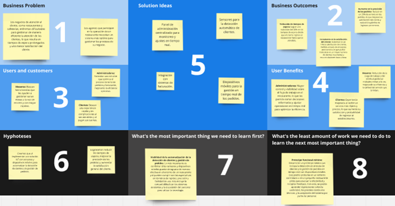

# Capítulo I: Introducción

## 1.1. Startup Profile
### 1.1.1. Descripción de la Startup
Somos Tecnogurus, un startup conformado por estudiantes de la Universidad Peruana de Ciencias Aplicadas. Solucionamos problemáticas con herramientas tecnológicas para automatizar y acelerar procesos.
En esta oportunidad presentamos Tecgnurus una solución IoT que buscara acortar los tiempos de atención de restaurantes por medio de dispositivos tecnológicos que nos ayudaran a facilitar esto. Para ello contaremos con sensores los cuales detectaran si un cliente ha ingresado al local y donde se ha sentado. De la misma forma estos sensores ayudaran a detectar cuando un cliente se para de su mesa o hay platos por recoger. Así mismo ofrecemos una solución tecnológica al tomar los pedidos con dispositivos móviles que trasmitan la información a cocina y caja para llevar un correcto control de las cuentas por clientes o mesas.

Misión: Mejorar los tiempos de producción y atención de un negocio centrado en la atención de comensales. Ya sean restaurantes, cafeterías u hoteles.
Visión: Ser la empresa que proporcione la solución más completa y satisfactoria a esta problemática que afecta este sector.
### 1.1.2. Perfiles de integrantes del equipo
#### Sandro Alarcon Rondon 

+  Soy estudiante de la carrera de ingenieria de software, he realizado proyectos en c++, java y c#, los cuales tengo conocimientos básicos y tambien he realizado proyectos con framework como Angular y Vue.

#### Fabrizzio Antonio Castro Manrique

+  Tengo desenvolvimientos en desarrollo web y arquitectura de software, he trabajado en proyectos de angular, vue y react para Front-end. Para Back-end C# .NET y SpringBoot.

#### Esteban Calderón Chauchi

+  En mi desarrollo académico, he adquirido diversas habilidades en C++, SQL, Python, Angular y .NET. Dentro de mi trayectoria en Ingeniería de Software, he logrado obtener una compresión más clara sobre los conceptos que abarcan los proyectos centrados en el desarrollo de aplicaciones.

#### Franco Surco Reyes

+  Soy estudiante de la carrera de ingeniería de Software en la universidad Peruana de Ciencias Aplicadas, elegí esta carrera por mi pasión por la programación e interés por la tecnología. Me considero una persona responsable y colaborativa, por lo que apoyaré al grupo en lo que se necesite. Además, tengo conocimientos de programación en C++, Python, HTML, CSS, JavaScript y modelado de base de datos en SQL Server

#### Nicolas Zagal Vallejo

+  Mi nombre es Nicolas Zagal, me considero un miemrbo clave para el equipo debido a mis conocimientos y compromiso. Poseo capacidad para enfrentar desafíos y su disposición para colaborar en el backend y frontend

## 1.2. Solution Profile
### 1.2.1 Antecedentes y problemática

*What?* 
Los negocios tipo restaurante, suelen tener problemas al momento de atender a sus clientes. El proceso sigue el siguiente flujo: Observar el ingreso del nuevo cliente, atenderlo y tomar su pedido, enviar el detalle del pedido a caja y cocina, recibir los platos de cocina y despacharlos, retirar platos y cobrarlo.

*When?*
Esta problematica se da en 3 ocaciones: 
Observar el ingreso del nuevo cliente: En ocasiones el negocio no cuenta con gran cantidad de personal por lo que algunos clientes pueden pasar desapercibidos. 
Enviar el detalle de la orden a mesa y cocina: Cuando hay mesas con gran cantidad de clientes a veces es difícil acordarse todos los platos o se pierde mucho tiempo al pasar las comandas a cocina o caja.
Retiro de utencilios: En ocasiones platos se quedan en las mesas vacías dando un aspecto descuidado al negocio

*Where?*
Esta problemática se da en los negocios de atención al cliente con despacho de alimentos como: Restaurantes, cafeterías, bares, hoteles, etc.

*Who?* 
Los principales afectados por esta problemática son los meseros de estos negocios y los administradores puesto que son ellos los encargados de brindar el servicio lo más rápido posible a los clientes.

*Why?* 
Esto se da principalmente por la falta de personal o la falta de herramientas que ayuden a gestionar los pedidos, alargando así los procesos.

*How?* 
El proyecto deberá llevarse a cabo utilizando sensores y dispositivos móviles de modo que se pueda detectar cuando un cliente nuevo ingresar, donde se sienta y si hay platos en la mesa. También se agilizará el proceso de gestionar el despacho del pedido mediante la expedición de comandas detalladas eficazmente.

*How much?* 
La cantidad de sensores o dispositivos se deberán calcular en base a las necesidades del cliente. Se estima el uso de un dispositivo para la entrada del local, así como un dispositivo por cada mesa y silla. Por otro lado, para la recepción de comandas se necesitará un dispositivo por mesero que se encargará de enviar información y uno por cada caja y centro de despacho de alimentos ya sea cocina, barra u otro. Este último se centrará en recibir la información. 

### 1.2.2 Lean UX Process.
#### 1.2.2.1. Lean UX Problem Statements.

El estado actual de la industria de la restauración se ha enfocado principalmente en los meseros, quienes a menudo tienen dificultades para atender varias mesas al mismo tiempo, lo que resulta en demoras en el servicio y descontento de los clientes. Asimismo, los administradores enfrentan problemas al ingresar los pedidos en el sistema, lo que puede ocasionar retrasos en el despacho de nuevas órdenes y complicar el proceso de facturación. 

La falta de un sistema de gestión de pedidos eficiente es una brecha que los productos y servicios actuales no abordan. Nuestra solución abordará esta necesidad mediante la implementación de un sistema basado en IoT que optimice el manejo de pedidos y facilite el trabajo tanto de meseros como de administradores. 

Nuestro enfoque inicial se dirigirá a estos dos segmentos de clientes. Sabremos que hemos tenido éxito cuando veamos una reducción en los tiempos de servicio y un aumento en la satisfacción del cliente en nuestro público objetivo.

#### 1.2.2.2. Lean UX Assumptions.

## Business Assumptions
- **La solución IoT reducirá los tiempos de atención**: Se asume que al automatizar la detección de clientes y la gestión de pedidos, los tiempos de atención disminuirán considerablemente, mejorando la eficiencia del servicio.
- **El mercado está dispuesto a adoptar nuevas tecnologías**: Se asume que los restaurantes, cafeterías y otros negocios de atención al cliente están dispuestos a invertir en tecnología para mejorar sus procesos operativos.
- **El costo de implementación será recuperable**: Se asume que el costo de implementar los dispositivos IoT y móviles será recuperado rápidamente debido a la mejora en la eficiencia operativa y la satisfacción del cliente.
- **La solución aumentará la satisfacción del cliente**: Se asume que una atención más rápida y eficiente resultará en una mayor satisfacción del cliente, lo que se traducirá en mayor lealtad y repetición de visitas.
- **El proyecto es escalable**: Se asume que la solución puede adaptarse a diferentes tamaños de negocio, desde pequeños cafés hasta grandes cadenas de restaurantes.

## Business Outcome Assumptions
- **Incremento en las ventas**: Se asume que al mejorar la eficiencia y satisfacción del cliente, las ventas de los establecimientos aumentarán.
- **Reducción de costos operativos**: Se asume que la automatización de procesos reducirá la necesidad de personal adicional y los costos asociados.
- **Mejora en la retención de clientes**: Se asume que un servicio más eficiente resultará en una mayor retención de clientes y en recomendaciones boca a boca.

## User Assumptions
- **Los meseros preferirán un sistema automatizado**: Se asume que los meseros estarán dispuestos a utilizar dispositivos móviles para gestionar pedidos, reconociendo los beneficios en términos de ahorro de tiempo y reducción de errores.
- **Los clientes valoran la rapidez y eficiencia**: Se asume que los clientes notarán y apreciarán la rapidez en la atención, lo que mejorará su experiencia general en el establecimiento.
- **El personal administrativo se adaptará fácilmente a la nueva tecnología**: Se asume que los administradores y el personal encargado de la caja y la cocina se adaptarán rápidamente al uso de los nuevos dispositivos, facilitando la integración con el sistema existente.
- **Los usuarios no tendrán problemas con la interfaz**: Se asume que la interfaz de usuario de los dispositivos móviles será intuitiva y fácil de usar, reduciendo la necesidad de capacitación extensa.

## User Outcome Assumptions
- **Aumento en la satisfacción del mesero**: Se asume que los meseros se sentirán más satisfechos y eficientes en su trabajo gracias a la reducción de tiempos de espera y errores en la gestión de pedidos.
- **Mejora en la experiencia del cliente**: Se asume que los clientes disfrutarán de una experiencia más fluida y rápida, lo que se traducirá en comentarios positivos y retorno al establecimiento.
- **Facilidad en la adopción del sistema**: Se asume que la capacitación para el uso del nuevo sistema será breve, resultando en una rápida adopción por parte del personal.

## Feature Assumptions
- **Detección de entrada de clientes**: Sensores que detectan automáticamente cuando un cliente entra al local, enviando una notificación al sistema para asignar una mesa.
- **Asignación automática de mesas**: Sistema que sugiere o asigna automáticamente mesas disponibles basándose en la información proporcionada por los sensores.
- **Gestión de pedidos en tiempo real**: Dispositivos móviles para meseros que permiten tomar pedidos y enviarlos instantáneamente a la cocina y caja, reduciendo tiempos de espera y errores.
- **Monitoreo de estado de mesas**: Sensores que detectan si hay platos por recoger o si una mesa está desocupada, notificando al personal para que mantengan el área limpia y ordenada.
- **Interfaz de administración centralizada**: Un panel para administradores que permite monitorear en tiempo real el estado de las mesas, pedidos en curso y realizar ajustes rápidos en el flujo de trabajo.
- **Integración con sistemas de facturación**: El sistema se conecta con el software de facturación del negocio para automatizar el cobro, reduciendo el tiempo de espera para los clientes al pagar.

#### 1.2.2.3.	Lean UX Hypothesis Statements.

-  **Si automatizamos la detección de clientes mediante sensores IoT,** entonces los meseros podrán atender a los clientes de manera más rápida y eficiente, **lo que reducirá los tiempos de espera y aumentará la satisfacción del cliente.**
-  **Si implementamos un sistema de gestión de pedidos en tiempo real a través de dispositivos móviles,** entonces los errores en las órdenes disminuirán y el proceso de toma de pedidos será más ágil, lo que mejorará la precisión de los pedidos y la eficiencia del servicio.
-  **Si desarrollamos una interfaz intuitiva y fácil de usar para los dispositivos móviles,** entonces el personal podrá adaptarse rápidamente al nuevo sistema**, lo que reducirá el tiempo de capacitación y mejorará la aceptación de la tecnología por parte de los empleados.**
-  **Si integramos nuestro sistema con el software de facturación existente,** entonces los procesos de cobro serán más rápidos y precisos**, lo que disminuirá los tiempos de espera al final de la experiencia del cliente y mejorará la percepción del servicio.**
-  **Si proporcionamos una solución escalable que se adapte a negocios de diferentes tamaños,** entonces más restaurantes y cafeterías adoptarán la tecnología**, lo que aumentará la cuota de mercado de nuestro startup y generará más ingresos.**

#### 1.2.2.4. Lean UX Canvas.

## 1.3. Segmentos objetivos.
Apuntamos a un segmento objetivo que requiera una aplicación integral que les ayude a gestionar eficazmente. 
Entre ellos están:

-  **Mesero**
Es el encargado de gestionar los y atender los pedidos de los comensales. Ellos son los principales afectados puesto que deben dar el mejor servicio y de la manera más eficaz.
-  **Administrador**
Este segmento buscara obtener el detalle de los platos vendidos, así como de conocer los montos de facturación del negocio.
