# Capitulo VI: Product Implamentation, Validation & Deployment

## 6.1 Software Configuration Management 
### 6.1.1 Software Development Environment Configuration
En esta sección se presentan los softwares correspondientes utilizados por los miembros del equipo y los enlaces utilizados para que cada uno tenga asignado el rol de administrador y pueda ejecutar sus cambios al proyecto:  
- **Miro:** Event Storming, Candidate Context Discovery, Domain Message Flows Modeling, Bounded Context Canvases
*Imagen*

Enlace del miro: https://miro.com/app/board/uXjVKkI6spU=/ 

- *Lucidchart:* Context Mapping, DDD Bounded Context Class Diagram
  
*Imagen*

- *Structurizr:* C4 Model System, Container, Component Diagram
  
*Imagen*

- *Vertabelo:* DDD Database Diagram
  
*Imagen*

- *Visual Paradigm:* Bounded Context Component Diagram
  
*Imagen*

- *Visual Studio Code:* Software Development
  
*Imagen*

  
- *Figma:* Web/Mobile Prototype & User Flow
  
*Imagen*

Enlace del figma: https://www.figma.com/design/nyBckh8w59BwWU4cN4DRW9/IoT?node-id=27-667&node-type=canvas&t=yWeXn4Jr6F7oE6yY-0 

### 6.1.2 Source Code Management
El manejo y la gestión de las diferentes modificaciones que se llevaron a cabo, fueron mediante una organización de GitHub para nuestro Startup. 

Organización: https://github.com/Techstudents-SW74 

Repositorio de Landing Page: https://github.com/Techstudents-SW74/LandingPage 

Deployment del Landing Page: https://techstudents-sw74.github.io/ 

Asimismo, se establecieron dos ramas correspondientes para el desarrollo:  

- Main: esta rama cuenta con la versión estable de nuestra landing page luego de que cada componente haya sido aprobado mediante una pull request. 

- develop: esta rama cuenta con versiones donde se pusieron a prueba los componentes que cada integrante implemento a la landing page

### 6.1.3 Source Code Style Guide & Conventions

###HTML:
Se aplicarán las directrices de “HTML Style Guide and Coding” de W3Schools, destacando convenciones clave como declarar siempre el tipo de documento (<!DOCTYPE>), utilizar etiquetas y atributos en minúsculas para mantener un código limpio y organizado, y cerrar todas las etiquetas para prevenir errores. Se colocarán comillas en los valores de los atributos y se especificarán siempre los atributos alt, width y height en las imágenes para mejorar la accesibilidad y el SEO. Además, no se omitirán las etiquetas <head> y los metadatos esenciales para la optimización en motores de búsqueda.

### CSS:
Basado en la “Google HTML/CSS Style Guide”, se seguirán prácticas recomendadas como usar nombres de clase generales, cortos y descriptivos, empleando guiones para separar palabras. Se evitarán los selectores de ID, priorizando selectores de clase, y se utilizarán propiedades abreviadas como margin, padding, y border para mejorar la legibilidad y reducir el número de líneas de código. Estas convenciones aseguran un estilo CSS más limpio y escalable.

### JavaScript:
Se implementarán las “JavaScript Best Practices” recomendadas por el W3C, priorizando nombres cortos y fáciles de entender para variables y funciones. Se evitará el uso de variables globales (var), prefiriendo let o const para evitar colisiones de nombres y errores a largo plazo. Se documentarán y comentarán solo las partes necesarias del código, explicando las secciones complejas, y se adoptarán notaciones y operadores sencillos para manipular estructuras de datos.

### Gherkin:
Para las pruebas, se seguirá la guía “Gherkin Conventions for Readable Specifications”, organizando claramente los bloques Given-When-Then mediante la indentación adecuada y el uso de la palabra clave "And" para pasos adicionales. Se utilizarán tablas cuando los pasos requieran mayor información y se emplearán comillas simples para los parámetros en los escenarios, mejorando la legibilidad. Los escenarios múltiples se separarán con comentarios para facilitar la organización visual.

### Frontend y Backend:
La landing page y las aplicaciones web seguirán las pautas de diseño de Material Design, utilizando Angular Material como biblioteca de componentes de UI. El frontend será desarrollado en Angular Framework, combinando HTML5, CSS3 y JavaScript/TypeScript para los aspectos estáticos y lógicos de las aplicaciones. En el backend, se implementarán servicios web bajo el estilo arquitectónico RESTful API usando Spring Boot y Java como lenguaje principal.

### Control de versiones:
El control de versiones será gestionado con GIT desde GitHub, siguiendo las prácticas de GitFlow Workflow junto con Conventional Commits y Semantic Versioning. Esto permitirá una integración continua, con despliegues automáticos y manejo eficiente de hotfixes.

### 6.1.4 Software Deployment Configuration
La siguiente tabla presenta los commits del repositorio del landing page en GitHub:
| Id del commit          | Commit           |
|------------------------|------------------|
|babf1bf8b1439d841dc4fde5b33f2aac61105ce0 |Initial commit |
|6aff73d0b39a7c9a4d5ae1c99d9338f9c6bd662d |Part 1 |
|b001457e48e36f514a12f978dbb9475c25c50e06 |Part 2 |
|                                         |Merge branch 'main' of https://github.com/Techstudents-SW74/LandingPage |
|70f08b4f25df21ae3535a38c6a58269014181cfd |Part 3 |
|bd7bee8feec07792a080e8d29913ebeb7db84b6e |Part 4 |
|d38272d239da0f26d26452496e6d3e89f8a871fe |(feat) "add header & footer" |

## 6.2 Landing Page, Services & Application Implementation 
En esta sección, se explicará y evidenciará el proceso de despliegue para la Landing page de nuestro startup, utilizando la herramienta de despliegue. Para lograr este objetivo se utilizó el CLI de esta herramienta y el GitHub donde se creó el repositorio. 

### 6.2.1 Sprint 1
#### 6.2.1.1 Sprint Planning 1 
A continuación, se presenta el Sprint Planning 1, donde se muestran las evidencias de planificación e implementación del Landing Page. Las evidencias se encuentran disponibles dentro del repositorio de GitHub.
| Sprint                        | Sprint 1            |
|-------------------------------|---------------------|
|Sprint Planning Background  |Initial commit |
|Date  |26 de septiembre del 2024 |
|Time  |13:00 horas (GMT-5) |
|Location  |Modalidad remota por Discord  |
|Prepared by  |Fabrizzio Antonio Castro Manrique  |
|Attendees (to planning meeting)  |Todos los integrantes del equipo |
|Sprint 1 – Review Summary  |En el primer sprint se estableció la agrupación de componentes y el despliegue del Landing Page. |
|Sprint 1 – Retrospective Summary |Para el primer sprint se estableció desarrollar el Landing Page y dividirlo por secciones. Establecimos un acuerdo de la utilización HTML, CSS y JS para seguir una arquitectura lineal y se pueda tener una mejor limpieza de código para eliminar o agregar secciones dentro de este. Se utilizaron diseños sobrios para poder utilizar conceptos de CSS de una forma más eficiente, asimismo como herramientas que permitieron su despliegue rápido dentro de Github |
|Sprint Goal & User Stories |                     |
|Sprint 1 Velocity | 33 |
|Sum of Story Points| 33 |

#### 6.2.1.2 Sprint Backlog
<table>
  <tr>
    <th colspan="2">Sprint #</th>
    <th colspan="6">Sprint 1</th>
  </tr>
  <tr>
    <th colspan="2">User Story</th>
    <th colspan="6">Work-Item / Task</th>
  </tr>
  <tr>
    <th>Id</th>
    <th>Title</th>
    <th>Id</th>
    <th>Title</th>
    <th>Description</th>
    <th>Estimation (Hours)</th>
    <th>Assigned to</th>
    <th>Status</th>
  </tr>
  <tr>
    <th>US001</th>
    <th>Seccion de Header </th>
    <th>2</th>
    <th>Seccion de Header</th>
    <th>COMO usuario QUIERO visualizar un encabezado de página que contenga opciones PARA una mejor navegación por la página. </th>
    <th>2</th>
    <th>Fabrizzio Castro</th>
    <th>Done</th>
  </tr>
  <tr>
    <th>US002</th>
    <th>Seccion de Footer</th>
    <th>3</th>
    <th>Seccion de Footer</th>
    <th>COMO usuario QUIERO visualizar pie de página que contenga información PARA un mejor entendimiento de la página. </th>
    <th>1</th>
    <th>Nicolas Zagal</th>
    <th>Done</th>
  </tr>
  <tr>
    <th>US005</th>
    <th>Boton para ver mas informacion</th>
    <th>4</th>
    <th>Boton para ver mas informacion</th>
    <th>COMO usuario QUIERO ver más información sobre la página PARA comprender más sobre la start-up.  </th>
    <th>1</th>
    <th>Esteban Calderon</th>
    <th>Done</th>
  </tr>
  <tr>
    <th>US006</th>
    <th>Sección de contacto </th>
    <th>5</th>
    <th>Sección de contacto </th>
    <th>COMO usuario QUIERO observar una seccion que contenga información de la página PARA poder conocer sobre qué se trata. </th>
    <th>2</th>
    <th>Sandro Alarcon</th>
    <th>Done</th>
  </tr>
  <tr>
    <th>US003</th>
    <th>Barra de Navegación </th>
    <th>13</th>
    <th>Barra de Navegación </th>
    <th>COMO usuario QUIERO presionar botones en el encabezado del landing page para desplazarme por la página.  </th>
    <th>3</th>
    <th>Nicolas Zagal</th>
    <th>Done</th>
  </tr>
  <tr>
    <th>US004</th>
    <th>Descripción de la Start-Up </th>
    <th>14</th>
    <th>Descripción de la Start-Up </th>
    <th>COMO usuario QUIERO observar una seccion “Contacto” PARA poder comunicarme directamente con el equipo de desarrollo.</th>
    <th>2</th>
    <th>Esteban Calderon</th>
    <th>Done</th>
  </tr>
  <tr>
    <th>US007</th>
    <th>Sección de información del equipo </th>
    <th>15</th>
    <th>Sección de información del equipo </th>
    <th>COMO usuario QUIERO observar en el encabezado una seccion de información del equipo PARA conocer más a fondo su desarrollo. </th>
    <th>3</th>
    <th>Fabrizzio Castro</th>
    <th>Done</th>
  </tr>
  <tr>
    <th>US009</th>
    <th>Logout </th>
    <th>1</th>
    <th>Logout </th>
    <th>COMO cliente QUIERO salir de la aplicación PARA evitar el uso de mi cuenta por otras personas.  </th>
    <th>1</th>
    <th>Sandro Alarcon</th>
    <th>Done</th>
  </tr>
  <tr>
    <th>US014</th>
    <th>Sección de inicio de sesión  </th>
    <th>9</th>
    <th>Sección de inicio de sesión  </th>
    <th>COMO usuario QUIERO iniciar sesión en mi cuenta PARA acceder a la información de la plataforma.  </th>
    <th>2</th>
    <th>Fabrizzio Castro</th>
    <th>Done</th>
  </tr>
  <tr>
    <th>US015</th>
    <th>Sección de registro  </th>
    <th>10</th>
    <th>Sección de registro  </th>
    <th>COMO usuario QUIERO observar una seccion de “Regístrate” PARA crear una cuenta nueva.  </th>
    <th>2</th>
    <th>Nicolas Zagal</th>
    <th>Done</th>
  </tr>
  <tr>
    <th>US016</th>
    <th>Dirigir a perfil de usuario  </th>
    <th>18</th>
    <th>Dirigir a perfil de usuario  </th>
    <th>COMO cliente QUIERO acceder a mi perfil PARA cambiar cualquier dato que necesite actualización. </th>
    <th>3</th>
    <th>Sandro Alarcon</th>
    <th>Done</th>
  </tr>
  <tr>
    <th>US018</th>
    <th>Ver y editar datos de usuario  </th>
    <th>19</th>
    <th>Ver y editar datos de usuario  </th>
    <th>COMO usuario QUIERO ver y editar mi información PARA mantenerla actualizada.  </th>
    <th>3</th>
    <th>Esteban Calderon</th>
    <th>In Progress </th>
  </tr>
  <tr>
    <th>US025</th>
    <th>Enviar pedido guardado a cocina y caja  </th>
    <th>28</th>
    <th>Enviar pedido guardado a cocina y caja  </th>
    <th>COMO mesero QUIERO enviar pedidos a cocina o caja PARA continuar con el flujo de trabajo sin necesidad de dictar la orden manualmente. </th>
    <th>4</th>
    <th>Fabrizzio Castro</th>
    <th>In Progress </th>
  </tr>
  <tr>
    <th>US013</th>
    <th>Ver resumen de ventas</th>
    <th>30</th>
    <th>Ver resumen de ventas</th>
    <th>COMO administrador QUIERO ver el resumen de ventas por días PARA saber cuánto se vendió en cada jornada.  </th>
    <th>4</th>
    <th>Fabrizzio Castro</th>
    <th>In Progress </th>
  </tr>
</table>

#### 6.2.1.3 Development Evidence for Sprint Review

Repository | Branch | Commit Id | Commit Message | Commit Message Body | Commited on (Date)
--- | --- | --- | --- | --- | ---
tech-kitchen-webapp | feature/sidebar | 4eb7589 |feature/sidebar added | - | 19/09/2023
tech-kitchen-webapp | feature/inventory | 13fa79a | feature/inventory added | - | 19/09/2023
tech-kitchen-webapp | feature/sign up | b79d6a8 | feature/sign up added | - | 19/09/2023
tech-kitchen-webapp | feature/login | 597a41e | feature/login added | - | 21/09/2023
tech-kitchen-webapp | feature/profile | 02d5eab | feature/profile added | - | 21/09/2023
tech-kitchen-webapp | feature/product | 9dd841f | feature/product added | - | 21/09/2023
tech-kitchen-webapp | feature/home-project | 239aecd | feature/home-project added | - | 23/09/2023
tech-kitchen-webapp | feature/features | 27abcdf |  feature/features added | - | 23/09/2023

LandingPage | feature/aboutus | 5832e79 |feature/aboutus added | - | 25/09/2023
LandingPage | feature/functionalities | c69748b | feature/functionalities added | - | 25/09/2023
LandingPage | feature/navbar | 457fd51 | feature/navbar added | - | 25/09/2023
LandingPage | develop | 4524261 | footer added | - | 19/09/2023
LandingPage | feature/features | 13c7bbe | feature/features | - | 19/09/2023
LandingPage | develop | 929a124 | fix: general items | - | 19/09/2023

#### 6.2.1.4 Testing Suite Evidence for Sprint Review 
Para este sprint, no se han realizado las actividades requeridas en la sección de pruebas.  

#### 6.2.1.5 Execution Evidence for Sprint Review 

En el Sprint 1 se alcanzó a desarrollar una primera versión de las web apps y la landing page

Vistas desarrolladas: Landing page (Hero section):

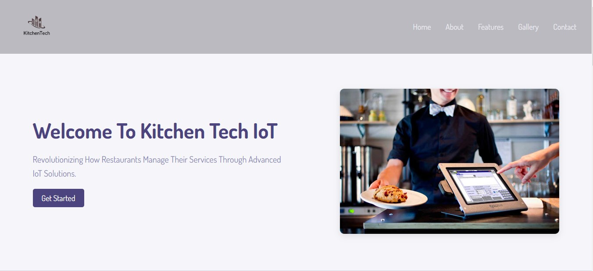

Landing page (About us):

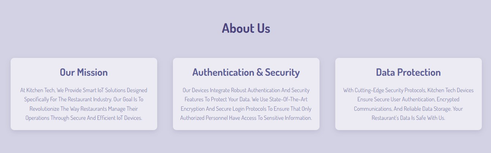

Landing page (Members):

Landing page (IOT features):

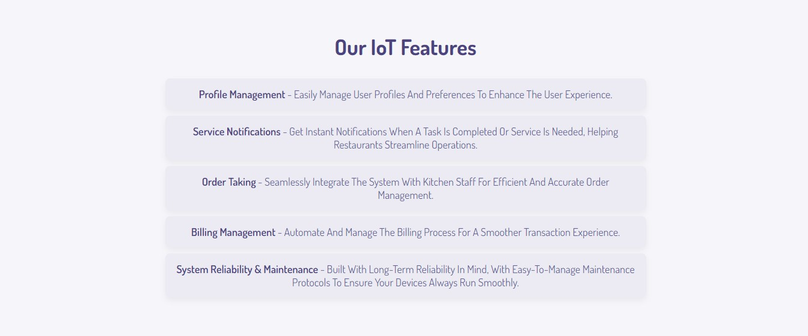

Landing page (Galelry section):

Landing page (Contact section y footer):

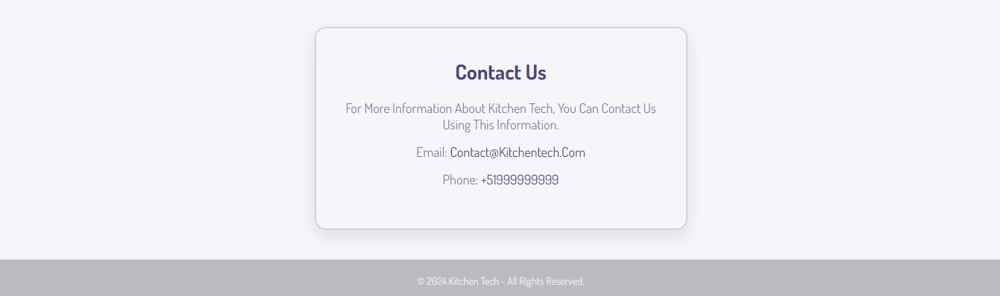

Vistas desarrolladas: Web app (profile):

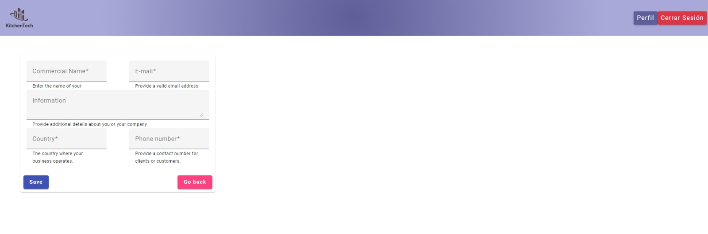

Web app (login):

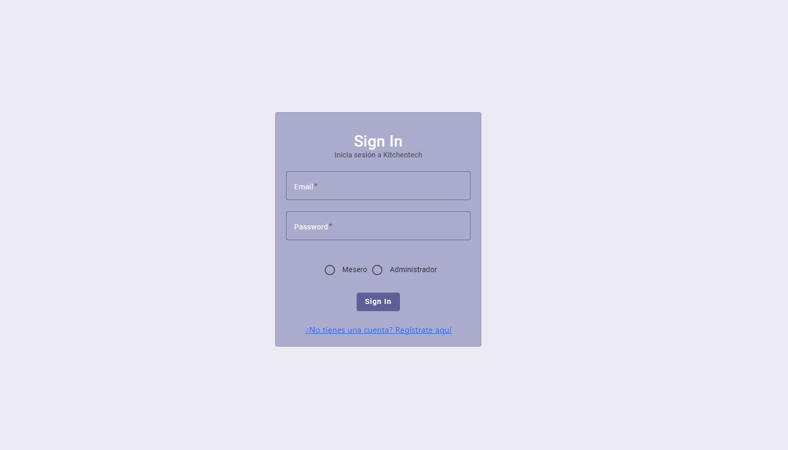

Web app (sign up):

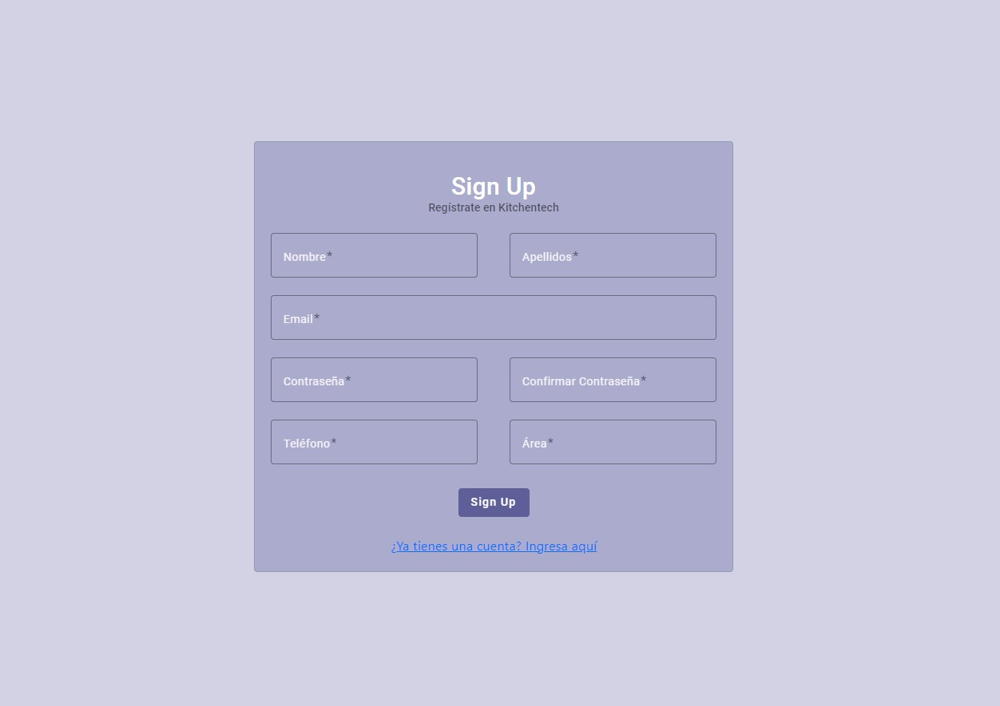

Web app (caja):

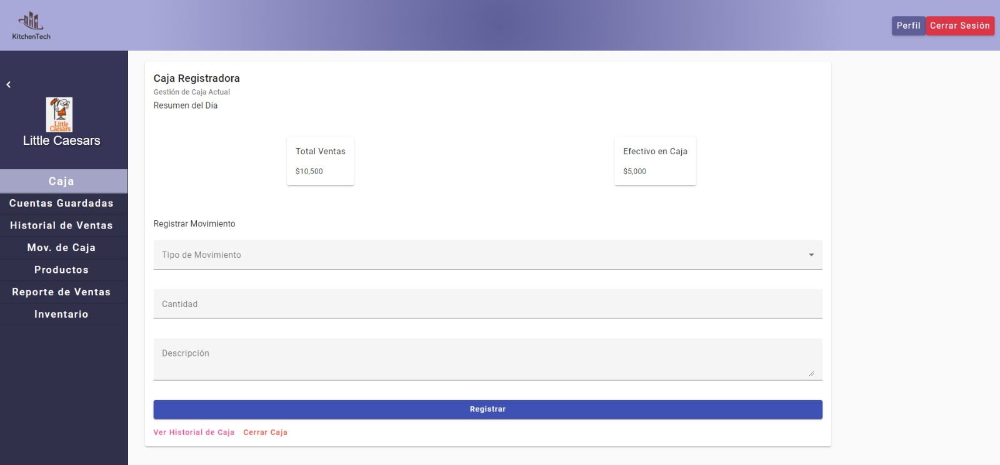

Web app (cuentas guardadas):

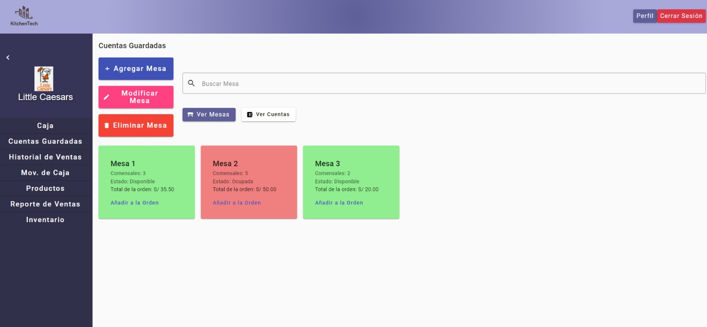

Web app (mov. de caja):

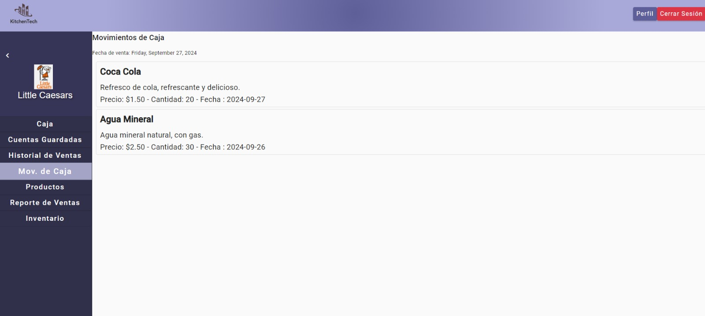

Web app (productos):

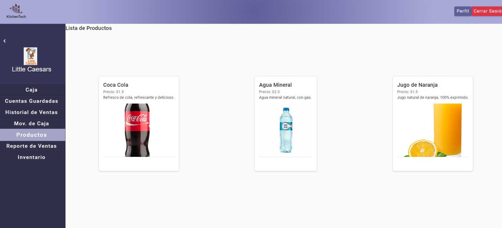

#### 6.2.1.6 Services Documentation Evidence for Sprint Review
Para este entregable en el sprint 1, hemos considerado utilizar una fake api, el cual permite concer la funcionalidades y vistas de la web app.

https://my-json-server.typicode.com/Techstudents-SW74/Kitchen-fakeAPI 

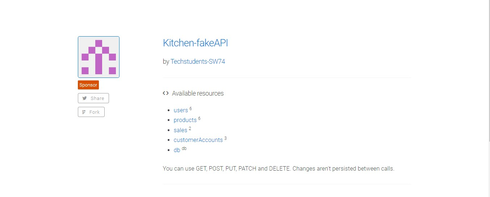

#### 6.2.1.7 Software Deployment Evidence for Sprint Review 

Para este entregable se realizó el despliegue de la primera version de la landing page como tambien de la web app.

https://techstudents-sw74.github.io/

https://kitchentech-app.web.app/home-project

#### 6.2.1.8 Team Collaboration Insights during Sprint 

Para este entregable se realizó el despliegue de la primera version de la landing page como tambien de la web app. Es to permitió la presencia de los miembros del grupo para intervenir en el desarrollo como de:

Landing page:

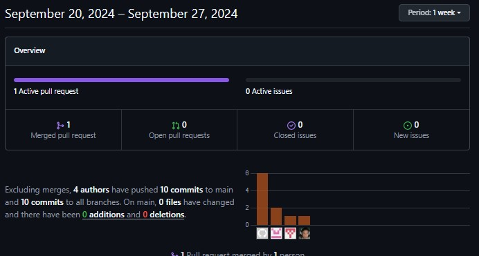

Weba app:

