# Capitulo VI: Product Implamentation, Validation & Deployment

## 6.1 Software Configuration Management 
### 6.1.1 Software Development Environment Configuration
En esta sección se presentan los softwares correspondientes utilizados por los miembros del equipo y los enlaces utilizados para que cada uno tenga asignado el rol de administrador y pueda ejecutar sus cambios al proyecto:  
- **Miro:** Event Storming, Candidate Context Discovery, Domain Message Flows Modeling, Bounded Context Canvases
*Imagen*

Enlace del miro: https://miro.com/app/board/uXjVKkI6spU=/ 

- *Lucidchart:* Context Mapping, DDD Bounded Context Class Diagram
  
*Imagen*

- *Structurizr:* C4 Model System, Container, Component Diagram
  
*Imagen*

- *Vertabelo:* DDD Database Diagram
  
*Imagen*

- *Visual Paradigm:* Bounded Context Component Diagram
  
*Imagen*

- *Visual Studio Code:* Software Development
  
*Imagen*

  
- *Figma:* Web/Mobile Prototype & User Flow
  
*Imagen*

Enlace del figma: https://www.figma.com/design/nyBckh8w59BwWU4cN4DRW9/IoT?node-id=27-667&node-type=canvas&t=yWeXn4Jr6F7oE6yY-0 

### 6.1.2 Source Code Management
El manejo y la gestión de las diferentes modificaciones que se llevaron a cabo, fueron mediante una organización de GitHub para nuestro Startup. 

Organización: https://github.com/Techstudents-SW74 

Repositorio de Landing Page: https://github.com/Techstudents-SW74/LandingPage 

Deployment del Landing Page: https://techstudents-sw74.github.io/ 

Asimismo, se establecieron dos ramas correspondientes para el desarrollo:  

- Main: esta rama cuenta con la versión estable de nuestra landing page luego de que cada componente haya sido aprobado mediante una pull request. 

- develop: esta rama cuenta con versiones donde se pusieron a prueba los componentes que cada integrante implemento a la landing page

### 6.1.3 Source Code Style Guide & Conventions

###HTML:
Se aplicarán las directrices de “HTML Style Guide and Coding” de W3Schools, destacando convenciones clave como declarar siempre el tipo de documento (<!DOCTYPE>), utilizar etiquetas y atributos en minúsculas para mantener un código limpio y organizado, y cerrar todas las etiquetas para prevenir errores. Se colocarán comillas en los valores de los atributos y se especificarán siempre los atributos alt, width y height en las imágenes para mejorar la accesibilidad y el SEO. Además, no se omitirán las etiquetas <head> y los metadatos esenciales para la optimización en motores de búsqueda.

### CSS:
Basado en la “Google HTML/CSS Style Guide”, se seguirán prácticas recomendadas como usar nombres de clase generales, cortos y descriptivos, empleando guiones para separar palabras. Se evitarán los selectores de ID, priorizando selectores de clase, y se utilizarán propiedades abreviadas como margin, padding, y border para mejorar la legibilidad y reducir el número de líneas de código. Estas convenciones aseguran un estilo CSS más limpio y escalable.

### JavaScript:
Se implementarán las “JavaScript Best Practices” recomendadas por el W3C, priorizando nombres cortos y fáciles de entender para variables y funciones. Se evitará el uso de variables globales (var), prefiriendo let o const para evitar colisiones de nombres y errores a largo plazo. Se documentarán y comentarán solo las partes necesarias del código, explicando las secciones complejas, y se adoptarán notaciones y operadores sencillos para manipular estructuras de datos.

### Gherkin:
Para las pruebas, se seguirá la guía “Gherkin Conventions for Readable Specifications”, organizando claramente los bloques Given-When-Then mediante la indentación adecuada y el uso de la palabra clave "And" para pasos adicionales. Se utilizarán tablas cuando los pasos requieran mayor información y se emplearán comillas simples para los parámetros en los escenarios, mejorando la legibilidad. Los escenarios múltiples se separarán con comentarios para facilitar la organización visual.

### Frontend y Backend:
La landing page y las aplicaciones web seguirán las pautas de diseño de Material Design, utilizando Angular Material como biblioteca de componentes de UI. El frontend será desarrollado en Angular Framework, combinando HTML5, CSS3 y JavaScript/TypeScript para los aspectos estáticos y lógicos de las aplicaciones. En el backend, se implementarán servicios web bajo el estilo arquitectónico RESTful API usando Spring Boot y Java como lenguaje principal.

### Control de versiones:
El control de versiones será gestionado con GIT desde GitHub, siguiendo las prácticas de GitFlow Workflow junto con Conventional Commits y Semantic Versioning. Esto permitirá una integración continua, con despliegues automáticos y manejo eficiente de hotfixes.

### 6.1.4 Software Deployment Configuration
La siguiente tabla presenta los commits del repositorio del landing page en GitHub:
| Id del commit          | Commit           |
|------------------------|------------------|
|babf1bf8b1439d841dc4fde5b33f2aac61105ce0 |Initial commit |
|6aff73d0b39a7c9a4d5ae1c99d9338f9c6bd662d |Part 1 |
|b001457e48e36f514a12f978dbb9475c25c50e06 |Part 2 |
|                                         |Merge branch 'main' of https://github.com/Techstudents-SW74/LandingPage |
|70f08b4f25df21ae3535a38c6a58269014181cfd |Part 3 |
|bd7bee8feec07792a080e8d29913ebeb7db84b6e |Part 4 |
|d38272d239da0f26d26452496e6d3e89f8a871fe |(feat) "add header & footer" |

## 6.2 Landing Page, Services & Application Implementation 
En esta sección, se explicará y evidenciará el proceso de despliegue para la Landing page de nuestro startup, utilizando la herramienta de despliegue. Para lograr este objetivo se utilizó el CLI de esta herramienta y el GitHub donde se creó el repositorio. 

### 6.2.1 Sprint 1
#### 6.2.1.1 Sprint Planning 1 
A continuación, se presenta el Sprint Planning 1, donde se muestran las evidencias de planificación e implementación del Landing Page. Las evidencias se encuentran disponibles dentro del repositorio de GitHub.
| Sprint                        | Sprint 1            |
|-------------------------------|---------------------|
|Sprint Planning Background  |Initial commit |
|Date  |26 de septiembre del 2024 |
|Time  |13:00 horas (GMT-5) |
|Location  |Modalidad remota por Discord  |
|Prepared by  |Fabrizzio Antonio Castro Manrique  |
|Attendees (to planning meeting)  |Todos los integrantes del equipo |
|Sprint 1 – Review Summary  |En el primer sprint se estableció la agrupación de componentes y el despliegue del Landing Page. |
|Sprint 1 – Retrospective Summary |Para el primer sprint se estableció desarrollar el Landing Page y dividirlo por secciones. Establecimos un acuerdo de la utilización HTML, CSS y JS para seguir una arquitectura lineal y se pueda tener una mejor limpieza de código para eliminar o agregar secciones dentro de este. Se utilizaron diseños sobrios para poder utilizar conceptos de CSS de una forma más eficiente, asimismo como herramientas que permitieron su despliegue rápido dentro de Github |
|Sprint Goal & User Stories | Este sprint, *nuestro objetivo se enfocará* en informar a nuestros visitantes sobre el funcionamiento esperado de la aplicación web mediante las descripciones de las secciones que se muestran la Landing Page. Además, se desarrollará la Web Application inicial para brindar a los administradores y meseros una herramienta que permita visualizar las cuentas de los comensales, entender el flujo básico del sistema y realizar pruebas iniciales de las funcionalidades CRUD implementadas con una fake api. Creemos que este objetivo permitirá a los visitantes comprender la importancia del sistema y su conexión con las operaciones del restaurante, además de generar buenas expectativas en los administradores y meseros gracias a la presentación clara de las funcionalidades iniciales, como la creación y visualización de cuentas. El objetivo se cumplirá cuando los visitantes tengan claridad sobre el propósito de la solución presentada, los administradores y meseros validen que el flujo básico de gestión de cuentas es funcional y fácil de entender, y los desarrolladores puedan recibir retroalimentación inicial para las siguientes iteraciones.
|
|Sprint 1 Velocity | 33 |
|Sum of Story Points| 33 |

#### 6.2.1.2 Sprint Backlog
<table>
  <tr>
    <th colspan="2">Sprint #</th>
    <th colspan="6">Sprint 1</th>
  </tr>
  <tr>
    <th colspan="2">User Story</th>
    <th colspan="6">Work-Item / Task</th>
  </tr>
  <tr>
    <th>Id</th>
    <th>Title</th>
    <th>Id</th>
    <th>Title</th>
    <th>Description</th>
    <th>Estimation (Hours)</th>
    <th>Assigned to</th>
    <th>Status</th>
  </tr>
  <tr>
    <th>US001</th>
    <th>Seccion de Header </th>
    <th>2</th>
    <th>Seccion de Header</th>
    <th>COMO usuario QUIERO visualizar un encabezado de página que contenga opciones PARA una mejor navegación por la página. </th>
    <th>2</th>
    <th>Fabrizzio Castro</th>
    <th>Done</th>
  </tr>
  <tr>
    <th>US002</th>
    <th>Seccion de Footer</th>
    <th>3</th>
    <th>Seccion de Footer</th>
    <th>COMO usuario QUIERO visualizar pie de página que contenga información PARA un mejor entendimiento de la página. </th>
    <th>1</th>
    <th>Nicolas Zagal</th>
    <th>Done</th>
  </tr>
  <tr>
    <th>US005</th>
    <th>Boton para ver mas informacion</th>
    <th>4</th>
    <th>Boton para ver mas informacion</th>
    <th>COMO usuario QUIERO ver más información sobre la página PARA comprender más sobre la start-up.  </th>
    <th>1</th>
    <th>Esteban Calderon</th>
    <th>Done</th>
  </tr>
  <tr>
    <th>US006</th>
    <th>Sección de contacto </th>
    <th>5</th>
    <th>Sección de contacto </th>
    <th>COMO usuario QUIERO observar una seccion que contenga información de la página PARA poder conocer sobre qué se trata. </th>
    <th>2</th>
    <th>Sandro Alarcon</th>
    <th>Done</th>
  </tr>
  <tr>
    <th>US003</th>
    <th>Barra de Navegación </th>
    <th>13</th>
    <th>Barra de Navegación </th>
    <th>COMO usuario QUIERO presionar botones en el encabezado del landing page para desplazarme por la página.  </th>
    <th>3</th>
    <th>Nicolas Zagal</th>
    <th>Done</th>
  </tr>
  <tr>
    <th>US004</th>
    <th>Descripción de la Start-Up </th>
    <th>14</th>
    <th>Descripción de la Start-Up </th>
    <th>COMO usuario QUIERO observar una seccion “Contacto” PARA poder comunicarme directamente con el equipo de desarrollo.</th>
    <th>2</th>
    <th>Esteban Calderon</th>
    <th>Done</th>
  </tr>
  <tr>
    <th>US007</th>
    <th>Sección de información del equipo </th>
    <th>15</th>
    <th>Sección de información del equipo </th>
    <th>COMO usuario QUIERO observar en el encabezado una seccion de información del equipo PARA conocer más a fondo su desarrollo. </th>
    <th>3</th>
    <th>Fabrizzio Castro</th>
    <th>Done</th>
  </tr>
  <tr>
    <th>US009</th>
    <th>Logout </th>
    <th>1</th>
    <th>Logout </th>
    <th>COMO cliente QUIERO salir de la aplicación PARA evitar el uso de mi cuenta por otras personas.  </th>
    <th>1</th>
    <th>Sandro Alarcon</th>
    <th>Done</th>
  </tr>
  <tr>
    <th>US014</th>
    <th>Sección de inicio de sesión  </th>
    <th>9</th>
    <th>Sección de inicio de sesión  </th>
    <th>COMO usuario QUIERO iniciar sesión en mi cuenta PARA acceder a la información de la plataforma.  </th>
    <th>2</th>
    <th>Fabrizzio Castro</th>
    <th>Done</th>
  </tr>
  <tr>
    <th>US015</th>
    <th>Sección de registro  </th>
    <th>10</th>
    <th>Sección de registro  </th>
    <th>COMO usuario QUIERO observar una seccion de “Regístrate” PARA crear una cuenta nueva.  </th>
    <th>2</th>
    <th>Nicolas Zagal</th>
    <th>Done</th>
  </tr>
  <tr>
    <th>US016</th>
    <th>Dirigir a perfil de usuario  </th>
    <th>18</th>
    <th>Dirigir a perfil de usuario  </th>
    <th>COMO cliente QUIERO acceder a mi perfil PARA cambiar cualquier dato que necesite actualización. </th>
    <th>3</th>
    <th>Sandro Alarcon</th>
    <th>Done</th>
  </tr>
  <tr>
    <th>US018</th>
    <th>Ver y editar datos de usuario  </th>
    <th>19</th>
    <th>Ver y editar datos de usuario  </th>
    <th>COMO usuario QUIERO ver y editar mi información PARA mantenerla actualizada.  </th>
    <th>3</th>
    <th>Esteban Calderon</th>
    <th>In Progress </th>
  </tr>
  <tr>
    <th>US025</th>
    <th>Enviar pedido guardado a cocina y caja  </th>
    <th>28</th>
    <th>Enviar pedido guardado a cocina y caja  </th>
    <th>COMO mesero QUIERO enviar pedidos a cocina o caja PARA continuar con el flujo de trabajo sin necesidad de dictar la orden manualmente. </th>
    <th>4</th>
    <th>Fabrizzio Castro</th>
    <th>In Progress </th>
  </tr>
  <tr>
    <th>US013</th>
    <th>Ver resumen de ventas</th>
    <th>30</th>
    <th>Ver resumen de ventas</th>
    <th>COMO administrador QUIERO ver el resumen de ventas por días PARA saber cuánto se vendió en cada jornada.  </th>
    <th>4</th>
    <th>Fabrizzio Castro</th>
    <th>In Progress </th>
  </tr>
</table>

#### 6.2.1.3 Development Evidence for Sprint Review

Repository | Branch | Commit Id | Commit Message | Commit Message Body | Commited on (Date)
--- | --- | --- | --- | --- | ---
tech-kitchen-webapp | feature/sidebar | 4eb7589 |feature/sidebar added | - | 19/09/2023
tech-kitchen-webapp | feature/inventory | 13fa79a | feature/inventory added | - | 19/09/2023
tech-kitchen-webapp | feature/sign up | b79d6a8 | feature/sign up added | - | 19/09/2023
tech-kitchen-webapp | feature/login | 597a41e | feature/login added | - | 21/09/2023
tech-kitchen-webapp | feature/profile | 02d5eab | feature/profile added | - | 21/09/2023
tech-kitchen-webapp | feature/product | 9dd841f | feature/product added | - | 21/09/2023
tech-kitchen-webapp | feature/home-project | 239aecd | feature/home-project added | - | 23/09/2023
tech-kitchen-webapp | feature/features | 27abcdf |  feature/features added | - | 23/09/2023
LandingPage | feature/aboutus | 5832e79 |feature/aboutus added | - | 25/09/2023
LandingPage | feature/functionalities | c69748b | feature/functionalities added | - | 25/09/2023
LandingPage | feature/navbar | 457fd51 | feature/navbar added | - | 25/09/2023
LandingPage | develop | 4524261 | footer added | - | 19/09/2023
LandingPage | feature/features | 13c7bbe | feature/features | - | 19/09/2023
LandingPage | develop | 929a124 | fix: general items | - | 19/09/2023

#### 6.2.1.4 Testing Suite Evidence for Sprint Review 
Para este sprint, no se han realizado las actividades requeridas en la sección de pruebas.  

#### 6.2.1.5 Execution Evidence for Sprint Review 

En el Sprint 1 se alcanzó a desarrollar una primera versión de las web apps y la landing page

Vistas desarrolladas: Landing page (Hero section):

Landing page (About us):

Landing page (Members):

Landing page (IOT features):

Landing page (Galelry section):

Landing page (Contact section y footer):

Vistas desarrolladas: Web app (profile):

Web app (login):

Web app (sign up):

Web app (caja):

Web app (cuentas guardadas):

Web app (mov. de caja):

Web app (productos):

#### 6.2.1.6 Services Documentation Evidence for Sprint Review
Para este entregable en el sprint 1, hemos considerado utilizar una fake api, el cual permite concer la funcionalidades y vistas de la web app.

https://my-json-server.typicode.com/Techstudents-SW74/Kitchen-fakeAPI 

#### 6.2.1.7 Software Deployment Evidence for Sprint Review 

Para este entregable se realizó el despliegue de la primera version de la landing page como tambien de la web app.

https://techstudents-sw74.github.io/

https://kitchentech-app.web.app/home-project

#### 6.2.1.8 Team Collaboration Insights during Sprint 

Para este entregable se realizó el despliegue de la primera version de la landing page como tambien de la web app. Es to permitió la presencia de los miembros del grupo para intervenir en el desarrollo como de:

Landing page:

Weba app:

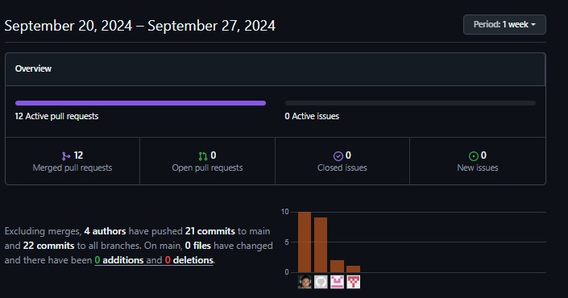

### 6.2.2 Sprint 2

#### 6.2.2.1 Sprint Planning 2.

A continuación, se presenta el Sprint Planning 2, donde se muestran las evidencias de planificación e implementación de web aplication, back end y app mobile. Las evidencias se encuentran disponibles dentro del repositorio de GitHub.
| Sprint                        | Sprint 2           |
|-------------------------------|---------------------|
|Sprint Planning Background  | El enfoque de este Sprint es consolidar los componentes críticos de la aplicación móvil, mejorar la interfaz de usuario de la aplicación web y asegurar la funcionalidad del backend. Además, se implementarán las conexiones iniciales para el sistema IoT, habilitando la interacción entre dispositivos y la plataforma para optimizar el flujo en restaurantes. |
|Date  |15 de octubre del 2024 |
|Time  |11:00 horas (GMT-5) |
|Location  |Modalidad remota por Discord  |
|Prepared by  |Fabrizzio Antonio Castro Manrique  |
|Attendees (to planning meeting)  |Todos los integrantes del equipo |
|Sprint 2 – Review Summary  |En el primer sprint, se logró la agrupación inicial de los componentes necesarios para establecer el flujo CRUD de las cuentas de comensales y la implementación de la lógica de asignación de mesas. Además, se trabajó en un prototipo funcional para la validación del flujo de pedidos, asegurando que la lógica de negocio conectara correctamente con el backend y los dispositivos IoT. Este trabajo sentó las bases para la integración entre el Edge Server y la aplicación móvil, facilitando pruebas preliminares en un entorno controlado.  |
|Sprint 2 – Retrospective Summary | Durante este sprint, se definieron los pilares para el desarrollo del flujo CRUD de cuentas de comensales y el prototipado de mesas. El equipo decidió utilizar una arquitectura basada en endpoints clave para garantizar la comunicación en tiempo real entre el IoT y el sistema de gestión. Se estableció el uso de herramientas de prototipado rápidas y la documentación de flujos para alinear al equipo técnico con la lógica de negocio. Aunque el desarrollo fue exitoso, se identificaron áreas de mejora en la coordinación entre las capas de backend e IoT, lo que será priorizado en los siguientes sprints. |
|Sprint Goal & User Stories                     |
|Sprint 2 Goal | Este sprint, *nuestro objetivo se enfocará* en informar a nuestros visitantes con el funcionamiento de la aplicación web y móvil esperado mediante el video "About The Team" publicado en el Landing Page, desarrollar las vistas de las cuentas de comensales para el entendimiento de los administradores y meseros sobre el flujo CRUD implementado, implementar el prototipado de las mesas con la validación del flujo correcto de los pedidos de los comensales  integrándolas con el Backend y la Edge Application para orientar a los usuarios sobre la lógica de negocio inducida y para que los desarrolladores detecten funcionamiento correcto entre el Endpoint de mesas integrado con el Edge Server y el Mobile Application, actualizar el CloudServer del Backend para trabajar con los endpoints de cuentas de comensales y toma de pedidos para que los desarrolladores puedan trabajar con data real. *Creemos que* este objetivo asegurará que los visitantes entiendan la importancia que tienen de los dispositivos Iot con las actualizaciones de los estados de las mesas, buenas expectativas de los meseros y administradores debido a las funcionalidades de toma de pedido, creación de cuenta, asignación a mesa y creación del cliente, una mejora significativa al desenvolvimiento de los desarrolladores debido al despliegue de endpoints clave como el de la gestión de mesas y productos. *El objetivo se cumplirá cuando* los visitantes tengan claridad del vinculo de los dispositivos IOT integrado hacia las mesas y productos con KitchenTech, los administradores y meseros validen que la lógica de negocio no es afectada por el flujo de toma de pedidos; creación de cuentas y que las mesas interactuen en tiempo real con el IOT, los desarrollares hayan mejorado su rendimiento en un 20% debido a los endpoints y Web Application desplegados.  |
|Sprint 2 Velocity | 88 points  |
|Sum of Story Points| 109 Story points |

#### 6.2.2.2. Sprint Backlog 2.

<table>
  <tr>
    <th colspan="2">User Story</th>
    <th colspan="6">Work-Item / Task</th>
  </tr>
  <tr>
    <th>Id</th>
    <th>Title</th>
    <th>Id</th>
    <th>Title</th>
    <th>Description</th>
    <th>Estimation (hours)</th>
    <th>Assigned to</th>
    <th>Status</th>
  </tr>
  <tr>
    <th>US009</th>
    <th>Implementar botón para Cerrar Sesión</th>
    <td>1</td>
    <td>Botón de Cerrar Sesión en menú desplegable</td>
    <td>Como usuario, quiero un botón de "Cerrar Sesión" en el menú para salir fácilmente.</td>
    <td>1</td>
    <td>Nicolas Zagal</td>
    <td>Done</td>
  </tr>
  <tr>
    <td></td>
    <td></td>
    <td>2</td>
    <td>Implementar método de Recuperación de contraseña</td>
    <td>Como usuario, quiero un método para recuperar mi contraseña para acceder si la olvido.</td>
    <td>1</td>
    <td>Nicolas Zagal </td>
    <td>Done</td>
  </tr>
  <tr>
    <th>US010</th>
    <th>Implementar método de Recuperación de contraseña</th>
    <td>1</td>
    <td>Implementar vista de recuperar contraseña</td>
    <td>Como usuario, quiero una vista para recuperar mi contraseña para reiniciar el acceso a mi cuenta.</td>
    <td>3</td>
    <td>Esteban Calderon</td>
    <td>To-Do</td>
  </tr>
  <tr>
    <td></td>
    <td></td>
    <td>2</td>
    <td>Implementar validaciones para vista de recuperar contraseña</td>
    <td>Como usuario, quiero validaciones en la vista de recuperar contraseña para asegurarme de que los datos ingresados sean correctos.</td>
    <td>1</td>
    <td>Esteban Calderon</td>
    <td>To-Do</td>
  </tr>
  <tr>
    <td></td>
    <td></td>
    <td>3</td>
    <td>Implementar ver contraseña en vista de recuperar contraseña</td>
    <td>Como usuario, quiero ver mi contraseña en la vista de recuperar contraseña para asegurarme de que la estoy ingresando correctamente.</td>
    <td>1</td>
    <td>Esteban Calderon</td>
    <td>To-Do</td>
  </tr>
  <tr>
    <th>TS001</th>
    <th>Implementar bloqueo de cuenta después de 5 intentos fallidos de inicio de sesión.</th>
    <td>1</td>
    <td>Bloquear acceso a la cuenta tras fallar en iniciar sesión 5 veces</td>
    <td>Como desarrollador, quiero bloquear el acceso a la cuenta tras 5 intentos fallidos de inicio de sesión para mejorar la seguridad del sistema.</td>
    <td>3</td>
    <td>Fabrizzio Castro</td>
    <td>To-Fix</td>
  </tr>
  <tr>
    <th>TS002</th>
    <th>Las contraseñas deben ser cifradas usando JWT</th>
    <td>1</td>
    <td>Cifrar contraseñas con JWT</td>
    <td>Como desarrollador, quiero cifrar contraseñas usando JWT para asegurar la autenticidad y protección de las credenciales de usuario durante la transmisión.</td>
    <td>3</td>
    <td>Fabrizzio Castro</td>
    <td>Done</td>
  </tr>
  <th>US014</th>
    <th>Implementar navegación a perfil de usuario.</th>
    <td>1</td>
    <td>Crear botón para desplegar menú de opciones de usuario</td>
    <td>Como usuario, quiero desplegar el menú de opciones de usuario.</td>
    <td>1</td>
    <td>Nicolas Zagal</td>
    <td>Done</td>
  </tr>
  <tr>
    <td></td>
    <td></td>
    <td>2</td>
    <td>Implementar botón de ver perfil en menú desplegable</td>
    <td>Como usuario, quiero ver mi perfil en el menú desplegable.</td>
    <td>1</td>
    <td>Nicolas Zagal</td>
    <td>Done</td>
  </tr>
  <tr>
    <th>US015</th>
    <th>Ver y editar datos de usuario.</th>
    <td>1</td>
    <td>Backend Implementar edición de datos de usuario</td>
    <td>Como desarrollador, quiero implementar la edición de datos de usuario en el backend.</td>
    <td>3</td>
    <td>Nicolas Zagal</td>
    <td>Done</td>
  </tr>
  <tr>
    <td></td>
    <td></td>
    <td>2</td>
    <td>Backend - Endpoint del método update del usuario</td>
    <td>Como desarrollador, quiero implementar un endpoint para actualizar los datos del usuario en el backend.</td>
    <td>1</td>
    <td>Esteban Calderon</td>
    <td>Done</td>
  </tr>
  <tr>
    <th>US016</th>
    <th>Implementar creación de usuario mesero</th>
    <td>1</td>
    <td>Implementar botón de crear nuevo mesero en menú desplegable</td>
    <td>Como usuario, quiero crear un nuevo mesero en el menú desplegable.</td>
    <td>1</td>
    <td>Nicolas Zagal</td>
    <td>To-Do</td>
  </tr>
  <tr>
    <td></td>
    <td></td>
    <td>2</td>
    <td>Crear validaciones para registro de nuevo mesero</td>
    <td>Como usuario, quiero validar el registro de un nuevo mesero para asegurar que la información ingresada sea correcta.</td>
    <td>1</td>
    <td>Fabrizzio Castro</td>
    <td>To-Do</td>
  </tr>
  <tr>
    <td></td>
    <td></td>
    <td>3</td>
    <td>Implementar ver contraseña en la vista de crear nuevo mesero</td>
    <td>Como usuario, quiero ver la contraseña en la vista de crear nuevo mesero para asegurarme de que la estoy ingresando correctamente.</td>
    <td>1</td>
    <td>Lucas Benedetti</td>
    <td>In Process</td>
  </tr>
  <tr>
    <td></td>
    <td></td>
    <td>4</td>
    <td>Endpoint de métodos de creación y autenticación</td>
    <td>Como desarrollador, quiero implementar un endpoint para los métodos de creación y autenticación de usuarios en el backend.</td>
    <td>3</td>
    <td>Esteban Calderon</td>
    <td>Done</td>
  </tr>
    <tr>
    <th>US020</th>
    <th>Agregar productos a una orden.</th>
    <td>1</td>
    <td>Crear vista de caja con searchbar y sección acceso directo de productos</td>
    <td>Como usuario, quiero una vista de caja con una barra de búsqueda y una sección de acceso directo a productos para facilitar la búsqueda y selección rápida de artículos.</td>
    <td>5</td>
    <td>Nicolas Zagal</td>
    <td>To Fix</td>
  </tr>
  <tr>
    <td></td>
    <td></td>
    <td>2</td>
    <td>Implementar edición de acceso directo de productos</td>
    <td>Como usuario, quiero editar los accesos directos a productos para personalizar y optimizar mi experiencia de compra.</td>
    <td>2</td>
    <td>Nicolas Zagal</td>
    <td>To-Do</td>
  </tr>
  <tr>
    <td></td>
    <td></td>
    <td>3</td>
    <td>Añadir productos a una orden para el servicio</td>
    <td>Como usuario, quiero añadir productos a una orden para el servicio para gestionar eficazmente lo que quiero solicitar.</td>
    <td>3</td>
    <td>Nicolas Zagal</td>
    <td>Done</td>
  </tr>
  <tr>
    <th>US021</th>
    <th>Guardar orden en una mesa.</th>
    <td>1</td>
    <td>Backend - Desarrollo del endpoint de las mesas insertado en una orden de cuenta.</td>
    <td>Como desarrollador, quiero desarrollar el endpoint para insertar mesas en una orden de cuenta para gestionar el seguimiento de las órdenes de manera eficiente.</td>
    <td>3</td>
    <td>Esteban Calderon</td>
    <td>To Review</td>
  </tr>
  <tr>
    <td></td>
    <td></td>
    <td>2</td>
    <td>Guardar orden en una mesa</td>
    <td>Como usuario, quiero guardar una orden en una mesa para registrar correctamente los pedidos realizados.</td>
    <td>1</td>
    <td>Fabrizzio Castro</td>
    <td>To Review</td>
  </tr>
  <tr>
    <th>US022</th>
    <th>Guardar orden en una cuenta.</th>
    <td>1</td>
    <td>Guardar orden en una cuenta</td>
    <td>Como usuario, quiero guardar una orden en una cuenta para asociar los pedidos con el cliente correspondiente.</td>
    <td>2</td>
    <td>Lucas Benedetti</td>
    <td>To Fix</td>
  </tr>
  <tr>
    <td></td>
    <td></td>
    <td>2</td>
    <td>Backend - Desarrollo del Endpoint de las cuentas</td>
    <td>Como desarrollador, quiero desarrollar el endpoint de las cuentas en el backend para gestionar la creación y actualización de cuentas de usuario.</td>
    <td>5</td>
    <td>Fabrizzio Castro</td>
    <td>Done</td>
  </tr>
  <tr>
    <th>US028</th>
    <th>Crear nuevos productos</th>
    <td>1</td>
    <td>Crear vista de productos</td>
    <td>Como usuario, quiero crear una vista de productos para explorar y seleccionar artículos disponibles.</td>
    <td>3</td>
    <td>Sandro Alarcon</td>
    <td>Done</td>
  </tr>
  <tr>
    <td></td>
    <td></td>
    <td>2</td>
    <td>Crear botón de agregar nuevos productos</td>
    <td>Como usuario, quiero agregar nuevos productos para poder añadir artículos al inventario fácilmente.</td>
    <td>1</td>
    <td>Sandro Alarcon</td>
    <td>Done</td>
  </tr>
  <tr>
    <td></td>
    <td></td>
    <td>3</td>
    <td>Implementar validaciones para el guardado de productos</td>
    <td>Como usuario, quiero validar el guardado de productos para asegurar que la información ingresada sea correcta y completa.</td>
    <td>2</td>
    <td>Fabrizzio Castro</td>
    <td>To-Review</td>
  </tr>
  <tr>
    <td></td>
    <td></td>
    <td>4</td>
    <td>Implementar campo de agregar insumos a nuevo producto</td>
    <td>Como usuario, quiero agregar insumos a un nuevo producto para detallar los componentes necesarios para su elaboración.</td>
    <td>1</td>
    <td>Nicolas Zagal</td>
    <td>To-Do</td>
  </tr>
  <tr>
    <td></td>
    <td></td>
    <td>5</td>
    <td>Desarrollo del Endpoint de los productos</td>
    <td>Como desarrollador, quiero desarrollar el endpoint de productos en el backend para gestionar la creación, actualización y eliminación de productos.</td>
    <td>3</td>
    <td>Esteban Calderon</td>
    <td>Done</td>
  </tr>
  <tr>
    <th>US042</th>
    <th>Ver cuentas guardadas</th>
    <td>1</td>
    <td>Crear vista de cuentas guardadas, debe contar con un searchbar y cards que incluyan el nombre de la cuenta, cliente, costo y botones</td>
    <td>Como usuario, quiero una vista de cuentas guardadas con una barra de búsqueda y tarjetas para acceder fácilmente a la información.</td>
    <td>5</td>
    <td>Nicolas Zagal</td>
    <td>Done</td>
  </tr>
  <tr>
    <td></td>
    <td></td>
    <td>2</td>
    <td>Implementar navegación a la página de caja con el pedido guardado al dar click en la cuenta</td>
    <td>Como usuario, quiero navegar a la página de caja con el pedido guardado para revisar y completar mi pedido fácilmente.</td>
    <td>2</td>
    <td>Sandro Alarcon</td>
    <td>To-Do</td>
  </tr>
  <tr>
    <th>US043</th>
    <th>Ver mesas creadas</th>
    <td>1</td>
    <td>Implementar botón para cambiar la vista de cuentas guardadas a mesas al costado de la searchbar</td>
    <td>Como usuario, quiero cambiar la vista de cuentas guardadas a mesas para facilitar la navegación entre las diferentes secciones.</td>
    <td>1</td>
    <td>Jonatan Curi</td>
    <td>Done</td>
  </tr>
  <tr>
    <th>US044</th>
    <th>Editar mesas creadas</th>
    <td>1</td>
    <td>Implementar la vista de mesas con sus métodos CRUD</td>
    <td>Como desarrollador, quiero implementar la vista de mesas con sus métodos CRUD para gestionar eficientemente la creación, lectura, actualización y eliminación de registros de mesas.</td>
    <td>5</td>
    <td>Nicolas Zagal</td>
    <td>In-Process</td>
  </tr>
  <tr>
    <th>TS005</th>
    <th>Mantener las cuentas y mesas guardadas actualizadas en tiempo real para todos los usuarios del negocio</th>
    <td>1</td>
    <td>Mantener actualizado en tiempo real los pedidos y mesas</td>
    <td>Como desarrollador, quiero mantener actualizados en tiempo real los pedidos y mesas para que los usuarios vean la información más reciente.</td>
    <td>3</td>
    <td>Lucas Benedetti</td>
    <td>To-Do</td>
  </tr>
  <tr>
    <th>US045</th>
    <th>Eliminar cuenta creada</th>
    <td>1</td>
    <td>Implementar botón para eliminar cuenta</td>
    <td>Como usuario, quiero eliminar una cuenta para poder eliminar registros que ya no necesito.</td>
    <td>1</td>
    <td>Nicolas Zagal</td>
    <td>To-Do</td>
  </tr>
  <tr>
    <th>US023</th>
    <th>Agregar un cliente con DNI o RUC</th>
    <td>1</td>
    <td>Implementar botón para agregar un cliente, este debe solicitar tipo de documento, número de documento y nombre del cliente</td>
    <td>Como usuario, quiero agregar un cliente que solicite el tipo de documento, número de documento y nombre del cliente para poder registrar nuevos clientes de manera sencilla.</td>
    <td>1</td>
    <td>Fabrizzio Castro</td>
    <td>To-Do</td>
  </tr>
  <tr>
    <th>TS009</th>
    <th>El cliente creado debe guardarse en la base de datos para poder acceder a él en caso se solicite nuevamente</th>
    <td>1</td>
    <td>Actualizar credenciales de base de datos para poder acceder a las cuentas de clientes en caso haya una incidencia</td>
    <td>Como desarrollador, quiero credenciales para poder acceder a la base de datos en producción, para manipular manualmente a los clientes, en caso haya una incidencia</td>
    <td>1</td>
    <td>Fabrizzio Castro</td>
    <td>Done</td>
  </tr>
<tr>
    <th>US029</th>
    <th>Crear nuevos insumos</th>
    <td>1</td>
    <td>Crear vista de insumos y su servicio</td>
    <td>Como usuario, quiero tener una vista de insumos y su servicio para poder gestionar y visualizar la información relacionada con los insumos utilizados.</td>
    <td>5</td>
    <td>Fabrizzio Castro</td>
    <td>To-Do</td>
  </tr>
  <tr>
    <th></th>
    <th></th>
    <td>2</td>
    <td>Crear botón de agregar nuevo insumo</td>
    <td>Como usuario, quiero agregar un nuevo insumo para poder registrar insumos de manera rápida y sencilla.</td>
    <td>1</td>
    <td>Esteban Calderon</td>
    <td>To-Do</td>
  </tr>
  <tr>
    <th></th>
    <th></th>
    <td>3</td>
    <td>Implementar validaciones para el insumo guardado</td>
    <td>Como usuario, quiero validar el insumo guardado para asegurar que la información ingresada sea correcta y completa.</td>
    <td>1</td>
    <td>Esteban Calderon</td>
    <td>To-Do</td>
  </tr>
  <tr>
    <th></th>
    <th></th>
    <td>4</td>
    <td>Desarrollo del Endpoint de los Insumos</td>
    <td>Como desarrollador, quiero desarrollar el endpoint de insumos en el backend para gestionar la creación, actualización y eliminación de insumos.</td>
    <td>3</td>
    <td>Esteban Alarcon</td>
    <td>Done</td>
  </tr>
  <tr>
    <th>US030</th>
    <th>Editar productos existentes</th>
    <td>1</td>
    <td>Implementar botón de editar productos</td>
    <td>Como usuario, quiero editar productos para poder actualizar la información de los artículos existentes.</td>
    <td>1</td>
    <td>Sandro Alarcon</td>
    <td>Done</td>
  </tr>
  <tr>
    <th></th>
    <th></th>
    <td>2</td>
    <td>Cargar la vista de nuevo producto con los datos del producto guardado para su edición</td>
    <td>Como usuario, quiero una vista de nuevo producto con los datos del producto guardado para poder editar la información de manera eficiente.</td>
    <td>2</td>
    <td>Nicolas Zagal</td>
    <td>Done</td>
  </tr>
  <tr>
    <th>US031</th>
    <th>Editar insumos existentes</th>
    <td>1</td>
    <td>Implementar botón de editar insumos</td>
    <td>Como usuario, quiero editar insumos para poder actualizar la información de los insumos existentes.</td>
    <td>1</td>
    <td>Jonatan Curi</td>
    <td>To-Do</td>
  </tr>
  <tr>
    <th></th>
    <th></th>
    <td>2</td>
    <td>Cargar la vista de nuevo insumo con los datos del insumo guardado para su edición</td>
    <td>Como usuario, quiero una vista de nuevo insumo con los datos del insumo guardado para poder editar la información de manera eficiente.</td>
    <td>1</td>
    <td>Nicolas Zagal</td>
    <td>To-Do</td>
  </tr>
  <tr>
    <th>US032</th>
    <th>Eliminar productos existentes</th>
    <td>1</td>
    <td>Crear botón de eliminar producto</td>
    <td>Como usuario, quiero eliminar un producto para poder eliminar artículos que ya no son necesarios.</td>
    <td>1</td>
    <td>Esteban Calderon</td>
    <td>To-Do</td>
  </tr>
  <tr>
    <th>US033</th>
    <th>Eliminar insumos existentes</th>
    <td>1</td>
    <td>Crear botón de eliminar insumo</td>
    <td>Como usuario, quiero eliminar un insumo para poder eliminar insumos que ya no son necesarios.</td>
    <td>1</td>
    <td>Nicolas Zagal</td>
    <td>To-Do</td>
  </tr>
  <tr>
    <th>TS006</th>
    <th>Asociar productos a categorías</th>
    <td>1</td>
    <td>Crear campo de categoría en la vista de nuevo producto</td>
    <td>Como desarrollador, quiero crear un campo de categoría en la vista de nuevo producto para clasificar los productos de manera adecuada.</td>
    <td>1</td>
    <td>Sandro Alarcon</td>
    <td>Done</td>
  </tr>
</table>

#### 6.2.2.3. Development Evidence for Sprint Review.

Repository | Branch | Commit Id | Commit Message | Commit Message Body | Commited on (Date)
--- | --- | --- | --- | --- | ---
tech-kitchen-webapp | feature/sidebar | 4eb7589 | feature/sidebar added | Added initial sidebar navigation component | 12/09/2024
LandingPage | feature/aboutus | 5832e79 | feature/aboutus added | Created About Us section with team details | 15/09/2024
kitchen-tech-backend | feature/auth | 9fe6712 | feature/auth added | Implemented JWT-based authentication | 18/09/2024
kitchen-tech | feature/reservations | 2b9f473 | feature/reservations added | Developed reservation system API | 21/09/2024
Mobile-application | feature/login | 1a3f592 | feature/login added | Created login UI and integrated with backend | 23/09/2024
tech-kitchen-webapp | feature/cart | 5c8f823 | feature/cart added | Added shopping cart functionality with local storage | 25/09/2024
LandingPage | feature/contactform | 6d2f481 | feature/contactform added | Built and styled contact form section | 27/09/2024
kitchen-tech-backend | feature/orders | 7e8d192 | feature/orders API | Implemented order processing API endpoints | 29/09/2024
kitchen-tech | feature/notifications | 3f5a782 | feature/notifications added | Set up push notifications for order status updates | 01/10/2024
Mobile-application | feature/checkout | 4b1e982 | feature/checkout added | Designed and integrated checkout screen | 09/10/2024
Mobile-application | feature/cashier | 2f41e324 | feature/cashier added | Designed and integrated cashier screen | 10/10/2024
Mobile-application | feature/payment | 1a3f592 | feature/payment added | Designed payment screen | 10/10/2024

#### 6.2.2.4. Testing Suite Evidence for Sprint Review.

Para este sprint, no se ha realizado el conjunto de pruebas automatizadas 
(Unit Tests, Integration Tests, y Acceptance Tests) para los servicios web asociados con las User Stories 
especificadas. Por lo tanto, no se cuenta con evidencia de testing suite para esta Sprint Review. Esto incluye 
la ausencia de archivos .feature en Gherkin para pruebas BDD, así como de los archivos Steps en el lenguaje de
 programación. Tampoco se han diseñado ni documentado los Unit Tests, Integration Tests o Acceptance Tests, ni se 
 han registrado commits en el repositorio relacionados con avances en Testing.
 
#### 6.2.2.5. Execution Evidence for Sprint Review.

En el Sprint 2, se logró desarrollar la aplicacion mobile, back end y version mejorada del front end:

Mejoras de desarrollo del front end():
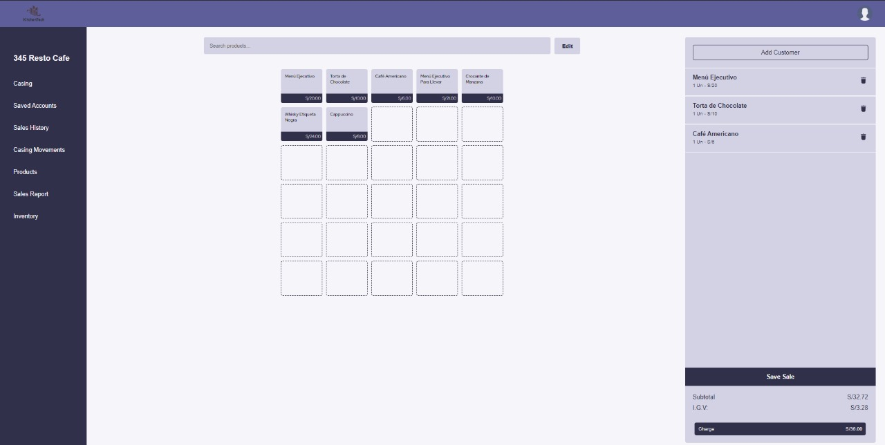
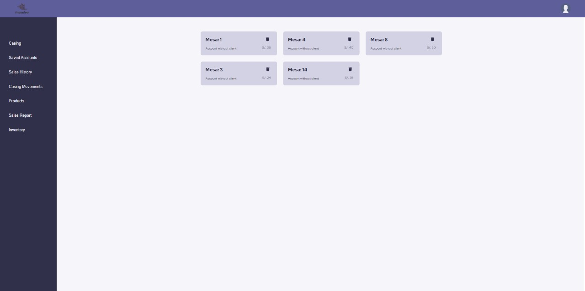
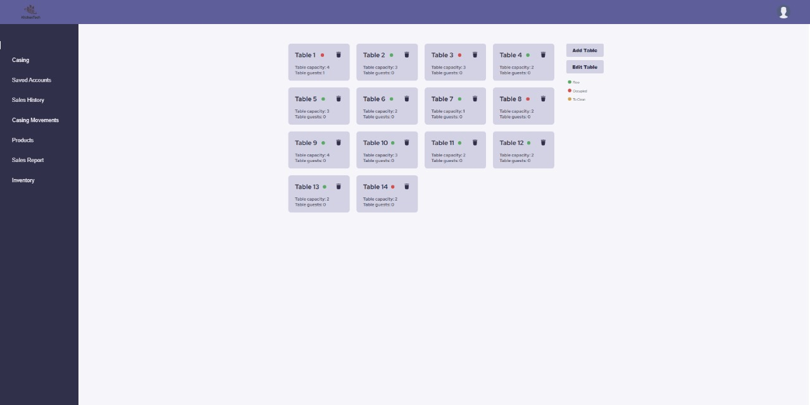
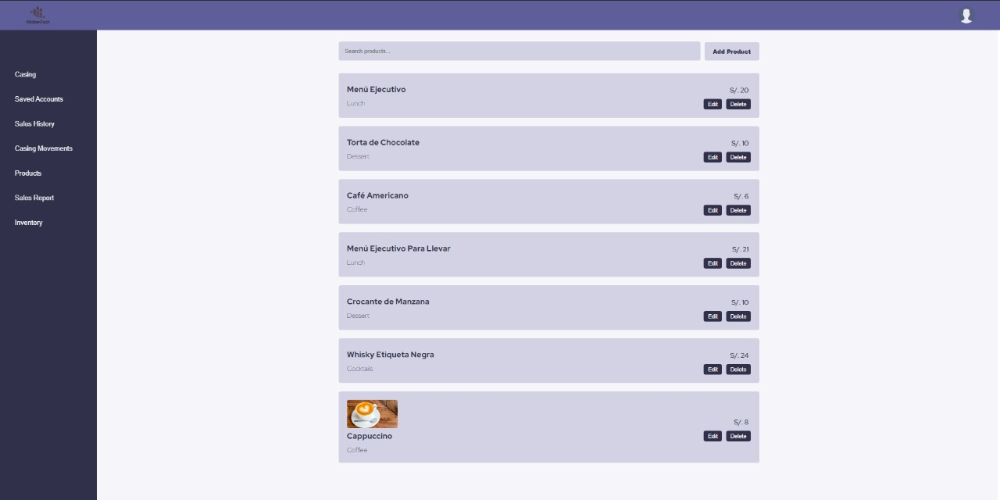

Capturas de desarrolo: Back end ():

Vistas desarrolladas: Mobile aplication ():

#### 6.2.2.6. Services Documentation Evidence for Sprint Review.

Backend Development of Kitchen Tech

| Endpoint                                               | Método  | Controlador              | Función                                                                                   |
|--------------------------------------------------------|---------|--------------------------|-------------------------------------------------------------------------------------------|
| `/api/kitchentech/v1/auth/register-restaurant`         | `POST`  | `AuthController`         | Registra todos los restaurantes que trabajan en Kitchen Tech.                             |
| `/api/kitchentech/v1/auth/register-staff`              | `POST`  | `AuthController`         | Registra al staff que contienen los restaurantes.                                         |
| `/api/kitchentech/v1/auth/login`                       | `POST`  | `AuthController`         | Loguear un usuario, tanto empresa como staff.                                             |
| `/api/kitchentech/v1/restaurant`                       | `GET`   | `RestaurantController`   | Obtiene la lista de los restaurantes de Kitchen Tech.                                     |
| `/api/kitchentech/v1/restaurant/{restaurantId}`        | `GET`   | `RestaurantController`   | Obtener un restaurante mediante su ID.                                                    |
| `/api/kitchentech/v1/restaurant/{restaurantId}`        | `PUT`   | `RestaurantController`   | Actualiza un restaurante mediante su ID                                                   |
| `/api/kitchentech/v1/restaurant/{restaurantId}`        | `DELETE`| `RestaurantController`   | Elimina un restaurante mediante su ID.                                                    |
| `/api/kitchentech/v1/staff-user`                       | `POST`  | `StaffUserController`    | Crea un staff mediante la aplicación, no mediante el register.                            |
| `/api/kitchentech/v1/staff-user/{staffUserId}`         | `GET`   | `StaffUserController`    | Obtiene un Staff por ID.                                                                  |
| `/api/kitchentech/v1/staff-user/{staffUserId}`         | `PUT`   | `StaffUserController`    | Actualiza un Staff por ID.                                                                |
| `/api/kitchentech/v1/staff-user/{staffUserId}`         | `DELETE`| `StaffUserController`    | Elimina un Staff por ID.                                                                  |
| `/api/kitchentech/v1/account/restaurant/{restaurantId}`| `GET`   | `AccountController`      | Obtiene todas las cuentas según un restaurante.                                           |
| `/api/kitchentech/v1/account/{accountId}`              | `GET`   | `AccountController`      | Obtiene una cuenta por su ID.                                                             |    
| `/api/kitchentech/v1/account`                          | `POST`  | `AccountController`      | Crea una cuenta respecto a un restaurante.                                                |    
| `/api/kitchentech/v1/account/{accountId}`              | `PUT`   | `AccountController`      | Actualiza una cuenta específica mendiante su ID.                                          |
| `/api/kitchentech/v1/account/{accountId}`              | `DELETE`| `AccountController`      | Elimina una cuenta específica mediante su ID.                                             |
| `/api/kitchentech/v1/account/{accountId}/products`     | `POST`  | `AccountController`      | Añade productos a la cuenta.                                                              |
| `/api/kitchentech/v1/account/{accountId}/products/{productId}`   | `PUT`   | `AccountController`  | Actualiza productos en una cuenta.                                                  |
| `/api/kitchentech/v1/account/{accountId}/products/{productId}`   | `DELETE`| `AccountController`  | Elimina productos en una cuenta.                                                    |
| `/api/kitchentech/v1/client/restaurant/{restaurantId}`           | `GET`   | `ClientController`   | Obtener todos los clientes mediante un ID de restaurante.                           |
| `/api/kitchentech/v1/client/{clientId}`                          | `GET`   | `ClientController`   | Obtiene un cliente por ID.                                                          |
| `/api/kitchentech/v1/client`                                     | `POST`  | `ClientController`   | Crea un cliente.                                                                    |
| `/api/kitchentech/v1/client/{clientId}`                          | `PUT`   | `ClientController`   | Actualiza un cliente por ID.                                                        |
| `/api/kitchentech/v1/client/{clientId}`                          | `DELETE`| `ClientController`   | Elimina un cliente por ID.                                                          |
| `/api/kitchentech/v1/product/restaurant/{restaurantId}`          | `GET`   | `ProductController`  | Obtiene todos los productos pertenecientes a un restaurante.                        |
| `/api/kitchentech/v1/product/{productId}`                        | `GET`   | `ProductController`  | Obtiene un producto por ID.                                                         |
| `/api/kitchentech/v1/product`                                    | `POST`  | `ProductController`  | Crea un producto.                                                                   |
| `/api/kitchentech/v1/product/{productId}`                        | `PUT`   | `ProductController`  | Actualiza un producto por ID.                                                       |
| `/api/kitchentech/v1/product/{productId}`                        | `DELETE`| `ProductController`  | Elimina un producto por ID.                                                         |
| `/api/kitchentech/v1/supply/restaurant/{restaurantId}`           | `GET`   | `SupplyController`   | Obtiene todos los suplementos pertenecientes a un restaurante.                      |
| `/api/kitchentech/v1/supply/{supplyId}`                          | `GET`   | `SupplyController`   | Obtiene un suplemento por ID.                                                       |
| `/api/kitchentech/v1/supply`                                     | `POST`  | `SupplyController`   | Crea un suplemento.                                                                 |
| `/api/kitchentech/v1/supply/{supplyId}`                          | `PUT`   | `SupplyController`   | Actualiza un suplemento por ID.                                                     |
| `/api/kitchentech/v1/supply/{supplyId}`                          | `DELETE`| `SupplyController`   | Elimina un suplemento por ID.                                                       |

Descripción

- **AuthController**: Gestiona las operaciones CRUD para la autenticación de usuarios.
- **RestaurantController**: Gestiona las operaciones CRUD para las peticiones de los restaurantes.
- **StaffUserController**: Gestiona las operaciones CRUD del staff del restaurante, como los meseros.
- **AccountController**: Gestiona las operaciones CRUD para las cuentas, incluyendo a los clientes, mesas y productos en sus operaciones.
- **ClientController**: Gestiona las operaciones CRUD para los clientes exclusivamente y su creación y relación con las cuentas.
- **ProductController**: Gestiona las operaciones CRUD para los productos, a su vez se pueden asignar a las cuentas como una lista de productos.
- **SupplyController**: Gestiona las operaciones CRUD para las suplementos, que son asignados a los productos y añadidos por Front End.
- **TableController**: Gestiona las operaciones CRUD para las mesas que son insertadas, manejadas por el restaurante que gestionarán los dispositivos IOT.

#### 6.2.2.7. Software Deployment Evidence for Sprint Review.

Esta sección recopila la evidencia del despliegue de software realizado durante el Sprint. Se incluyen capturas y registros que muestran el proceso de implementación en el entorno correspondiente, verificando que el despliegue se llevó a cabo correctamente y que el sistema cumple con los requisitos definidos para el Sprint Review. 

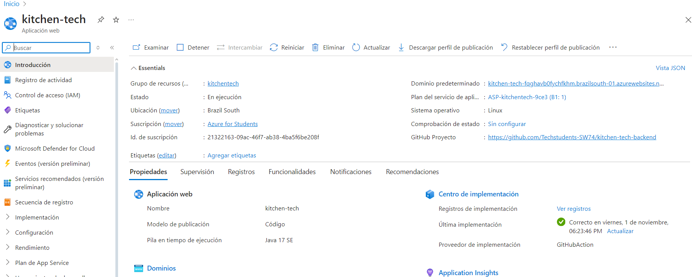

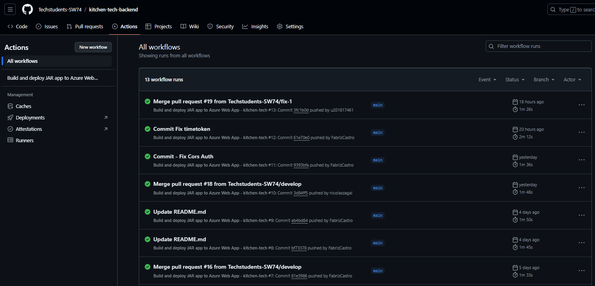

#### 6.2.2.8. Team Collaboration Insights during Sprint.

Durante el presente sprint se meustra la colaboración de los integrantes, con el fin distribuir el peso de trabajo de cada uno de los miembros del equipo.

### 6.2.3. Sprint 3

#### 6.2.3.1 Sprint Planning 3.

A continuación, se presenta el Sprint Planning 3, donde se muestran las evidencias de planificación e implementación del Landing Page. Las evidencias se encuentran disponibles dentro del repositorio de GitHub.
| Sprint                        | Sprint 3            |
|-------------------------------|---------------------|
|Sprint Planning Background  |fix-1 Web Config Fix |
|Date  |10 de Noviembre del 2024 |
|Time  |13:00 horas (GMT-5) |
|Location  |Modalidad remota por Discord  |
|Prepared by  |Fabrizzio Antonio Castro Manrique  |
|Attendees (to planning meeting)  |Todos los integrantes del equipo |
|Sprint 3 – Review Summary  | "About the Team" en el Landing Page, proporcionando a los visitantes una visión clara de los nuevos features del sistema KitchenTech. También se logró una disminución significativa en la latencia de actualización de los estados de las mesas, integradas con los dispositivos IoT en el Edge Application, mejorando la eficiencia del flujo de trabajo para meseros y administradores. Además, se optimizó la Mobile Application con los nuevos endpoints de gestión de órdenes y cuentas, agilizando el proceso de atención al cliente. Por último, se desplegaron las vistas de Productos, Insumos y Clientes en el Cloud Server para validaciones, y se presentó el modelo físico IoT como parte integral de la solución KitchenTech.|
|Sprint 3 – Retrospective Summary | Durante este sprint, el equipo mantuvo un enfoque colaborativo y logró avances significativos en múltiples áreas clave, incluyendo la integración del IoT, optimización de la aplicación móvil y despliegue de vistas críticas en el Frontend. Sin embargo, se enfrentaron desafíos relacionados con la latencia inicial en la comunicación entre el Edge Server y el Mobile Application, que fueron mitigados al implementar mejoras en el manejo de eventos en tiempo real. También se identificó la necesidad de mayor documentación técnica para facilitar las pruebas de los dispositivos IoT físicos. En futuras iteraciones, se buscará priorizar la automatización de pruebas para endpoints críticos y mejorar la coordinación entre los equipos de desarrollo y validación. |
|Sprint Goal & User Stories |                     |
|Sprint 3 Goal | *Nuestro objetivo se enfoca* en ofrecer el detalle de los nuevos features implementados en las secciones de "About the product" y "About the team" del Landing Page a nuestros visitantes, disminuir la latencia de los estados de las mesas integradas con dispositivos IOT en el Edge Application para la eficiencia del flujo de negocio orientado a los meseros y administradores, optimizar el Mobile Application con los nuevos endpoints de gestión de ordenes y cuentas para agilizar el proceso de atención a los clientes de los meseros, desplegar el Frontend con las vistas de Productos, Insumos y Clientes en el Cloud Server para que los desarrollares realicen validaciones de flujo e implementar el modelo físico IOT utilizado para la solución de KitchenTech. *Creemos* que este objetivo otorgará eficiencia hacia el trabajo de los meseros en la toma de pedidos, mayor rápidez en la actualización de estados de las mesas para el seguimiento continuo de los administradores y meseros, la comunicación actualizada del Mobile Application con el Backend para el envío de información correcta a los usuarios, las pruebas necesarias en el flujo del Frontend para los desarrolladores y mejor entendimiento de los dispositivos IOT usados en KitchenTech. *Esto se confirmará cuando* los visitantes entiendan el proceso de gestión de mesas y pedidos con dispositivos IOT ofrecida por KitchenTech, los administradores y meseros validen el proceso eficiente de estados de las mesas, los meseros puedan tomar pedidos eficientemente a los comensales desde su dispositivo móvil con información correcta, los desarrolladores hayan realizado con éxito las pruebas funcionales de las principales vistas de KitchenTech y los desarrolladores integren y presenten el dispositivos físicos IOT utilizados en la solución ofrecida.      |
|Sprint 3 Velocity |  72 |
|Sum of Story Points| 63 |

#### 6.2.3.2. Sprint Backlog 3.
<table>
   <tr>
      <th colspan="2">User Story</th>
      <th colspan="6">Work-Item / Task</th>
   </tr>
   <tr>
      <th>Id</th>
      <th>Title</th>
      <th>Id</th>
      <th>Title</th>
      <th>Description</th>
      <th>Estimation (hours)</th>
      <th>Assigned to</th>
      <th>Status</th>
   </tr>
   <tr>
      <th>US023</th>
      <th>Agregar un cliente con DNI o RUC.</th>
      <td>1</td>
      <td>Implementar botón para agregar un cliente, este debe solicitar tipo de documento, número de documento y nombre del cliente</td>
      <td>Como usuario, quiero poder agregar clientes con su DNI o RUC para registrar sus datos en el sistema.</td>
      <td>3</td>
      <td>Sandro Alarcon</td>
      <td>To-do</td>
   </tr>
   <tr>
      <th>TS041</th>
      <th>Despliegue del Backend</th>
      <td>1</td>
      <td>Despliegue de Backend en Azure</td>
      <td>Como desarrollador, quiero desplegar el backend en Azure para que el sistema esté disponible en la nube.</td>
      <td>1</td>
      <td>Fabrizzio Castro</td>
      <td>Done</td>
   </tr>
   <tr>
    <th>TS041</th>
    <th>Despliegue del Backend</th>
    <td>2</td>
    <td>Actualización del API REST desplegado con los nuevos endpoints</td>
    <td>Como desarrollador, quiero actualizar el API REST desplegado con los nuevos endpoints en Azure para asegurar que el sistema esté disponible y que las funcionalidades del backend sean accesibles desde la nube.        </td>
    <td>1</td>
    <td>Fabrizzio Castro</td>
    <td>Done</td>
   </tr>
   <tr>
      <th>US013</th>
      <th>Implementar navegación mediante Sidebar.</th>
      <td>1</td>
      <td>Implementar el componente de navegación Sidebar.</td>
      <td>Como administrador, quiero poder navegar rápidamente en la aplicación para monitorear muchas ventanas al mismo tiempo.</td>
      <td>3</td>
      <td>Nicolas Zagal</td>
      <td>Done</td>
   </tr>
   <tr>
      <th>US013</th>
      <th>Implementar navegación mediante Sidebar.</th>
      <td>2</td>
      <td>Crear un Sidebar que incluya los botones de navegación a todas las opciones de Mesero</td>
      <td>Como mesero, quiero tener un menú lateral para navegar fácilmente entre las opciones del sistema.</td>
      <td>5</td>
      <td>Nicolas Zagal</td>
      <td>In-Process</td>
   </tr>
   <tr>
      <th>TS044</th>
      <th>Detectar Mesas y Clientes mediante IoT.</th>
      <td>1</td>
      <td>Cargar número de mesa y nombre de cuenta en la caja al dar click en una cuenta guardada</td>
      <td> Como mesero, quiero cargar rápidamente el número de mesa y el nombre de la cuenta en la caja para facilitar la gestión de la cuenta. </td>
      <td>3</td>
      <td>Esteban Calderon</td>
      <td>In-Process</td>
   </tr>
   <tr>
      <th>TS044</th>
      <th>Detectar Mesas y Clientes mediante IoT.</th>
      <td>2</td>
      <td>Implementar el método Update en la vista de caja cuando se cargue una cuenta</td>
      <td>Como administrador, quiero detectar mesas y clientes automáticamente mediante IoT para optimizar la gestión de mesas.</td>
      <td>1</td>
      <td>Jonatan Curi</td>
      <td>In-Process</td>
   </tr>
   <tr>
      <th>TS044</th>
      <th>Detectar Mesas y Clientes mediante IoT.</th>
      <td>3</td>
      <td>Implementar update para actualizar la cantidad máxima de comensales en una mesa</td>
      <td>Como administrador, quiero poder actualizar la cantidad máxima de comensales en una mesa para adaptarme a cambios en la disponibilidad de espacio. </td>
      <td>5</td>
      <td>Lucas Benedetti</td>
      <td>In-Process</td>
   </tr>
   <tr>
      <th>TS005</th>
      <th>Mantener las cuentas y mesas guardadas actualizadas en tiempo real para todos los usuarios del negocio.</th>
      <td>1</td>
      <td>Optimizar el API para que actualización de las mesas por información IoT</td>
      <td>Como administrador, quiero que las cuentas y mesas se actualicen en tiempo real para evitar errores en la gestión.</td>
      <td>3</td>
      <td>Sandro Alarcon</td>
      <td>To-review</td>
   </tr>
   <tr>
      <th>US016</th>
      <th>Recibir alerta cuando un cliente cruza la puerta del local.</th>
      <td>1</td>
      <td>Implementar creación de usuario mesero</td>
      <td>Como administrador, quiero recibir una alerta cuando un cliente entre al local para ofrecerle una atención rápida.</td>
      <td>1</td>
      <td>Fabrizzio Castro</td>
      <td>To-review</td>
   </tr>
   <tr>
      <th>US016</th>
      <th>Recibir alerta cuando un cliente cruza la puerta del local.</th>
      <td>2</td>
      <td>Crear validaciones para registro de nuevo mesero</td>
      <td>Como administrador, quiero que se implemente la funcionalidad de alertas cuando un cliente entre al local, para garantizar que los meseros puedan ofrecer una atención rápida y eficiente.</td>
      <td>3</td>
      <td>Fabrizzio Castro</td>
      <td>To-review</td>
   </tr>
   <tr>
      <th>US028</th>
      <th>Filtrar ventas por platos.</th>
      <td>4</td>
      <td>Implementar campo de agregar insumos a nuevo producto</td>
      <td>Como administrador, quiero poder filtrar las ventas por platos para identificar los más vendidos.</td>
      <td>5</td>
      <td>Fabrizzio Castro</td>
      <td>Done</td>
   </tr>
   <tr>
      <th>US029</th>
      <th>Crear nuevos insumos.</th>
      <td>1</td>
      <td>Crear vista de insumos y su servicio</td>
      <td>Como administrador, quiero poder registrar nuevos insumos para mantener actualizado el inventario.</td>
      <td>3</td>
      <td>Esteban Calderon</td>
      <td>To-review</td>
   </tr>
  <tr>
      <th>US029</th>
      <th>Crear nuevos insumos.</th>
      <td>2</td>
      <td>Crear botón de agregar nuevo insumo</td>
      <td>Como administrador, quiero registrar nuevos insumos para mantener actualizado el inventario.</td>
      <td>3</td>
      <td>Lucas Benedetti</td>
      <td>To-review</td>
   </tr>
   <tr>
      <th>US029</th>
      <th>Crear nuevos insumos.</th>
      <td>3</td>
      <td>Implementar validaciones para el insumo guardado</td>
      <td>Como administrador, quiero asegurarme de que los datos de los nuevos insumos sean válidos antes de guardarlos.</td>
      <td>1</td>
      <td>Jonatan Curi</td>
      <td>To-review</td>
   </tr>
   <tr>
      <th>US032</th>
      <th>Editar insumos existentes.</th>
      <td>1</td>
      <td>Implementar botón de editar insumos</td>
      <td>Como administrador, quiero editar insumos existentes para corregir errores o actualizar información.</td>
      <td>3</td>
      <td>Esteban Calderon</td>
      <td>To-review</td>
   </tr>
   <tr>
      <th>US032</th>
      <th>Editar insumos existentes.</th>
      <td>2</td>
      <td>Cargar la vista de nuevo insumo con los datos del insumo guardado para su edición</td>
      <td>Como administrador, quiero pre-cargar los datos del insumo para facilitar su edición.</td>
      <td>1</td>
      <td>Nicolas Zagal</td>
      <td>To-review</td>
   </tr>
   <tr>
      <th>US033</th>
      <th>Eliminar insumos existentes.</th>
      <td>1</td>
      <td>Crear botón de eliminar insumo</td>
      <td>Como administrador, quiero eliminar insumos no deseados para mantener el inventario actualizado.</td>
      <td>3</td>
      <td>Fabrizzio Castro</td>
      <td>To-review</td>
   </tr>
   <tr>
      <th>US020</th>
      <th>Agregar productos a una orden.</th>
      <td>1</td>
      <td>Crear vista de caja con searchbar y sección acceso directo de productos</td>
      <td>Como mesero, quiero agregar productos rápidamente a una orden para agilizar el servicio.</td>
      <td>5</td>
      <td>Sandro Alarcon</td>
      <td>To-fix</td>
   </tr>
   <tr>
    <th>TS042</th>
    <th>Despliegue del App Web.</th>
    <td>1</td>
    <td>Despliegue Automático del repositorio de Frontend (main)</td>
    <td>Como desarrollador, quiero implementar el despliegue automático del repositorio de Frontend para asegurar que los cambios se reflejen rápidamente en la aplicación web y que los usuarios siempre tengan acceso a       la versión más reciente.</td>
    <td>3</td>
    <td>Lucas Benedetti</td>
    <td>Done</td>
   </tr>
   <tr>
      <th>TS042</th>
      <th>Despliegue del App Web.</th>
      <td>2</td>
      <td>Crear una vista de historial de modificaciones la rama de desarrollo</td>
      <td>Como desarrollador, quiero desplegar el App Web para asegurar que las funcionalidades estén correctamente integradas con el backend y que los usuarios puedan interactuar con los datos en tiempo real.</td>
      <td>3</td>
      <td>Lucas Benedetti</td>
      <td>To-fix</td>
   </tr>
   <tr>
      <th>TS044</th>
      <th>Detección IoT para mesas y clientes.</th>
      <td>1</td>
      <td>Conectar IoT a Backend Desplegado con el DB Table</td>
      <td>Como desarrollador, quiero conectar dispositivos IoT al backend para obtener información en tiempo real.</td>
      <td>1</td>
      <td>Lucas Benedetti</td>
      <td>Done</td>
   </tr>
   <tr>
      <th>TS044</th>
      <th>Detección IoT para mesas y clientes.</th>
      <td>4</td>
      <td>Lógica de Agregación de Clientes mediante Sensores</td>
      <td>Como administrador, quiero que los sensores agreguen información de clientes para mejorar la experiencia.</td>
      <td>3</td>
      <td>Jonatan Curi</td>
      <td>Done</td>
   </tr>
   <tr>
      <th>TS043</th>
      <th>Inventariado de Insumos mediante IoT.</th>
      <td>1</td>
      <td>Conectar IoT a Backend Desplegado con el BD Supply</td>
      <td>Como desarrollador, quiero conectar dispositivos IoT al backend para gestionar el inventario automáticamente.</td>
      <td>5</td>
      <td>Esteban Calderon</td>
      <td>Done</td>
   </tr>
   <tr>
      <th>TS043</th>
      <th>Inventariado de Insumos mediante IoT.</th>
      <td>2</td>
      <td>Lógica de Detección de Objetos</td>
      <td>Como administrador, quiero automatizar el inventariado con IoT para reducir errores humanos.</td>
      <td>3</td>
      <td>Nicolas Zagal</td>
      <td>Done</td>
   </tr>

  
</table>

#### 6.2.3.3. Development Evidence for Sprint Review.

Ruta indicada para la visualización de los repositorios: https://github.com/orgs/Techstudents-SW74/repositories

Repository             | Branch                    | Commit Id  | Commit Message                 | Commit Message Body                                                | Commited on (Date)
---                    | ---                        | ---        | ---                            | ---                                                                | ---
tech-kitchen-webapp    | feature/feedback           | d7a8c63    | feature/feedback added         | Integrated feedback form for customer reviews                      | 11/11/2024
tech-kitchen-webapp    | feature/user-profile       | b2e5f47    | feature/user-profile added     | Developed user profile page with update functionality              | 13/11/2024
tech-kitchen-webapp    | feature/dashboard          | f9c3e28    | feature/dashboard added        | Created admin dashboard for order and user management              | 16/11/2024
tech-kitchen-webapp    | feature/promotions         | a3d4f92    | feature/promotions added       | Added promotions section for seasonal offers                       | 18/11/2024
tech-kitchen-webapp    | feature/menu               | c8f6b52    | feature/menu added             | Implemented dynamic menu rendering with category filters           | 19/11/2024
kitchen-tech-backend   | feature/inventory          | e4a7c62    | feature/inventory API added    | Developed API endpoints for inventory management                   | 11/11/2024
kitchen-tech-backend   | feature/delivery           | f7b9e32    | feature/delivery API added     | Added endpoints for tracking delivery status                       | 13/11/2024
kitchen-tech-backend   | feature/reports            | a5c6d14    | feature/reports added          | Generated API for sales and inventory reports                      | 15/11/2024
kitchen-tech-backend   | feature/roles              | d3b2e41    | feature/roles API added        | Implemented role-based access control endpoints                    | 17/11/2024
kitchen-tech-backend   | feature/settings           | c4f8d61    | feature/settings added         | Created API for managing system configuration                      | 19/11/2024
Mobile-application     | feature/registration       | b1c4d82    | feature/registration added     | Built user registration flow and validation checks                 | 12/11/2024
Mobile-application     | feature/history            | e8d7f54    | feature/history added          | Designed order history screen with detailed views                  | 14/11/2024
Mobile-application     | feature/preferences        | f2c8a91    | feature/preferences added      | Added user preferences functionality for notifications              | 16/11/2024
Mobile-application     | feature/reviews            | d3e5b73    | feature/reviews added          | Created product review and rating screen                           | 18/11/2024
Mobile-application     | feature/table-booking      | b5c4a61    | feature/table-booking added    | Implemented table booking feature integrated with backend          | 20/11/2024
kitchen-tech           | feature/analytics          | a9c7e42    | feature/analytics added        | Created analytics dashboard for sales trends                       | 12/11/2024
kitchen-tech           | feature/settings-ui        | d5a4f72    | feature/settings-ui added      | Designed user interface for system settings                        | 14/11/2024
kitchen-tech           | feature/loyalty            | e2b7f93    | feature/loyalty program added  | Added API support for customer loyalty programs                    | 16/11/2024
kitchen-tech           | feature/social-login       | b3d6c41    | feature/social-login added     | Integrated social login (Google, Facebook) functionality           | 18/11/2024
kitchen-tech           | feature/coupons            | c7e2a84    | feature/coupons added          | Developed coupon management system for promotions                  | 19/11/2024

#### 6.2.3.4. Testing Suite Evidence for Sprint Review.

Para este sprint, no se ha realizado el conjunto de pruebas automatizadas 
(Unit Tests, Integration Tests, y Acceptance Tests) para los servicios web asociados con las User Stories 
especificadas. Por lo tanto, no se cuenta con evidencia de testing suite para esta Sprint Review. Esto incluye 
la ausencia de archivos .feature en Gherkin para pruebas BDD, así como de los archivos Steps en el lenguaje de
 programación. Tampoco se han diseñado ni documentado los Unit Tests, Integration Tests o Acceptance Tests, ni se 
 han registrado commits en el repositorio relacionados con avances en Testing.

#### 6.2.3.5. Execution Evidence for Sprint Review.

En el Sprint 3.

Desarrollo de la aplicacion mobile:

Se logró mejoras de la aplicación mobile y conexión con el back end desarrollado, secciones dentro de la app logran ser accesibles e interactivas para el usuario en la app.

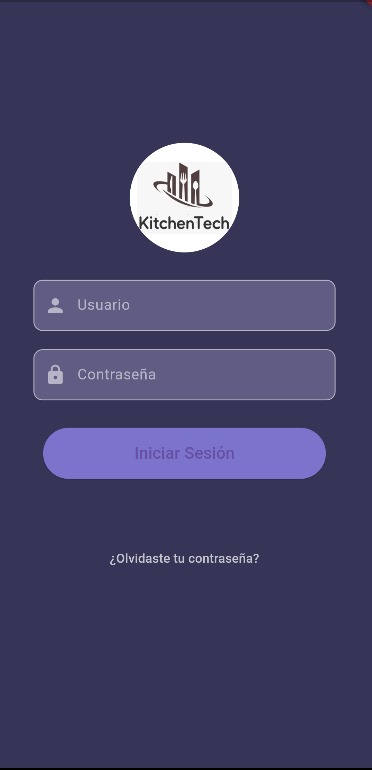

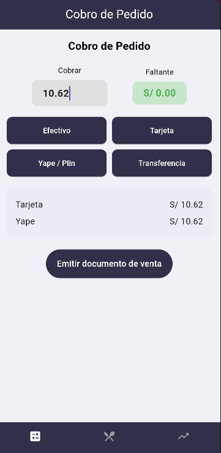

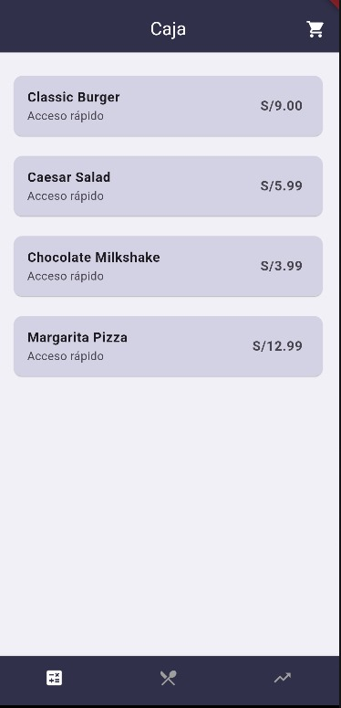

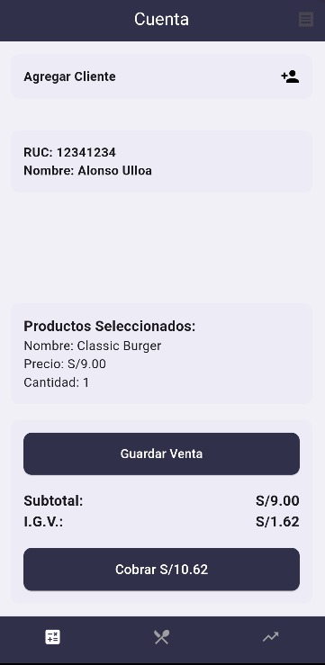

*Mejoras del back end:*

En el backend del proyecto, incluye la mejora de la funcionalidad correspondiente al controlador de tablas y al controlador de suministros, enfocándose específicamente en gestionar esas áreas.

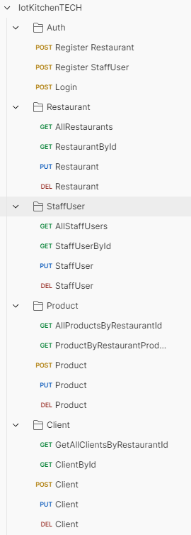

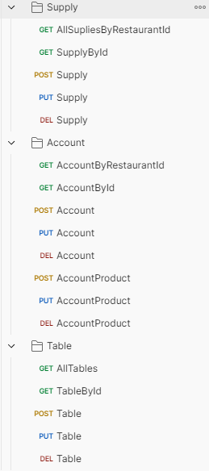

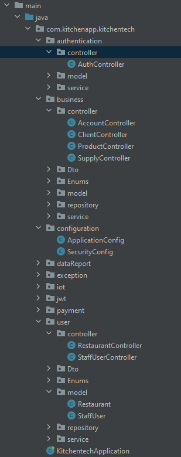

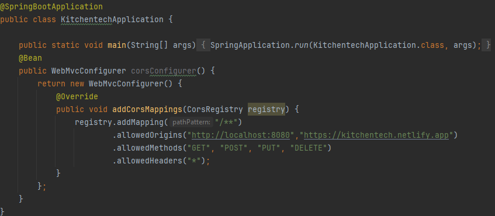

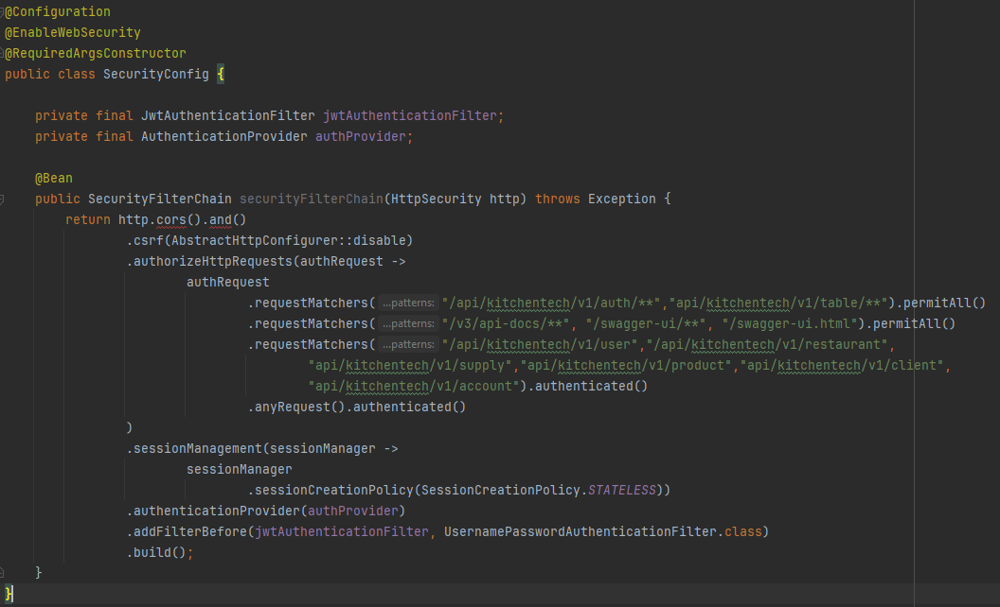

*Mejoras del front end:*

En el frontend del proyecto, se ha implementado la mejora de la funcionalidad correspondiente al controlador de tablas y al controlador de suministros, centrándose específicamente en optimizar la gestión y visualización de esas áreas.

*Desarrollo de dispositivo IOT en wokwi:*

*Desarrollo de dispositivo IOT físico:*

El dispositivo IoT utiliza una variedad de componentes físicos para su funcionamiento. Entre ellos, el Arduino UNO actúa como el controlador principal que gestiona las entradas y salidas del sistema. Un buzzer se emplea para emitir alertas sonoras, mientras que un conjunto de LEDs de colores (rojo, amarillo y verde) proporciona señales visuales para diferentes estados del sistema. 

El dispositivo también incluye un display de 7 segmentos con 2 dígitos y 18 pines, que se utiliza para mostrar información en tiempo real, como valores o estados del sistema. Un botón permite la interacción del usuario, y un potenciómetro ajusta ciertos parámetros, como la intensidad de una señal o el brillo de los LEDs. 

Además, se utilizan resistencias de diferentes valores (390 ohms x8 y 100 ohms x3) para limitar la corriente y proteger los componentes electrónicos. Los cables de cobre y una protoboard facilitan las conexiones eléctricas y el montaje del circuito, permitiendo una configuración modular y flexible. Este conjunto de elementos hace posible el desarrollo de un dispositivo IoT funcional y adaptable a diversas aplicaciones.

#### 6.2.3.6. Services Documentation Evidence for Sprint Review.

Backend Development of Kitchen Tech
API Endpoints

| Endpoint                                               | Método  | Controlador              | Función                                                                                   |
|--------------------------------------------------------|---------|--------------------------|-------------------------------------------------------------------------------------------|
| `/api/kitchentech/v1/auth/register-restaurant`         | `POST`  | `AuthController`         | Registra todos los restaurantes que trabajan en Kitchen Tech.                             |
| `/api/kitchentech/v1/auth/register-staff`              | `POST`  | `AuthController`         | Registra al staff que contienen los restaurantes.                                         |
| `/api/kitchentech/v1/auth/login`                       | `POST`  | `AuthController`         | Loguear un usuario, tanto empresa como staff.                                             |
| `/api/kitchentech/v1/restaurant`                       | `GET`   | `RestaurantController`   | Obtiene la lista de los restaurantes de Kitchen Tech.                                     |
| `/api/kitchentech/v1/restaurant/{restaurantId}`        | `GET`   | `RestaurantController`   | Obtener un restaurante mediante su ID.                                                    |
| `/api/kitchentech/v1/restaurant/{restaurantId}`        | `PUT`   | `RestaurantController`   | Actualiza un restaurante mediante su ID                                                   |
| `/api/kitchentech/v1/restaurant/{restaurantId}`        | `DELETE`| `RestaurantController`   | Elimina un restaurante mediante su ID.                                                    |
| `/api/kitchentech/v1/staff-user`                       | `POST`  | `StaffUserController`    | Crea un staff mediante la aplicación, no mediante el register.                            |
| `/api/kitchentech/v1/staff-user/{staffUserId}`         | `GET`   | `StaffUserController`    | Obtiene un Staff por ID.                                                                  |
| `/api/kitchentech/v1/staff-user/{staffUserId}`         | `PUT`   | `StaffUserController`    | Actualiza un Staff por ID.                                                                |
| `/api/kitchentech/v1/staff-user/{staffUserId}`         | `DELETE`| `StaffUserController`    | Elimina un Staff por ID.                                                                  |
| `/api/kitchentech/v1/account/restaurant/{restaurantId}`| `GET`   | `AccountController`      | Obtiene todas las cuentas según un restaurante.                                           |
| `/api/kitchentech/v1/account/{accountId}`              | `GET`   | `AccountController`      | Obtiene una cuenta por su ID.                                                             |    
| `/api/kitchentech/v1/account`                          | `POST`  | `AccountController`      | Crea una cuenta respecto a un restaurante.                                                |    
| `/api/kitchentech/v1/account/{accountId}`              | `PUT`   | `AccountController`      | Actualiza una cuenta específica mendiante su ID.                                          |
| `/api/kitchentech/v1/account/{accountId}`              | `DELETE`| `AccountController`      | Elimina una cuenta específica mediante su ID.                                             |
| `/api/kitchentech/v1/account/{accountId}/products`     | `POST`  | `AccountController`      | Añade productos a la cuenta.                                                              |
| `/api/kitchentech/v1/account/{accountId}/products/{productId}`   | `PUT`   | `AccountController`  | Actualiza productos en una cuenta.                                                  |
| `/api/kitchentech/v1/account/{accountId}/products/{productId}`   | `DELETE`| `AccountController`  | Elimina productos en una cuenta.                                                    |
| `/api/kitchentech/v1/client/restaurant/{restaurantId}`           | `GET`   | `ClientController`   | Obtener todos los clientes mediante un ID de restaurante.                           |
| `/api/kitchentech/v1/client/{clientId}`                          | `GET`   | `ClientController`   | Obtiene un cliente por ID.                                                          |
| `/api/kitchentech/v1/client`                                     | `POST`  | `ClientController`   | Crea un cliente.                                                                    |
| `/api/kitchentech/v1/client/{clientId}`                          | `PUT`   | `ClientController`   | Actualiza un cliente por ID.                                                        |
| `/api/kitchentech/v1/client/{clientId}`                          | `DELETE`| `ClientController`   | Elimina un cliente por ID.                                                          |
| `/api/kitchentech/v1/product/restaurant/{restaurantId}`          | `GET`   | `ProductController`  | Obtiene todos los productos pertenecientes a un restaurante.                        |
| `/api/kitchentech/v1/product/{productId}`                        | `GET`   | `ProductController`  | Obtiene un producto por ID.                                                         |
| `/api/kitchentech/v1/product`                                    | `POST`  | `ProductController`  | Crea un producto.                                                                   |
| `/api/kitchentech/v1/product/{productId}`                        | `PUT`   | `ProductController`  | Actualiza un producto por ID.                                                       |
| `/api/kitchentech/v1/product/{productId}`                        | `DELETE`| `ProductController`  | Elimina un producto por ID.                                                         |
| `/api/kitchentech/v1/supply/restaurant/{restaurantId}`           | `GET`   | `SupplyController`   | Obtiene todos los suplementos pertenecientes a un restaurante.                      |
| `/api/kitchentech/v1/supply/{supplyId}`                          | `GET`   | `SupplyController`   | Obtiene un suplemento por ID.                                                       |
| `/api/kitchentech/v1/supply`                                     | `POST`  | `SupplyController`   | Crea un suplemento.                                                                 |
| `/api/kitchentech/v1/supply/{supplyId}`                          | `PUT`   | `SupplyController`   | Actualiza un suplemento por ID.                                                     |
| `/api/kitchentech/v1/supply/{supplyId}`                          | `DELETE`| `SupplyController`   | Elimina un suplemento por ID.                                                       |

Descripción

- **AuthController**: Gestiona las operaciones CRUD para la autenticación de usuarios.
- **RestaurantController**: Gestiona las operaciones CRUD para las peticiones de los restaurantes.
- **StaffUserController**: Gestiona las operaciones CRUD del staff del restaurante, como los meseros.
- **AccountController**: Gestiona las operaciones CRUD para las cuentas, incluyendo a los clientes, mesas y productos en sus operaciones.
- **ClientController**: Gestiona las operaciones CRUD para los clientes exclusivamente y su creación y relación con las cuentas.
- **ProductController**: Gestiona las operaciones CRUD para los productos, a su vez se pueden asignar a las cuentas como una lista de productos.
- **SupplyController**: Gestiona las operaciones CRUD para las suplementos, que son asignados a los productos y añadidos por Front End.
- **TableController**: Gestiona las operaciones CRUD para las mesas que son insertadas, manejadas por el restaurante que gestionarán los dispositivos IOT.

#### 6.2.3.7. Software Deployment Evidence for Sprint Review.

Esta sección recopila la evidencia del despliegue de software realizado durante el Sprint. Se incluyen capturas y registros que muestran el proceso de implementación en el entorno correspondiente, verificando que el despliegue se llevó a cabo correctamente y que el sistema cumple con los requisitos definidos para el Sprint Review. 

#### 6.2.3.8. Team Collaboration Insights during Sprint.

Durante el presente sprint se meustra la colaboración de los integrantes, con el fin distribuir el peso de trabajo de cada uno de los miembros del equipo.
<table border="1">
  <thead>
    <tr>
      <th>Alumno</th>
      <th>Actividad</th>
    </tr>
  </thead>
  <tbody>
    <tr>
      <td>Sandro Alarcón</td>
      <td>Desarrollo de backend, mobile app, Embedded app IoT</td>
    </tr>
    <tr>
      <td>Fabrizzio Castro</td>
      <td>Desarrollo de backend, mobile app, Landing Page, Embedded app IoT</td>
    </tr>
    <tr>
      <td>Nicolás Zagal</td>
      <td>Desarrollo de backend, mobile app, Embedded app IoT</td>
    </tr>
    <tr>
      <td>Esteban Calderón</td>
      <td>Desarrollo de backend, mobile app, Frontend, Embedded app IoT</td>
    </tr>
    <tr>
      <td>Jonatan Curi</td>
      <td>Desarrollo de backend, mobile app, Embedded app IoT</td>
    </tr>
    <tr>
      <td>Lucas Benedetti</td>
      <td>Desarrollo de backend, mobile app, Embedded app IoT</td>
    </tr>
  </tbody>
</table>

Mobile App:

Backend:

IoT Embedded App:

Landing Page:

## 6.3. Validation Interviews.

### 6.3.1. Diseño de Entrevistas.

- ¿Qué tan fácil te resultó navegar por la landing page y encontrar información relevante sobre el sistema?

- ¿La información proporcionada en la landing page te ayudó a comprender cómo la solución IoT podría mejorar la atención en el restaurante?
- ¿Qué aspectos de la aplicación te resultaron intuitivos o confusos al tomar un pedido?
- ¿Qué tan fácil te resultó recibir y gestionar notificaciones sobre el estado de las mesas (como la llegada de clientes o platos por recoger)?
- ¿Sientes que el proceso de enviar pedidos a cocina y caja desde la aplicación agiliza tu flujo de trabajo?
- ¿Cómo evaluas la velocidad y precisión de la aplicación al registrar cambios en los pedidos?
- ¿La interfaz de la aplicación facilita la gestión de cuentas y pagos de los clientes? ¿Por qué?
- ¿Qué tan útil te resulta la opción de recibir alertas cuando los clientes entran o salen del restaurante?
- ¿Crees que el sistema IoT implementado mejora la experiencia de servicio para el cliente? ¿En qué aspectos?
- ¿Qué cambiarías o mejorarías en la aplicación para facilitar aún más la atención a los clientes?

### 6.3.2. Registro de Entrevistas.

-  Primera Entrevista:
-  Segmento: Meseros
-  Nombre: Yeret Yucta
-  Edad: 21
-  Ocupación: Estudiante universitario y mesero a tiempo parcial
-  Enlace: https://upcedupe-my.sharepoint.com/:v:/g/personal/u202110966_upc_edu_pe/ESsC5d2geJZHmvEWDpBGKLgBcXgkFYSqc4YfkWn7CYaRBQ?e=sOxJuy
-  Duración: 0:00 a 11:21 (11 minutos 21 segundos) 

-  Resumen:
Yeret, un estudiante universitario de 21 años que trabaja a tiempo parcial como mesero en una restaurante familiar, es analítico e ingenioso, lo que le permite actuar de manera correcta con los clientes.
Comenta que la landing page le ayudó a entender cómo el sistema IoT agiliza su trabajo al permitirle gestionar notificaciones en tiempo real sobre el estado de las mesas y pedidos. Esta información le permite organizarse mejor y reducir tiempos de espera.
Aspectos intuitivos y confusos: Al tomar un pedido, Yeret encontró que el menú digital es fácil de navegar y le permite incluir especificaciones, aunque sugiere mejorar algunos íconos para que sean más claros.
Gestión de notificaciones: Yeret considera muy útil la función de notificaciones, ya que son visibles y manejables sin interrumpir su flujo de trabajo, lo cual reduce desplazamientos innecesarios y facilita su labor.
Envío de pedidos a cocina y caja: Destaca la eficiencia de poder enviar los pedidos directamente a cocina y caja desde la app, ahorrando tiempo y evitando errores durante horas pico.
Velocidad y precisión de la app: La rapidez y precisión de Kitchen Tech al registrar cambios en pedidos es clave para mejorar la satisfacción del cliente y evitar confusiones.
Gestión de cuentas y pagos: La interfaz para gestionar cuentas resulta sencilla y permite dividir pagos o registrar transacciones sin dificultad, minimizando errores.
Alertas de entrada y salida de clientes: Yeret aprecia esta función, ya que le permite atender a los clientes más oportunamente y preparar mesas rápidamente para nuevos clientes.
Experiencia del cliente: Cree que el sistema IoT mejora la experiencia de servicio, ya que los clientes perciben un servicio más atento y eficiente, con pedidos que llegan rápido y la cuenta lista a tiempo.
Sugerencias de mejora: Sugiere añadir funciones de recomendaciones para upselling o sugerencias de platos, además de optimizar íconos y descripciones para hacer la app aún más intuitiva.

### 6.3.3. Evaluaciones según heurísticas.

**CARRERA**: Ingeniería de Software  
**CURSO**: Desarrollo de Soluciones IoT  
**SECCIÓN**: SW92  
**PROFESORES**: Todos  
**AUDITOR**: LosTecnogurus  
**CLIENTE(S)**: Usuarios entrevistados  

---

**SITE o APP A EVALUAR**: Kitchen Tech

---

### TAREAS A EVALUAR:

El alcance de esta evaluación incluye la revisión de la usabilidad de las siguientes tareas:

1. Crear botón para desplegar menú de opciones de usuario
2. Implementar botón de ver perfil en menú desplegable
3. Implementar botón de crear nuevo mesero en menú desplegable
4. Crear vista de cuentas guardadas, con search bar y cards que incluyan nombre de la cuenta, cliente, costo y botones
5. Guardar orden en una cuenta
6. Implementar botón para eliminar cuenta
7. Guardar orden en una mesa
8. Actualización de los pedidos y mesas
9. Implementar botón para cambiar la vista de cuentas guardadas a mesas junto al search bar
10. Implementar navegación a la página de caja con el pedido guardado al dar clic en la cuenta
11. Crear botón de agregar nuevos productos
12. Implementar validaciones para el guardado de productos
13. Crear vista de productos
14. Cargar la vista de nuevo producto con los datos del producto guardado para su edición
15. Crear botón de eliminar producto
16. Desarrollar vista en la web app de inicio de sesión
17. Implementar validaciones de credenciales en la vista de iniciar sesión
18. Crear botón de cerrar sesión en menú desplegable

---

No están incluidas en esta versión de la evaluación las siguientes tareas:

1. Crear vista de caja con searchbar y sección acceso directo de productos
2. Implementar la vista de mesas con sus métodos CRUD
3. Implementar vista de recuperar contraseña
4. Implementar validaciones para vista de recuperar contraseña
5. Implementar ver contraseña en vista de recuperar contraseña
6. Bloquear acceso a la cuenta tras fallar en iniciar sesión 5 veces
7. Crear validaciones para registro de nuevo mesero
8. Crear un Sidebar que incluya los botones de navegación a todas las opciones de Mesero

---

### ESCALA DE SEVERIDAD:

Los errores serán puntuados tomando en cuenta la siguiente escala de severidad

| Nivel | Descripción |
|-------|-------------|
| 1 | Problema superficial: puede ser fácilmente superado por el usuario o ocurre con muy poca frecuencia. No necesita ser arreglado a no ser que exista disponibilidad de tiempo. |
| 2 | Problema menor: puede ocurrir un poco más frecuentemente o es un poco más difícil de superar para el usuario. Se le debería asignar una prioridad baja resolverlo de cara a la siguiente release. |
| 3 | Problema mayor: ocurre frecuentemente o los usuarios no son capaces de resolverlos. Es importante que sean corregidos y se les debe asignar una prioridad alta. |
| 4 | Problema muy grave: un error de gran impacto que impide al usuario continuar con el uso de la herramienta. Es imperativo que sea corregido antes del lanzamiento. |

---

### TABLA RESUMEN:

| #  | Problema | Escala de severidad | Heurística/Principio violado(a) |
|----|----------|----------------------|---------------------------------|
| 1  | Cuestión de confusión entre vistas | 3 | Usability: Consistencia y estándares |
| 2  | Mejorar la organización de funcionalidades | 3 | Information Architecture: Is it findable? |
| 3  | Mejora en la sección de pedido para el caso de edición en escenarios de cambios de pedido a último momento | 4 | Usability: Flexibilidad y eficiencia de uso |

---

### DESCRIPCIÓN DE PROBLEMAS:

**PROBLEMA #1**: Cuestión de confusión entre vistas  
**Severidad**: 3  
**Heurística violada**: Usability – Consistencia y estándares  

**Problema**:  
Los usuarios encuentran dificultades para identificar a qué vista pertenecen ciertas opciones de menú. Esto genera confusión y aumenta el tiempo necesario para completar una tarea específica.

**Recomendación**:  
Reorganizar las vistas para mejorar la diferenciación visual entre ellas, asegurando que cada vista tenga elementos distintivos claros que guíen al usuario.

---

**PROBLEMA #2**: Mejorar la organización de funcionalidades  
**Severidad**: 3  
**Heurística violada**: Information Architecture – Is it findable?  

**Problema**:  
La disposición de las funcionalidades no permite una rápida localización, lo cual impacta negativamente la experiencia del usuario.

**Recomendación**:  
Agrupar las funcionalidades de acuerdo con su propósito y frecuencia de uso, proporcionando accesos rápidos a las tareas más comunes.

---

**PROBLEMA #3**: Mejora en la sección de pedido para el caso de edición en escenarios de cambios de pedido a último momento  
**Severidad**: 4  
**Heurística violada**: Usability – Flexibilidad y eficiencia de uso  

**Problema**:  
Cuando un usuario intenta realizar modificaciones de último momento en un pedido, se encuentra con limitaciones en la interfaz que dificultan completar el cambio sin reiniciar el proceso.

**Recomendación**:  
Implementar una opción de edición rápida para cambios de último momento, que permita al usuario modificar elementos del pedido sin necesidad de repetir los pasos previos.

## 6.4. Video About-the-Product.

Link del video: https://upcedupe-my.sharepoint.com/:v:/g/personal/u202114140_upc_edu_pe/Ec69qyP2xOJOpyxyRbFLQvQBdxpenJBiKMBqLxAPxoCHTg?e=XhhznD&nav=eyJyZWZlcnJhbEluZm8iOnsicmVmZXJyYWxBcHAiOiJTdHJlYW1XZWJBcHAiLCJyZWZlcnJhbFZpZXciOiJTaGFyZURpYWxvZy1MaW5rIiwicmVmZXJyYWxBcHBQbGF0Zm9ybSI6IldlYiIsInJlZmVycmFsTW9kZSI6InZpZXcifX0%3D

