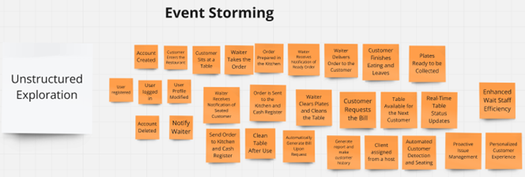
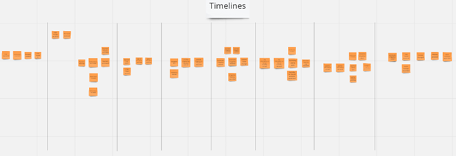
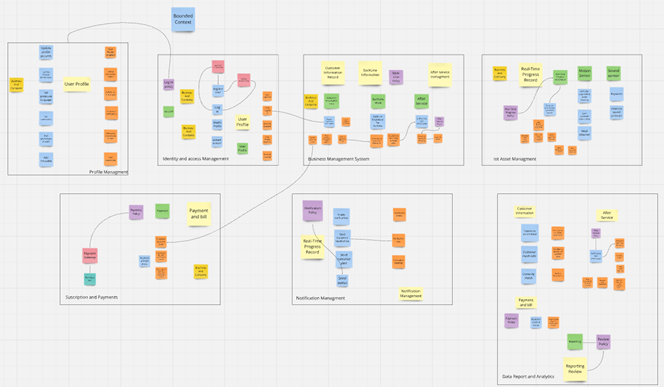

# Capítulo IV: Solution Software Design

## 4.1. Strategic-Level Domain-Driven-Design

En el siguiente apartado, se detalla una serie de enfoques clave en el proceso de Diseño Dirigido por el Dominio a nivel estratégico (Strategic-Level Domain-Driven Design). Estos enfoques fueron fundamentales para establecer una base sólida para definir y modelar dominios complejos. A través de técnicas como Event Storming, Context Mapping y la definición de la Arquitectura de Software, se logró obtener una comprensión profunda de los elementos esenciales necesarios para la creación de sistemas efectivos y bien estructurados. A continuación, se describen los puntos clave que se abordaron en esta sección.

### 4.1.1. Event Storming

Se abordó un enfoque colaborativo y visual que permitió modelar el contexto del dominio. Se exploraron las etapas de Candidate Context Discovery, Domain Message Flows Modeling y la creación de Bounded Context Canvases.

**Event Storming**

Es un enfoque visual que reúne a todas las partes interesadas para explorar el dominio de un sistema. Se utilizan notas adhesivas de diferentes colores para representar distintos elementos, facilitando la discusión y el descubrimiento de requisitos.

** Pain Points**

Son los problemas o dificultades que enfrentan los usuarios y las partes interesadas en el contexto del sistema. Identificarlos ayuda a priorizar características y soluciones que realmente aborden las necesidades del usuario.

** Timelines **

Se refiere a la secuencia de eventos que ocurren en el sistema a lo largo del tiempo. Establecer una línea de tiempo ayuda a visualizar cómo los eventos interactúan y afectan el flujo de trabajo, así como a identificar puntos críticos en el proceso.

** Pivotal Points **

Son momentos clave en el flujo de eventos que pueden cambiar el estado del sistema o influir significativamente en la experiencia del usuario. Identificar estos puntos ayuda a concentrar esfuerzos en las áreas más críticas.

** Commands **

Son las acciones o instrucciones que un usuario o sistema puede ejecutar para provocar un cambio en el estado del sistema. Por ejemplo, "Crear Pedido" o "Actualizar Inventario".

** Policies **

Son las reglas o directrices que rigen cómo se deben tomar las decisiones dentro del sistema. Pueden incluir reglas de negocio que determinan cuándo se deben ejecutar ciertos comandos o cómo se deben manejar ciertos eventos.

** Read Models **

Son las representaciones de los datos que se utilizan para responder a consultas o solicitudes de información. Los modelos de lectura están diseñados para optimizar la consulta de datos, separándose de los modelos de escritura para mejorar el rendimiento y la escalabilidad.

** External Systems **

Se refiere a otros sistemas o servicios que interactúan con el sistema principal. Identificar estos sistemas ayuda a entender las dependencias y las integraciones necesarias para el funcionamiento del sistema.

** Aggregates **

Son grupos de objetos que se tratan como una única unidad para la gestión de datos y la lógica de negocio. Un agregado garantiza la consistencia de sus partes en las operaciones y encapsula la lógica de negocio relacionada.

** Bounded Context **

Es un límite claro dentro del dominio del sistema donde un modelo particular se aplica. Define la frontera en la que un conjunto de conceptos y términos tiene un significado específico, ayudando a evitar confusiones y a manejar complejidades en sistemas grandes y distribuidos.

Link del Event Storming: https://miro.com/app/board/uXjVKkI6spU=/

#### 4.1.1.1 Candidate Context Discovery

#### 4.1.1.2 Domain Message Flows Modeling

#### 4.1.1.3 Bounded Context Canvases

### 4.1.2	Context Mapping

### 4.1.3	Software Architecture

#### 4.1.3.1	Software Architecture System Landscape Diagram

#### 4.1.3.2	Software Architecture Context Level Diagrams

#### 4.1.3.3	Software Architecture Container Level Diagrams

#### 4.1.3.4	Software Architecture Deployment Diagrams

## 4.2. Tactical-Level Doamin-Driven-Design

###

### 5.1.1. General Style Guidelines
#### Branding

#### Typography

