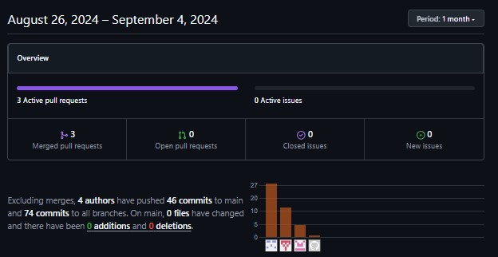
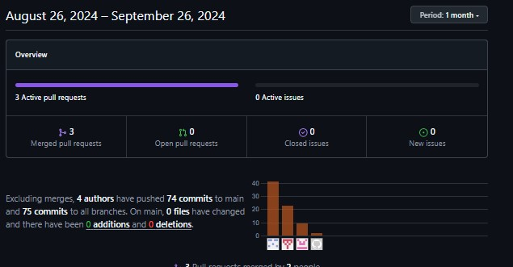

    

**Universidad Peruana de Ciencias Aplicadas**

**Ingeniería de Software**

Ciclo: 2024-2

Curso: Desarrollo de Soluciones IOT

Sección: SW74

Profesor: Velasquez Nuñez, Angel Augusto

---

# INFORME DE TRABAJO FINAL - TF

## tecnogurus

### KitchenTech

#### Team Members

| Integrante                               | Código     |
| ---------------------------------------- | ---------- |
| Fabrizzio Antonio Castro Manrique        | U202110966 |
| Alarcon Rondon Sandro                    | U202114140 |
| Esteban Calderón Chauchi                 | U202110966 |
| Franco Surco Reyes                       | U202015132 |
| Nicolas Zagal Vallejo                    | U20201C429 |

# Registro de Versiones del Informe

| Versión | Fecha       | Autor                                    | Descripción de la modificación                                                                                                                       |
|---------|-------------|------------------------------------------|-----------------------------------------------------------------------------------------------------------------------------------------------------|
| 1.0    | 17/08/2024  | Fabrizzio Antonio Castro Manrique        | Desarrollo del proceso Lean UX, incluyendo el diseño, análisis y recopilación de entrevistas                                                         |
| 1.1    | 18/08/2024  | Alarcon Rondon Sandro                    | Documentación de las entrevistas realizadas, diseño del cuestionario y contexto acotado en el diseño táctico del dominio                             |
| 1.2   | 21/08/2024  | Esteban Calderón Chauchi                 | Creación de la portada, índice del informe, registro de entrevistas, y ajustes en el proceso Lean UX                                                 |
| 1.3    | 25/08/2024  | Franco Surco Reyes                       | Desarrollo del mapeo del recorrido del usuario y formalización de los resultados obtenidos en entrevistas                                             |
| 1.4    | 30/08/2024  | Nicolas Zagal Vallejo                    | Diseño y análisis de las entrevistas con su respectivo registro                                                                                      |
| 2.0    | 25/08/2024  | Nicolas Zagal Vallejo                       | Correcciones de primera version, secciones de US y creacion de mock ups, wireframes y prototipos                                             |
| 2.1    | 30/08/2024  | Esteban Calderón Chauchi                    | Mejora continua de la seccion  Requirements Elicitation & Analysis                                                                                      |
| 2.2    | 17/08/2024  | Fabrizzio Antonio Castro Manrique        | Elaboracion del Sprint 1                                                      |
| 2.3   | 18/08/2024  | Alarcon Rondon Sandro                    | Correcciones de Lean Ux Problem Statement e hipotesis como tabien del task de Sprint 1                             |

---

# Project Report Collaboration Insights

**TB1:** Se realizaron diversas actividades para la entrega TB1, disponibles en el siguiente repositorio de Github del equipo:  
[Repositorio Github](https://github.com/Techstudents-SW74/upc-pre-202402--si572-SW74-tecnogurus-report)

Para la creación del informe se llevaron a cabo las siguientes acciones:

- Redacción y estructuración en formato Markdown de los puntos asignados a cada miembro, con la posterior realización de commits para guardar el progreso.
- Documentación de los cambios en las herramientas correspondientes y generación de enlaces de imágenes mediante el uso de "issues" en el repositorio del informe.
- Se organizaron reuniones para coordinar el avance del informe y discutir las primeras versiones de la arquitectura de la solución IoT.
- Se crearon ramas en el repositorio para dividir el archivo README.md principal en diferentes capítulos.
- Desarrollo de la primera versión de la arquitectura del software, incluyendo el diseño estratégico orientado a atributos y dominios.
- Implementación del proceso de Lean UX.
- Diseño y análisis de entrevistas.
- Estudio de la competencia.
- Elaboración de User Stories y del Product Backlog.

---

    

---

**TP:** Se completaron diversas actividades para la entrega TP, las cuales se encuentran documentadas en el siguiente repositorio de Github del equipo:  
[Repositorio Github](https://github.com/Techstudents-SW74/upc-pre-202402--si572-SW74-tecnogurus-report)

Para la elaboración del informe se realizaron las siguientes tareas:

- Redacción y estructuración en formato Markdown de los puntos asignados a cada miembro, seguido de la realización de commits para registrar el progreso.
- Documentación de las afectaciones en las herramientas utilizadas y obtención de enlaces de imágenes a través de "issues" en el repositorio del informe.
- Se coordinaron reuniones de equipo para revisar el avance y evaluar las partes previamente desarrolladas del informe.
- Agregamos los 2 nuevos capítulos enfocados en el diseño de soluciones y la implementación de productos.
- Se realiazó la ejecucion  de la primera iteración del Sprint 1, que incluye el desarrollo inicial y las pruebas de la web app.

---

    

---

# Student Outcome

El curso contribuye al cumplimiento del Student Outcome ABET:

ABET – EAC - Student Outcome 5

Criterio: La capacidad de funcionar efectivamente en un equipo cuyos miembros juntos proporcionan liderazgo, crean un entorno de colaboración e inclusivo, establecen objetivos, planifican tareas y cumplen objetivos.

En este presente se describe las acciones realizadas y enunciados de conclusiones por parte del grupo, que permiten sustentar el haber alcanzado el logro del ABET – EAC - Student Outcome 5.

<table align="center"> <tr> <th>Criterio específico</th> <th>Acciones Realizadas</th> <th>Conclusiones</th> </tr> <tr> <td>Trabaja en equipo para proporcionar liderazgo en forma conjunta.</td> <td> <strong>Fabrizzio Antonio Castro Manrique:</strong>  
TB1: Participó en la distribución de tareas y el registro de las entrevistas realizadas. TP: Se involucró en la asignación de tareas del Sprint 1 y desempeñó un papel clave en el diseño de mockups y wireframes.

    <strong>Alarcon Rondon Sandro:</strong>  TB1: Colaboró en la creación de entrevistas y en el diseño táctico de los bounded contexts dentro del enfoque de diseño orientado al dominio. TP: Aportó al equipo mediante la mejora continua de artefactos previos y lideró la elaboración de diagramas de user flows y wire flows, además de gestionar sus tareas del Sprint 1.
 
     <strong>Esteban Calderón Chauchi:</strong>  TB1: Contribuyó al trabajo colaborativo, ayudando en la redacción de secciones clave del informe y en el desarrollo de Lean UX.  TP: Lideró el trabajo en equipo en la creación y planificación del Sprint 1, además de desarrollar guías de estilo, mockups y wireframes para webapp.
  
      <strong>Nicolas Zagal Vallejo:</strong>   TB1: Ayudó en el diseño, análisis y documentación de las entrevistas. TP: Desempeñó un papel activo en la colaboración del equipo, liderando el desarrollo de la primera versión de la aplicación web y elaborando mockups y wireframes para la página web.
   
 </td> <td> TB1: Se hizo un  trabajo regular como equipo para liderar el desarrollo de los puntos que se requerian dentro del informe. TP: En esta entrega, se realizaron las bases del diseño de la solución IOT y el primer Sprint donde se entrego la Landing Page y una primera versión de nuestra aplicacion web.
</td> </tr> <tr> <td>Crea un entorno colaborativo e inclusivo, establece metas, planifica tareas y cumple objetivos.</td> <td> <strong>Fabrizzio Antonio Castro Manrique:</strong>  
 TB1: Contribuyó al logro de los objetivos relacionados con el análisis y las entrevistas. TP: Ayudó a cumplir con los objetivos establecidos para la creación de mockups y wireframes de la aplicación móvil, asegurando que se cumpliera el alcance definido.

     <strong>Alarcon Rondon Sandro:</strong>  
  TB1: Desarrolló un plan para el registro de entrevistas y se encargó del diseño táctico en el contexto de diseño orientado al dominio. TP: Organizó tareas enfocadas en la mejora continua y logró desarrollar los diagramas de user flow y wire flow.
     <strong>Esteban Calderón Chauchi:</strong>  
  TB1: Estableció metas para el desarrollo de Lean UX y supervisó la creación de documentos estructurales para el informe. TP: Planificó las tareas del Sprint 1, definiendo su alcance y entrega, estableciendo como meta maximizar los story points, y elaboró las guías de estilo.
      <strong>Nicolas Zagal Vallejo:</strong>  
   TB1: Planificó y ejecutó tareas relacionadas con el mapeo de la experiencia del usuario (User Journey Mapping). TP: Ayudó a cumplir con las user stories del Sprint 1 relacionadas con la aplicación web, contribuyendo también a la mejora continua.
 </td> <td> TB1: Para el primer entregable, se estableció un ambiente de colaboración y participación  regular con el fin de establecer las metas, tareas y la inspección de cumplimiento de objetivos  
TP: Para este entregable se establecio un ambiente de colaboracion y participacion optimo. Se alcanzaron las metas esperadas en el tiempo esperado. Se trabajo en funcion de un objetivo en general se cumplieron todas las user stories para este sprint para entregar un avance que cumpla con los requisitos mas prioritarios.</td> </tr> </table>

---

(<a href="https://github.com/Techstudents-SW74/upc-pre-202402--si572-SW74-tecnogurus-report/blob/main/Contenido.md"> Tabla de Contenido</a>)

